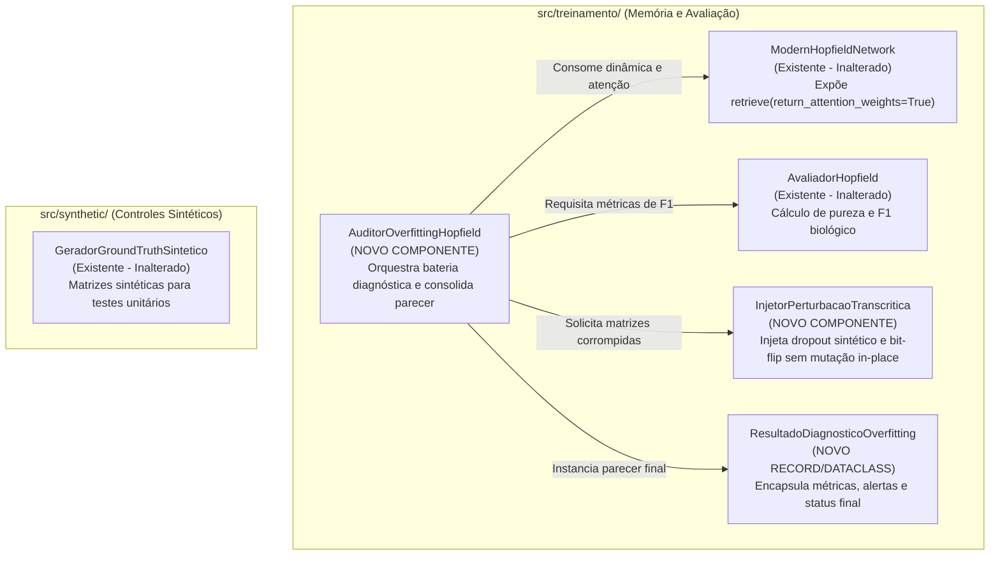
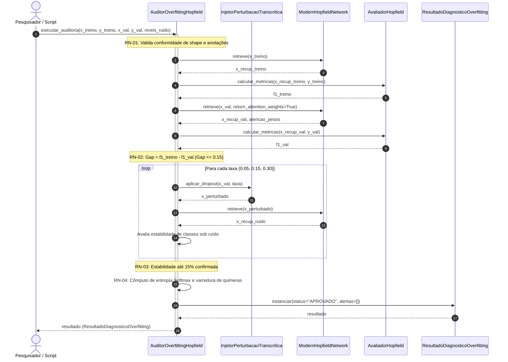
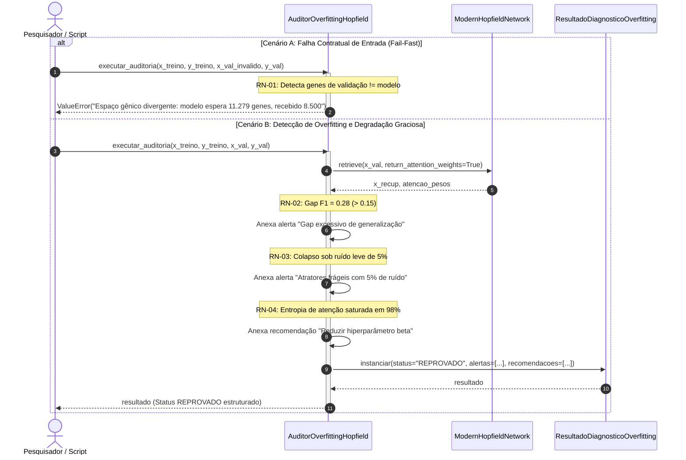

[Índice](../index.md) | [Spec](spec.md)

# Arquitetura Técnica: Diagnóstico de Overfitting e Robustez em Rede Hopfield
fase: arquitetura

## Repo e Slug
- **Repositório:** `pipiline_hopifield`
- **Slug:** `diagnostico-overfitting-rede-hopfield`

---

## Mapeamento de Arquivos e Responsabilidades

| Arquivo | Tipo | Responsabilidade Única (SRP) e Justificativa (SOLID) |
| :--- | :---: | :--- |
| `src/treinamento/diagnostico_overfitting.py` | **Novo** | **Módulo Especialista de Diagnóstico:** Encapsula o orquestrador `AuditorOverfittingHopfield`, o injetor funcional `InjetorPerturbacaoTranscritica` e o contrato de saída `ResultadoDiagnosticoOverfitting`. Evita transformar componentes existentes em God Classes. |
| `src/treinamento/hopfield.py` | **Existente (Inalterado)** | **Memória Associativa:** Mantém a execução da dinâmica contínua de atratores via atenção Softmax, fornecendo tensores de pesos e projeções sem mutações em seus métodos consolidados. |
| `src/treinamento/avaliador_hopfield.py` | **Existente (Inalterado)** | **Classificação de Recuperação:** Mantém o cálculo das métricas de F1-Score biológico, acurácia balanceada e matriz de confusão. |
| `src/synthetic/gerador_ground_truth.py` | **Existente (Inalterado)** | **Geração de Controles Sintéticos:** Fornece matrizes humano-verificáveis para testes unitários determinísticos. |
| `tests/test_diagnostico_overfitting.py` | **Novo** | **Suíte Automatizada de Testes:** Cobre os cenários de teste vinculados às regras `RN-01` a `RN-04` e ao requisito `RF-05`. |

---

## Containers e Componentes (Diagrama C4 Nível 3)



---

## Contratos de Fronteira

```python
from __future__ import annotations

from collections.abc import Sequence
from dataclasses import dataclass, field
from typing import Any, Literal
import numpy as np
from numpy.typing import NDArray

@dataclass(frozen=True)
class ResultadoDiagnosticoOverfitting:
    """Contrato imutável de resultado da auditoria de overfitting."""

    status: Literal["APROVADO", "ALERTA", "REPROVADO"]
    gap_generalizacao: float
    f1_treino: float
    f1_validacao: float
    fidelidade_sob_ruido: dict[float, float]
    ponto_ruptura_ruido: float | None
    entropia_media_atencao: float
    proporcao_atencao_saturada: float
    quimeras_detectadas: int
    alertas: list[str] = field(default_factory=list)
    recomendacoes: list[str] = field(default_factory=list)


class InjetorPerturbacaoTranscritica:
    """Injetor determinístico de ruído estocástico e dropout artificial."""

    def aplicar_dropout(
        self,
        matriz: NDArray[np.float32],
        taxa: float,
        seed: int | None = None,
    ) -> NDArray[np.float32]:
        """Zera estocasticamente uma fração dos genes ativos sem mutação in-place."""
        ...

    def aplicar_bit_flip(
        self,
        matriz: NDArray[np.float32],
        taxa: float,
        seed: int | None = None,
    ) -> NDArray[np.float32]:
        """Inverte aleatoriamente uma fração dos valores da matriz binária."""
        ...


class AuditorOverfittingHopfield:
    """Orquestrador de auditoria diagnóstica de generalização e estabilidade."""

    def __init__(
        self,
        modelo: Any,
        padroes_referencia: NDArray[np.float32],
        rotulos_padroes: Sequence[int],
        gap_maximo_tolerado: float = 0.15,
        limiar_entropia_minima: float = 0.05,
        marcadores_exclusivos: dict[int, Sequence[int]] | None = None,
        seed: int = 42,
    ) -> None: ...

    def executar_auditoria(
        self,
        x_treino: NDArray[np.float32],
        y_treino: Sequence[int],
        x_val: NDArray[np.float32],
        y_val: Sequence[int],
        niveis_ruido: Sequence[float] = (0.05, 0.15, 0.30),
    ) -> ResultadoDiagnosticoOverfitting:
        """Executa a bateria de testes de generalização, estresse e quimeras."""
        ...
```

---

## Diagramas de Sequência

### 1. Fluxo Principal (Caminho Feliz)



### 2. Fluxo de Falha e Resiliência



---

## Infraestrutura

- **Modelo de Execução:** Processamento científico estritamente em memória RAM / GPU via PyTorch e NumPy.
- **Gerenciamento de Escala:** Reutilização transparente do processamento em lotes (`batch_size=1024`) nativo de `ModernHopfieldNetwork.retrieve`, prevenindo esgotamento de memória em matrizes de larga escala.

---

## ADRs (Decisões de Arquitetura de Software)

### ADR-01: Isolamento do Auditor em Módulo Desacoplado (`diagnostico_overfitting.py`)
- **Contexto:** Havia a opção de estender a classe consolidada `AvaliadorHopfield` com funções de perturbação e entropia.
- **Decisão:** Criar `AuditorOverfittingHopfield` desacoplado em `src/treinamento/diagnostico_overfitting.py`.
- **Justificativa:** Preserva o Princípio da Responsabilidade Única (SRP) e o Princípio Aberto/Fechado (OCP), impedindo a formação de God Classes.

### ADR-02: Diagnóstico Termodinâmico via Entropia de Shannon da Atenção Softmax
- **Contexto:** Verificar saturação de `beta` sem requerer busca em grade (*grid search*) computacionalmente onerosa.
- **Decisão:** Calcular a Entropia de Shannon sobre a distribuição de pesos de atenção retornada na inferência da rede contínua.
- **Justificativa:** Fornece indicador instantâneo de degeneração para 1-Nearest Neighbor rígido a custo computacional residual O(1).

### ADR-03: Imutabilidade Estrita na Injeção de Ruído
- **Contexto:** Perturbações *in-place* poderiam poupar memória temporária à custa de efeitos colaterais.
- **Decisão:** Forçar cópia explícita de matrizes em `InjetorPerturbacaoTranscritica`.
- **Justificativa:** Blindagem contra corrupção silenciosa de dados que serão reutilizados em etapas subsequentes do pipeline.

---

## Casos de Teste Vinculados aos IDs da Spec (`RN-XX`)

| ID da Spec | Nome do Caso de Teste | Cenário Avaliado | Asserção Concreta de Domínio |
| :---: | :--- | :--- | :--- |
| **RN-01** | `test_auditor_lanca_value_error_quando_genes_divergem_do_modelo` | Matriz de validação com número de genes diferente dos protótipos da rede. | `pytest.raises(ValueError, match="Espaço gênico divergente")` |
| **RN-01** | `test_auditor_lanca_value_error_quando_rotulos_incompativeis_com_celulas` | Vetor de rótulos celulares com tamanho diferente do número de células. | `pytest.raises(ValueError, match="Incompatibilidade de dimensões")` |
| **RN-02** | `test_auditor_sinaliza_alerta_quando_gap_generalizacao_excede_limiar` | F1 de treino = 1.0 e F1 de validação = 0.75 (gap = 0.25 > 0.15). | `res.status == "ALERTA"`, `res.gap_generalizacao == 0.25`, alerta de gap presente. |
| **RN-02** | `test_auditor_aprova_quando_gap_generalizacao_dentro_do_limiar` | F1 de treino = 1.0 e F1 de validação = 0.95 (gap = 0.05 ≤ 0.15). | `res.gap_generalizacao <= 0.15`, sem alerta de generalização. |
| **RN-03** | `test_injetor_perturbacao_aplica_dropout_sem_mutacao_in_place` | Matriz binária submetida a *dropout* sintético de 20%. | Matriz original permanece inalterada; nova matriz preserva dimensões e reduz densidade. |
| **RN-03** | `test_auditor_reprova_quando_bacia_de_atracao_colapsa_com_ruido_leve` | Perturbação de 5% provoca colapso abrupto (> 25% de perda) de recuperação. | `res.status == "REPROVADO"`, alerta de atratores frágeis registrado. |
| **RN-03** | `test_auditor_confirma_robustez_quando_estavel_sob_ruido_moderado` | Rede mantém recuperação biológica precisa sob 15% de *dropout*. | `res.ponto_ruptura_ruido is None` ou > 0.15. |
| **RN-04** | `test_auditor_detecta_saturacao_temperatura_quando_entropia_atencao_nula` | Rede com beta hiper-saturado onde atenção concentra peso 1.0 em um único padrão em > 95% das consultas. | `res.proporcao_atencao_saturada > 0.95`, alerta de saturação emitido, recomendação de redução de beta incluída. |
| **RN-04** | `test_auditor_detecta_quimera_quando_marcadores_exclusivos_coativados` | Perfil recuperado expressa simultaneamente marcadores de classes mutuamente exclusivas. | `res.quimeras_detectadas > 0`, `res.status == "REPROVADO"`. |
| **RF-05** | `test_auditor_emite_status_aprovado_para_rede_com_generalizacao_robusta` | Rede ideal sobre Ground Truth sintético (sem gap excessivo, robusta a ruído e sem quimeras). | `res.status == "APROVADO"`, `len(res.alertas) == 0`. |
