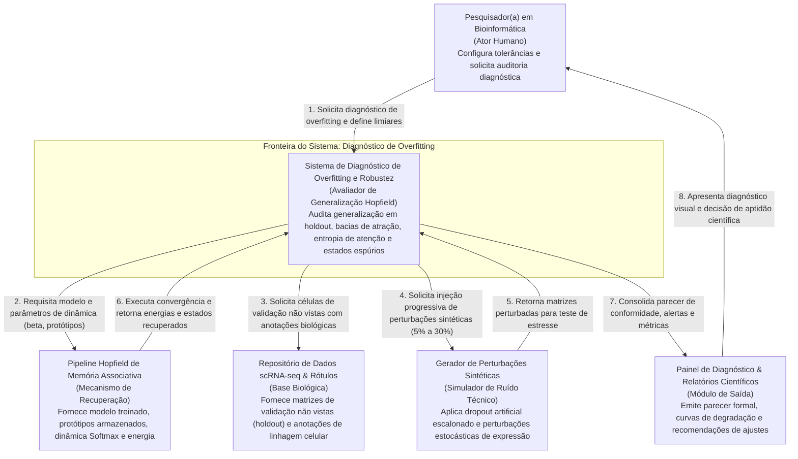

cell_types_binarioF.txt---
tipo: especificacao
slug: diagnostico-overfitting-rede-hopfield
generated.by: antigravity/implementar
data: 2026-09-30T16:18:00Z
resumo: "Especificação formal do protocolo de diagnóstico de overfitting, generalização fora da amostra e robustez em rede Hopfield para dados scRNA-seq."
---

# Especificação: Diagnóstico de Overfitting e Robustez em Rede Hopfield
fase: spec

## Repo e Slug
- **Repositório:** `pipiline_hopifield`
- **Slug:** `diagnostico-overfitting-rede-hopfield`

---

## Problema e Atores

### Problema de Negócio
Em redes de memória associativa contínua (*Modern Hopfield Networks / Dense Associative Memory*), o sobreajuste (*overfitting*) e a memorização de ruído manifestam-se de forma substancialmente distinta dos modelos supervisionados clássicos. Em dados de sequenciamento de RNA de célula única (*scRNA-seq*), a rede pode sofrer colapso de temperatura (hiperparâmetro `beta` excessivamente elevado, transformando a dinâmica de recuperação em uma tabela de busca exata *1-Nearest Neighbor* que decora ruídos técnicos de sequenciamento e *dropouts*), superpopulação de protótipos redundantes por classe, estreitamento patológico de bacias de atração ou geração de estados espúrios quiméricos (ativação cruzada de assinaturas de linhagens celulares incompatíveis).

Atualmente, não existe um protocolo automatizado, observável e contratual no pipeline para certificar se a memória associativa possui generalização transcricional autêntica antes de sua utilização em análises e imputações científicas.

### Atores
- **Pesquisador(a) em Bioinformática (Ator Humano Principal):** Configura a rede, define as tolerâncias de generalização e necessita de um parecer científico assertivo (com métricas quantitativas de robustez e alertas claros de sobreajuste) antes de homologar a rede.
- **Avaliador Diagnóstico de Overfitting e Robustez (Ator Automatizado / Auditor do Sistema):** Conduz a bateria de testes de estresse com ruído sintético, validação fora da amostra (*holdout* e *cross-dataset*), inspeção termodinâmica de temperatura e detecção de mínimos locais espúrios, emitindo parecer consolidado em três estados de conformidade (*Aprovado*, *Alerta de Overfitting* ou *Reprovado*).

---

## Contexto do Sistema (Diagrama C1)

---

## Fluxo de Negócio

```mermaid
flowchart TD
    Start(["Início da Auditoria de Overfitting"]) --> RF01["RF-01: Inicialização do Diagnóstico<br/>(Carrega modelo Hopfield, protótipos e conjunto de validação holdout)"]
    
    RF01 --> RN01{"RN-01: Integridade dos dados de validação?<br/>(Dimensão gênica compatível e anotações celulares presentes)"}
    RN01 -- "Não" --> TermErro(["Erro Contratual: Dados de validação inválidos"]):::error
    
    RN01 -- "Sim" --> RF02["RF-02: Teste de Generalização Fora da Amostra<br/>(Recuperação em células não vistas do holdout)"]
    
    RF02 --> RN02{"RN-02: Gap Treino-Validação aceitável?<br/>(Queda de F1-Score biológico entre treino e teste <= 15%)"}
    RN02 -- "Não (Gap > 15%)" --> FlagOverfitting["Alerta: Queda excessiva de generalização (Overfitting clássico)"]
    RN02 -- "Sim" --> RF03["RF-03: Teste de Estresse por Injeção de Ruído<br/>(Aplica perturbação progressiva de 5%, 15% e 30% de dropout e bit-flip)"]
    
    FlagOverfitting --> RF03
    
    RF03 --> RN03{"RN-03: Bacia de atração robusta a perturbações?<br/>(Mantém convergência estável com ruído de até 15%)"}
    RN03 -- "Não (Colapso com ruído <= 5%)" --> FlagInstabilidade["Alerta: Atratores frágeis / Bacias de atração colapsadas"]
    RN03 -- "Sim" --> RF04["RF-04: Auditoria de Temperatura (Beta) e Estados Espúrios<br/>(Cômputo da entropia da atenção Softmax e coexpressão de marcadores opostos)"]
    
    FlagInstabilidade --> RF04
    
    RF04 --> RN04{"RN-04: Ausência de colapso delta e de quimeras?<br/>(Atenção não degenerada para 1-NN puro e sem ativação de classes mutuamente exclusivas)"}
    RN04 -- "Não (Saturação ou Quimera)" --> FlagEspurio["Alerta: Memorização rígida de ruído ou mínimo local espúrio"]
    RN04 -- "Sim" --> RF05["RF-05: Consolidação do Parecer Diagnóstico"]
    
    FlagEspurio --> RF05
    
    RF05 --> DecisaoFinal{"Avaliação Consolidada"}
    DecisaoFinal -- "Sem alertas" --> StatusA(["Estado Aprovado: Generalização Robusta"]):::success
    DecisaoFinal -- "Apenas alerta RN-02 ou RN-04 (saturação)" --> StatusB(["Estado Alerta: Risco de Overfitting / Recomendado ajustar Beta"]):::warning
    DecisaoFinal -- "Falha em RN-03 ou quimeras em RN-04" --> StatusC(["Estado Reprovado: Memória Instável / Estados Espúrios Críticos"]):::error

    classDef success fill:#e8f5e9,stroke:#2e7d32,stroke-width:2px;
    classDef warning fill:#fff3e0,stroke:#ef6c00,stroke-width:2px;
    classDef error fill:#ffebee,stroke:#c62828,stroke-width:2px;
```

---

## Regras de Negócio e Exceções

- **RF-01 (Inicialização da Auditoria):** Carrega o modelo de memória associativa, seus protótipos estruturados e a partição independente de células biológicas de validação.
- **RN-01 (Integridade dos Dados de Validação):** A partição de validação deve possuir estritamente o mesmo número e ordenação de genes do modelo treinado, além de conter os rótulos de tipos celulares anotados. Caso contrário, a execução é abortada preventivamente.
- **RF-02 (Teste Fora da Amostra):** Submete células não vistas do *holdout* à dinâmica de convergência da rede Hopfield e mensura o F1-Score biológico e a fidelidade transcricional de recuperação.
- **RN-02 (Tolerância do Gap de Generalização):** Se a fidelidade biológica ou o F1-Score celular no conjunto de validação for mais de 15% inferior ao desempenho obtido nas células de treino, o sistema emite `Alerta: Queda excessiva de generalização`.
- **RF-03 (Teste de Estresse por Perturbação Sintética):** Aplica perturbações sintéticas escalonadas (5%, 15% e 30% de *dropout* artificial e inversão de genes) para avaliar a profundidade e estabilidade das bacias de atração.
- **RN-03 (Robustez a Ruído e Ruptura de Atratores):** A rede deve manter a recuperação correta da linhagem biológica sob perturbação moderada (até 15% de ruído). Queda abrupta de desempenho sob perturbação leve (≤ 5% de ruído) aciona `Alerta: Atratores Frágeis / Bacias Colapsadas`.
- **RF-04 (Auditoria de Temperatura e Quimeras Transcricionais):** Analisa a distribuição de probabilidades da atenção Softmax ao longo das consultas e verifica a presença de coativação biológica impossível no perfil convergido.
- **RN-04 (Prevenção de Efeito Lookup Table e Estados Espúrios):**
  - Se a atenção Softmax convergir com entropia nula (peso 1.0 exclusivo sobre um único protótipo) em mais de 95% dos casos, sinaliza `Alerta: Saturação de Beta / Memorização Rígida de Ruído`.
  - Se o estado convergido coativar marcadores canônicos de linhagens mutuamente exclusivas, sinaliza `Alerta: Estado Espúrio / Quimera Transcricional`.
- **RF-05 (Consolidação do Parecer Diagnóstico):** Classifica a rede em três estados resolutivos:
  1. *Aprovado (Generalização Robusta)*: Atende integralmente a todas as regras sem alertas.
  2. *Alerta de Overfitting*: Apresenta gap elevado ou saturação de beta, emitindo recomendação de calibração paramétrica.
  3. *Reprovado*: Apresenta instabilidade a ruído mínimo ou proliferação de quimeras espúrias.

---

## Critérios de Aceite Observáveis

- **CA-01 (Vinculado a RF-01 e RN-01 — Barreira Contratual de Entrada):**
  - **Dado** um modelo Hopfield treinado e uma partição de dados de validação,
  - **Quando** a rotina for disparada com discrepância no espaço gênico ou ausência de anotações de tipo celular,
  - **Então** o sistema deve interromper a execução imediatamente com mensagem explicativa clara, sem consumir processamento nos testes de estresse.
- **CA-02 (Vinculado a RF-02 e RN-02 — Medição do Gap de Generalização):**
  - **Dado** um conjunto de validação fora da amostra (*holdout*),
  - **Quando** a rede recuperar as células não vistas e o F1-Score biológico for mais de 15% inferior ao do conjunto de treino,
  - **Então** o sistema deve registrar formalmente o aviso `Alerta: Queda excessiva de generalização (Gap de X%)`.
- **CA-03 (Vinculado a RF-03 e RN-03 — Tolerância a Perturbações Sintéticas):**
  - **Dado** o teste de estresse com perturbações escalonadas (5%, 15% e 30%),
  - **Quando** a rede sofrer perda abrupta de recuperação sob ruído leve de apenas 5% (queda superior a 25% na fidelidade transcricional),
  - **Então** o sistema deve registrar `Alerta: Atratores Frágeis / Bacias de Atração Colapsadas`. Mantendo a estabilidade até 15% de ruído, deve registrar `Conformidade de Robustez a Ruído`.
- **CA-04 (Vinculado a RF-04 e RN-04 — Auditoria de Temperatura e Quimeras):**
  - **Dado** o monitoramento dos pesos de atenção e dos perfis reconstruídos,
  - **Quando** mais de 95% das células convergirem com entropia nula de atenção ou quando houver coativação de marcadores celulares antagônicos,
  - **Então** o sistema deve sinalizar `Alerta: Saturação de Temperatura (Beta excessivo)` e/ou `Alerta: Estado Espúrio / Quimera Transcricional`.
- **CA-05 (Vinculado a RF-05 — Parecer Resolutivo Final):**
  - **Dado** o término de todas as etapas diagnósticas,
  - **Quando** o relatório for gerado,
  - **Então** deve emitir o parecer final classificado em: *APROVADO (Generalização Robusta)*, *ALERTA (Risco de Overfitting)* ou *REPROVADO (Instabilidade Crítica)*.

---

## Fora de Escopo

1. **Re-treinamento Automático ou Grid Search Autônomo:** O sistema atua estritamente como auditor consultivo e diagnóstico; ele recomenda ajustes de hiperparâmetros, mas não realiza buscas exaustivas nem altera pesos de forma não assistida.
2. **Alteração do Algoritmo rSWeeP da UFPR:** A projeção vetorial oficial em R permanece mandatória, íntegra e inalterada.
3. **Modificação da Dinâmica Central de Produção da Rede:** A dinâmica de convergência do pipeline existente é mantida como está; o diagnóstico atua apenas como consumidor/avaliador externo.
4. **Criação de Servidores Web ou Dashboards Gráficos Externos:** Os resultados são exibidos no console e estruturados em artefatos Markdown e relatórios tabulares.
5. **Aplicação a Modelos Não Baseados em Hopfield:** O escopo é restrito à arquitetura de memória associativa Hopfield do projeto.

---

## Glossário

| Termo | Definição no Contexto do Projeto |
| :--- | :--- |
| **Rede Hopfield Moderna (Modern Hopfield / DAM)** | Arquitetura de memória associativa contínua cuja atualização ocorre por atenção Softmax ponderada sobre padrões prototípicos armazenados, apresentando capacidade de armazenamento exponencial. |
| **Overfitting em Memória Associativa** | Condição em que a rede decora ruídos técnicos e variações idiossincráticas dos dados de treinamento, colapsando as bacias de atração e perdendo a capacidade de restaurar células não vistas ou perturbadas. |
| **Temperatura / Sensibilidade (`Beta`)** | Hiperparâmetro que dita a nitidez da distribuição de atenção Softmax. Valores excessivamente altos levam ao efeito *Lookup Table* (1-Nearest Neighbor rígido); valores excessivamente baixos misturam classes distintas. |
| **Bacia de Atração** | Volume no espaço multidimensional de expressão em torno de um atrator (protótipo) onde qualquer célula perturbada é atraída para o mesmo padrão biológico. |
| **Estado Espúrio (Quimera Transcricional)** | Ponto de equilíbrio ou mínimo local na dinâmica da rede que não reflete a biologia celular real, caracterizado pela ativação cruzada de marcadores de linhagens celulares mutuamente exclusivas. |
| **Validação Fora da Amostra (*Holdout*)** | Células reservadas e isoladas que não participaram da extração de protótipos, servindo de padrão-ouro para avaliar se a generalização transcricional é autêntica. |
| **Teste de Estresse por Perturbação** | Injeção progressiva e estocástica de *dropout* técnico artificial e inversões de expressão (5%, 15%, 30%) para mapear o raio de tolerância das bacias de atração. |
| **Fidelidade Transcricional & F1 Biológico** | Métrica de conformidade que avalia a precisão na reconstituição de genes marcadores e a pureza na classificação correta do tipo celular recuperado. |
