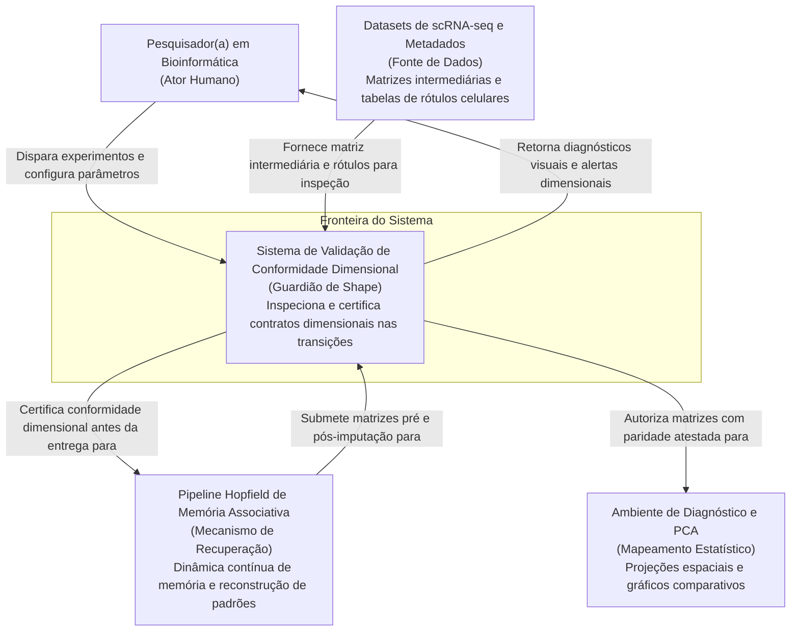
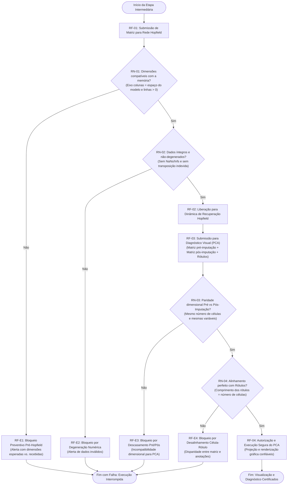

# Especificação de Validação de Conformidade Dimensional (Shape) Pré-Hopfield e Pré-PCA
fase: spec

## Repo e Slug
- **Repositório:** `pipiline_hopifield`
- **Slug:** `validacao-shape-hopfield-pca`

---

## Problema e Atores

### Problema de Negócio
No processamento de dados de sequenciamento de RNA de célula única (*scRNA-seq*), as matrizes biológicas sofrem transformações dimensionais sucessivas e computacionalmente onerosas. Discrepâncias dimensionais sutis — como inversão acidental entre linhas e colunas (transposição indevida), perda ou truncamento de células/genes durante filtragens intermediárias, ou descompasso numérico entre matrizes celulares e suas tabelas de anotação de tipos celulares — podem se propagar de forma silenciosa. Isso acarreta conclusões científicas enviesadas ou falhas tardias após horas de execução de algoritmos pesados de memória associativa e visualização estatística.

### Atores
- **Pesquisador(a) em Bioinformática (Ator Humano Principal):** Configura e executa as análises de harmonização e imputação. Requer barreiras contratuais nos pontos de transição que ofereçam feedback imediato e diagnóstico claro (dimensões esperadas vs. observadas) antes de consumir tempo e memória computacional.
- **Validador de Integridade Dimensional (Ator Automatizado / Guardião do Pipeline):** Componente preventivo que inspeciona matrizes intermediárias nas fronteiras do Hopfield e do PCA, bloqueando a execução imediatamente caso haja descasamento de dimensões, degeneração numérica ou divergência de rótulos.

---

## Contexto do Sistema (Diagrama C1)

---

## Fluxo de Negócio

---

## Regras de Negócio e Exceções

- **`RN-01` (Compatibilidade Dimensional Pré-Hopfield):** A matriz intermediária de consulta enviada à rede Hopfield deve conter obrigatoriamente um número de colunas igual ao espaço dimensional configurado no modelo (ex.: 600 dimensões para projeção compacta rSWeeP) e possuir cardinalidade estritamente positiva de células (linhas > 0).
  - *Exceção (`RF-E1`):* Se o número de colunas divergir do modelo ou a quantidade de linhas for zero, a execução é interrompida com diagnóstico formal contendo dimensões esperadas versus dimensões observadas.
- **`RN-02` (Integridade Numérica e Não-Degeneração):** A matriz pré-Hopfield não pode conter valores não numéricos (`NaN` ou infinito) e sua conformação geométrica não pode estar transposta indevidamente (número de células alocado nas colunas ao invés das linhas).
  - *Exceção (`RF-E2`):* Se houver presença de `NaN`/infinito ou evidência de transposição incorreta, a execução é bloqueada impedindo a alocação pesada de memória na dinâmica associativa.
- **`RN-03` (Paridade Dimensional Pré vs. Pós-Imputação para PCA):** A matriz de entrada (antes da imputação) e a matriz reconstruída pela memória Hopfield (pós-imputação) devem possuir rigorosamente a mesma quantidade de linhas (células) e colunas (variáveis/dimensões).
  - *Exceção (`RF-E3`):* Se houver qualquer divergência em linhas ou colunas entre os dois estados, o cálculo de PCA é impedido com relatório de disparidade entre os estados antes e depois da reconstrução.
- **`RN-04` (Alinhamento de Rótulos Biológicos com Células):** A quantidade de anotações categóricas (como tipo celular) deve bater exatamente 1 para 1 com o número de linhas de ambas as matrizes submetidas ao PCA.
  - *Exceção (`RF-E4`):* Se o comprimento do vetor de rótulos for diferente do número de linhas das matrizes, a projeção e a coloração dos gráficos de PCA são abortadas preventivamente, evitando atribuição biológica incorreta.

---

## Critérios de Aceite Observáveis

### Cenário 1: Rejeição por incompatibilidade de colunas na entrada do Hopfield
- **Vínculo:** `RN-01` e `RF-E1`
- **Dado** que uma matriz intermediária possui 500 colunas (ou qualquer valor diferente das 600 dimensões contratadas para o modelo);
- **Quando** a matriz for submetida à validação antes da rede Hopfield;
- **Então** o sistema deve interromper imediatamente o processo sem executar a memória;
- **E** deve exibir mensagem de erro clara indicando a dimensão esperada (ex.: 600 colunas) e a observada (500 colunas).

### Cenário 2: Rejeição por dados corrompidos ou degenerados pré-Hopfield
- **Vínculo:** `RN-02` e `RF-E2`
- **Dado** que a matriz intermediária possui o formato dimensional correto, porém contém valores inválidos (`NaN`, infinito) ou transposição errônea;
- **Quando** a verificação de integridade for executada;
- **Então** o sistema deve bloquear a passagem para o Hopfield, emitindo alerta de degeneração numérica antes de qualquer alocação pesada.

### Cenário 3: Liberação do caminho feliz pré-Hopfield
- **Vínculo:** `RN-01`, `RN-02` e `RF-02`
- **Dado** que a matriz intermediária possui linhas > 0, exatamente as 600 colunas biológicas esperadas e integridade numérica;
- **Quando** a validação for concluída;
- **Então** o sistema deve emitir confirmação visual de conformidade (ex.: células e dimensões validadas) e autorizar a dinâmica da rede.

### Cenário 4: Rejeição por disparidade de células/dimensões no PCA
- **Vínculo:** `RN-03` e `RF-E3`
- **Dado** que a matriz pré-imputação e a matriz pós-imputação possuem contagens divergentes de células (ex.: 58.326 vs. 58.000) ou colunas;
- **Quando** forem submetidas para o diagnóstico de PCA;
- **Então** o cálculo de PCA não deve ser iniciado;
- **E** o sistema deve emitir aviso explícito de disparidade entre os estados antes e depois da reconstrução.

### Cenário 5: Rejeição por descasamento entre células e rótulos biológicos
- **Vínculo:** `RN-04` e `RF-E4`
- **Dado** que as matrizes possuem 58.326 células, mas o vetor de anotações categóricas possui contagem distinta (ex.: 50.000);
- **Quando** a validação pré-PCA for processada;
- **Então** a renderização do PCA deve ser bloqueada preventivamente;
- **E** o usuário deve ser alertado de que os rótulos biológicos não correspondem 1 a 1 à população celular da matriz.

### Cenário 6: Liberação do caminho feliz e geração de PCA
- **Vínculo:** `RN-03`, `RN-04` e `RF-04`
- **Dado** que a matriz pré-imputação, a matriz pós-imputação e o vetor de rótulos apresentam paridade dimensional e alinhamento perfeitos;
- **Quando** a validação pré-PCA for concluída;
- **Então** o sistema deve autorizar o cálculo de PCA e a plotagem dos gráficos de dispersão comparativos com total garantia de correspondência biológica.

---

## Fora de Escopo

1. **Alteração do algoritmo de redução dimensional rSWeeP:** O algoritmo de projeção via pacote R oficial da UFPR permanece inalterado; o validador atua apenas na inspeção das matrizes resultantes.
2. **Modificação da dinâmica de atratores da Rede Hopfield:** Parâmetros intrínsecos do modelo de memória (como sensibilidade de ativação, iterações ou limiar) não são alterados pelo validador.
3. **Imputação ou correção automática de rótulos celulares:** Caso o vetor de anotações esteja em desacordo, o validador apenas acusa e bloqueia; não deduz nem preenche rótulos desconhecidos.
4. **Validação de baixo nível de arquivos brutos em disco:** A leitura direta de arquivos `.h5ad` e conversões de formato continuam sob responsabilidade dos módulos de ingestão primária.
5. **Ajuste de hiperparâmetros de clusterização:** O agrupamento de protótipos celulares (K-Means) não é modificado pela validação.
6. **Implementação de novas técnicas de visualização:** O validador assegura a compatibilidade de dados para o PCA e gráficos existentes, sem construir novas ferramentas analíticas.

---

## Glossário do Domínio

- **Shape (Conformação Dimensional):** Estrutura geométrica de uma matriz expressa por dois eixos (número de linhas × número de colunas), em que as linhas correspondem às células biológicas observadas e as colunas correspondem às variáveis de medição (genes ou dimensões reduzidas).
- **Matriz Intermediária:** Estrutura de dados resultante de etapas prévias (como binarização ou projeção vetorial) que aguarda em memória para ser consumida pela rede de memória ou pelo módulo de diagnóstico.
- **Espaço do Modelo (600D):** Espaço vetorial contínuo de 600 dimensões gerado pelo algoritmo rSWeeP da UFPR, no qual cada célula cerebral é representada por um perfil compacto e desprovido de ruídos.
- **Rede de Memória Associativa Hopfield:** Modelo que armazena padrões de protótipos celulares e realiza a recuperação contínua de estados transcricionais biológicos a partir de vetores de consulta.
- **Imputação / Reconstrução:** Ação de recuperar a expressão biológica de genes que estavam ausentes ou marcados com sentinela neutro no estudo alvo.
- **Paridade Pré vs. Pós-Imputação:** Propriedade que atesta que a matriz original de entrada e a matriz resultante da imputação possuem estritamente o mesmo número de instâncias celulares e a mesma correspondência de variáveis.
- **Alinhamento de Rótulos Biológicos:** Equivalência unívoca (1 para 1) entre cada linha da matriz celular e a anotação do tipo celular no vetor de metadados.
- **PCA (Análise de Componentes Principais):** Método de redução de dimensionalidade linear utilizado no diagnóstico visual para comparar o agrupamento e a separação dos tipos celulares antes e depois da passagem pela memória Hopfield.
