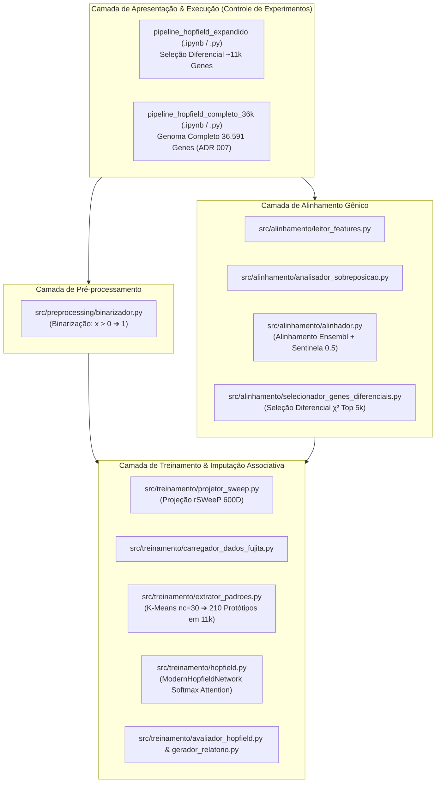
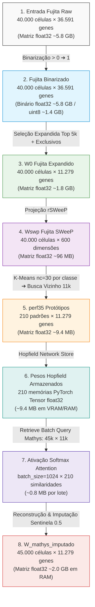

# Documento de Arquitetura do Sistema — Pipeline Hopfield Expandido

> **Versão:** 2.0  
> **Data:** 30/07/2026  
> **Status:** Ativo  
> **Idioma:** Português (PT-BR)  

---

## 1. Visão Geral da Arquitetura

O sistema de **Pipeline Hopfield Expandido** foi desenhado com base em uma arquitetura em camadas modular e desacoplada. Seu objetivo central é realizar o **alinhamento cross-dataset**, a **projeção vetorial de baixa dimensionalidade** e a **imputação de dados de expressão gênica single-cell (scRNA-seq)** utilizando **[[03_Conhecimento/atencao_softmax_hopfield|Redes Hopfield Modernas]]** com mecanismo de atenção contínuo Softmax.

---

## 2. Taxonomia dos Módulos (`src/`)

### 2.1. `src/config.py` — Central de Configuração
Define os caminhos absolutos e relativos para arquivos de dados brutos (`.h5ad`), listas de features, diretórios de saída e relatórios. Garante a reprodutibilidade dos caminhos em diferentes ambientes.

### 2.2. `src/preprocessing/` — Binarização
- **`binarizador.py` (`Binarizador`)**: Converte matrizes contínuas/contagens de arquivos `.h5ad` para matrizes de presença/ausência binária ($x > 0 \rightarrow 1$, $x \le 0 \rightarrow 0$). Veja **[[03_Conhecimento/binarizacao_expressao_genica|Conceito Atômico]]** e **[[04_Recursos/adrs/adr_001_binarizacao_expressao_genica|ADR 001]]**.

### 2.3. `src/alinhamento/` — Harmonização Canônica de Espaços Gênicos
- **`leitor_features.py` (`LeitorFeatures`)**: Lê arquivos TSV/CSV de features (`gene_name` $\rightarrow$ `ensembl_id`) dos datasets de Referência e Alvo (com suporte e fallback às configurações do `src/config.py`).
- **`analisador_sobreposicao.py` (`AnalisadorSobreposicao`)**: Mapeia a interseção e os genes exclusivos de cada dataset baseando-se no Ensembl ID.
- **`alinhador.py` (`Alinhador`)**: Realinha as matrizes binarizadas para a ordem de genes canônica do Fujita. Para o dataset Mathys, genes inexistentes no seu genoma nativo recebem o **[[03_Conhecimento/sentinela_meio_genes_ausentes|valor sentinela neutro 0.5]]**. Veja **[[04_Recursos/adrs/adr_002_sentinela_meio_genes_ausentes|ADR 002]]**.
- **`validador_alinhamento.py` (`ValidadorAlinhamento`)**: Valida programaticamente se os genes alinhados em ambos os datasets estão na mesma ordem Ensembl.
- **`selecionador_genes_frequentes.py` (`SelecionadorGenesFrequentes`)**: Módulo original que calcula o suporte simples de presença dos genes (legado).
- **`selecionador_genes_diferenciais.py` (`SelecionadorGenesDiferenciais`)**: Aplica o teste estatístico de Qui-Quadrado ($\chi^2$) entre a expressão binarizada e os rótulos celulares (`clo`), selecionando os Top 5.000 genes de maior ganho de informação biológica (sem ruído de genes constitutivos) e unindo-os aos ~6.000 genes exclusivos nativos do Fujita (espaço expandido de ~11.000 genes). Veja **[[04_Recursos/adrs/adr_006_selecao_diferencial_genes_chi2|ADR 006]]** e **[[04_Recursos/adrs/adr_003_expansao_espaco_genico_11k|ADR 003]]**.
- **`analisador_cobertura.py` (`AnalisadorCobertura`)**: Avalia a taxa de preenchimento e presenças no espaço gênico expandido.

### 2.4. `src/treinamento/` — Aprendizado Associativo e Recuperação
- **`projetor_sweep.py` (`ProjetorSWeePR`, `ProjetorSWeP`)**: Projeta as matrizes binárias de ~11.000 genes para o espaço reduzido de 600 dimensões através da matriz ortonormal rSWeeP. Veja **[[03_Conhecimento/projecao_rsweep_600d|Conceito Atômico]]** e **[[04_Recursos/adrs/adr_004_projecao_rsweep_600d_kmeans|ADR 004]]**.
- **`carregador_dados_fujita.py` (`CarregadorDadosFujita`)**: Carrega a matriz binária original $W_0$, os rótulos de tipo celular `clo` e as projeções SWeeP $W_{\text{swp}}$.
- **`extrator_padroes.py` (`ExtratorPadroesSubcluster`)**: Agrupa as células de cada uma das 7 classes biológicas no espaço SWeeP 600D utilizando K-Means ($nc=30$ subclusters). Seleciona a célula real binária mais próxima ($k=1$) no espaço de 11.000 genes de cada centroide. Veja **[[03_Conhecimento/amostragem_prototipos_kmeans|Conceito Atômico]]**.
- **`hopfield.py` (`ModernHopfieldNetwork`)**: Implementação PyTorch da Modern Hopfield Network (Ramsauer et al., 2020). Veja **[[03_Conhecimento/atencao_softmax_hopfield|Conceito Atômico]]** e **[[04_Recursos/adrs/adr_005_rede_hopfield_moderna_parametros|ADR 005]]**.
- **`avaliador_hopfield.py` (`AvaliadorHopfield`)**: Calcula acurácia de classificação por distância L2 aos 210 protótipos, F1-score ponderado, matrizes de confusão e relatórios.
- **`exportador_imputacao.py` (`ExportadorImputacao`)**: Exporta a matriz imputada cross-dataset em formato AnnData (`.h5ad`) comprimido com gzip (CSR Sparse) e camadas de rastreamento (`layers['original']` e `layers['mascara_imputada']`), preservando metadados biológicos autênticos de células (`obs`), genes (`var`), proveniência (`uns`) e retrocompatibilidade NumPy (`.npy`). Veja **[[04_Recursos/adrs/adr_017_exportador_anndata_imputacao_cross_dataset|ADR 017]]**.
- **`gerador_relatorio.py` (`GeradorRelatorio`)**: Compila os resultados dos experimentos em um relatório HTML/Markdown exportável.

---

## 3. Contratos de Dados e Persistência

| Estágio | Tipo de Dado | Formato de Arquivo | Localização / Artefato | Função no Sistema |
| :--- | :--- | :--- | :--- | :--- |
| **Entrada Bruta** | Expressão Contínua | `.h5ad` (AnnData) | `PATH_REFERENCIA`, `PATH_ALVO` | Leituras originais do sequenciamento scRNA-seq |
| **Binarização** | Matriz Binária $\{0, 1\}$ | `.h5ad` | `outputs/binarizacao/` | Preservação de assinaturas ON/OFF de expressão |
| **Alinhamento** | Genes Alinhados | `.h5ad` / `.txt` | `outputs/alinhamento/` | Referência Ensembl unificada |
| **Expansão Gênica** | Top 5k + Exclusivos | `.csv` / `.npy` | `outputs/top_genes/` | Matrizes filtradas no espaço de ~11.000 genes |
| **Projeção SWeeP** | Embeddings 600D | `.csv` / `.npy` | `outputs/treinamento/` | Coordenadas compactas para clusterização K-Means |
| **Rede Treinada** | Pesos & Metadados | `.pt` / `.json` | `outputs/hopfield/` | Modelo de memória associativa salvo (210 padrões) |
| **Imputação Cross-Dataset** | Expressão Reconstruída com Layers & Metadados | `.h5ad` (CSR Gzip) / `.npy` / `.json` | `outputs/imputacao/` | AnnData com camadas `original` e `mascara_imputada`, metadados de células/genes e relatório (ADR 017) |

---

## 4. Perfil de Memória e Computação (Transformações de Matrizes)

---

## 5. Estratégias de Otimização e Gargalos Identificados

1. **Precisão Numérica (`float32` vs `float64`)**:
   - O uso de `float32` é suficiente e obrigatório. `float64` duplica o consumo de memória RAM/VRAM sem trazer ganho de precisão biológica na recuperação Hopfield.
2. **Liberação Explícita de Memória (`gc.collect()`)**:
   - Após as etapas de recuperação cross-dataset (Seção 13 e 14 do notebook), as matrizes temporárias `Wrecuperado_m` (~2.0 GB) devem ser explicitamente deletadas com `del` seguido de `gc.collect()` para prevenir falhas de *Out of Memory (OOM)*.
3. **Tamanho do Lote na Recuperação (`batch_size=1024` ou `512`)**:
   - O método `retrieve` divide os 45.000 vetores de busca do Mathys em blocos para evitar a alocação simultânea da matriz de atenção em VRAM/RAM.
4. **Otimização OOM e Persistência Esparsa no Pipeline 36k Genes**:
   - No experimento de genoma integral de 36.591 genes ([pipeline_hopfield_completo_36k](file:///c:/Users/Leticia/Documents/Letworkspace/pipiline_hopifield/pipeline_hopfield_completo_36k.ipynb)), uma matriz denso em `float32` pesa ~6,6 GB. Para prevenir estouro de memória, utilizamos `batch_size=512` na atenção Softmax e exportamos o resultado em arquivo **`.h5ad` esparso (`scipy.sparse.csr_matrix`) com compressão `gzip`**, reduzindo o tamanho físico do arquivo final em disco para cerca de 600 MB e aliviando a carga de memória, de acordo com o registro **[[04_Recursos/adrs/adr_007_pipeline_genoma_completo_36k_esparso|ADR 007]]**.
5. **Calibração da Temperatura ($\beta$) e Suavização de Consenso**:
   - Para evitar o regime de *Hard-Argmax* (vulnerável a ruídos de sequenciamento individuais) que ocorre em $\beta = 50.0$ no espaço de 36.591 genes, a Seção 13 executa uma **varredura em grade (Grid Search)** sobre o espectro $\beta \in [5, ..., 50]$. A rede identifica autônoma e empíricamente o **$\beta^*$ ótimo**, que maximiza o F1-Score do dataset Mathys, gerando imputação baseada no consenso ponderado de múltiplos protótipos compatíveis. Veja **[[04_Recursos/adrs/adr_008_calibracao_temperatura_consenso_hopfield|ADR 008]]**.
6. **Otimização da Granularidade de Protótipos ($nc$) e Capacidade Associativa**:
   - Superando a limitação de $nc=30$ subclusters fixados pelo sistema legado, a Seção 13.1 introduz uma varredura empírica sobre a capacidade associativa para $nc \in [10, 20, 30, 50, 80, 100, 150]$. Como a Rede Hopfield Moderna possui capacidade exponencial sem amnésia por sobreposição de memórias, a identificação automática do **$nc^*$ ótimo** permite mapear de centenas até mais de mil protótipos em 36k genes, cobriando variações sutis e subtipos celulare neuronais transicionais. Veja **[[04_Recursos/adrs/adr_009_otimizacao_granularidade_subclusters_nc|ADR 009]]**.
7. **Harmonização Trans-Dataset (Atenção Cosseno e Protótipos Consolidados $k > 1$)**:
   - Para eliminar o viés de profundidade e esparsidade de sequenciamento entre Fujita e Mathys (*Sparsity Bias*), o cálculo de atenção em `ModernHopfieldNetwork` e o avaliador de desempenho suportam opcionalmente a normalização L2 e distância de cosseno (`normalize=True`, `metrica='cosseno'`). Ademais, a extração no espaço rSWeeP 600D com `ExtratorPadroesSubcluster` suporta amostragem por votação majoritária de vizinhos mais próximos ($k > 1$), mitigando ruídos de *dropout* estocásticos individuais na memória de Hopfield. Veja **[[04_Recursos/adrs/adr_010_harmonizacao_cosseno_e_prototipos_consolidados|ADR 010]]**.
8. **Tipagem Estrita Defensiva e Docstrings NumPy (Zero Runtime Surprises)**:
   - Todo o código em `src/` e `pipeline_generico` é submetido à verificação estática estrita do **Pyrefly** (com `infer-return-types = "never"` e stubs dedicados `pandas-stubs` e `types-tqdm`), além de documentação completa em padrão NumPy (`Parameters`, `Returns`, `Attributes`). Isso elimina ambiguidades entre representações esparsas/densas e previne regressões durante refatorações. Veja **[[04_Recursos/adrs/adr_014_adocao_estrita_type_hints_docstrings_pyrefly|ADR 014]]**.
9. **Exportação Estruturada em AnnData OOM-Safe com Camadas de Auditoria (`layers`)**:
   - Para garantir auditabilidade biológica e interoperabilidade com Scanpy/Seurat, a exportação da imputação cross-dataset é orquestrada pelo componente `ExportadorImputacao` (`src/treinamento/exportador_imputacao.py`). O componente constrói fatias esparsas CSR em streaming (`chunk_size=4096`), gravando `layers['original']` (com sentinelas $0.5$) e `layers['mascara_imputada']` (máscara booleana), além de gerar relatórios JSON de proveniência e persistir a matriz `.npy` retrocompatível via `numpy.memmap`. Veja **[[04_Recursos/adrs/adr_017_exportador_anndata_imputacao_cross_dataset|ADR 017]]**.

