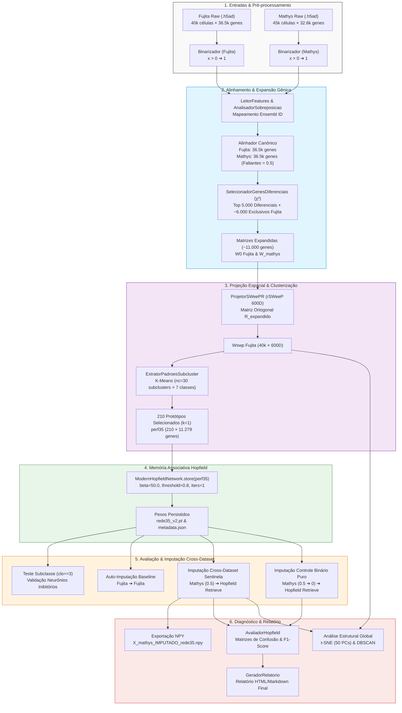
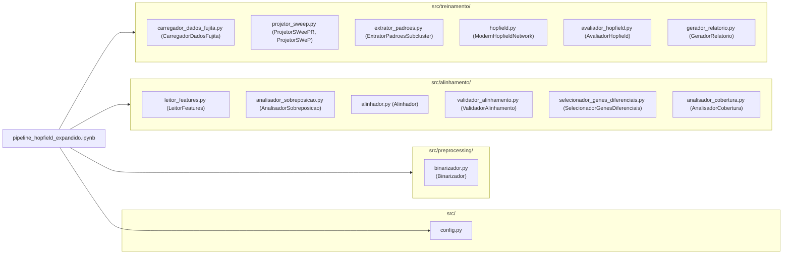

# Documentação Mestre do Pipeline Hopfield Expandido (~11.000 Genes)

> **Projeto:** Pipeline Hopfield Expandido  
> **Arquivo Base:** `pipeline_hopfield_expandido.ipynb` / `pipeline_hopfield_expandido.py`  
> **Status:** Concluído e Documentado  
> **Data:** 30/07/2026  
> **Idioma:** Português do Brasil (PT-BR)  

---

## 1. Resumo Executivo e Contexto Biológico

Este trabalho aborda a **harmonização de dados de sequenciamento de RNA de célula única (scRNA-seq)** e a **imputação de dados transcricionais cross-dataset** entre duas grandes coortes de tecido cerebral humano:
- **Dataset Fujita (~40.000 células, 36.591 genes nativos):** Utilizado como referência de treinamento para construir o atlas de protótipos de memória celular.
- **Dataset Mathys (~45.000 células, 32.643 genes nativos):** Utilizado como dataset alvo para alinhamento e imputação. Contém ~6.289 genes nativos do Fujita que estavam ausentes em seu sequenciamento original.

Para resolver a perda de genes e os efeitos de lote entre os estudos, o pipeline expande o espaço de busca para **~11.000 genes** (Top 5.000 frequentes + ~6.000 genes exclusivos do Fujita) e emprega uma **[[03_Conhecimento/atencao_softmax_hopfield|Modern Hopfield Network]]** (Ramsauer et al., 2020) combinada com a técnica de redução vetorial **[[03_Conhecimento/projecao_rsweep_600d|rSWeeP (600D)]]**. Os genes ausentes no Mathys são preenchidos com o **[[03_Conhecimento/sentinela_meio_genes_ausentes|valor sentinela neutro 0.5]]**, permitindo que a rede reconstrua a expressão biológica correta via atenção contínua Softmax.

---

## 2. Diagrama de Fluxo de Trabalho de Ponta a Ponta (End-to-End Workflow)

---

## 3. Análise Detalhada Seção por Seção (1 a 18)

### Seção 1: Imports e Configuração
- **Objetivo:** Inicializar dependências de sistema (`sys.path`), carregar a configuração central (`src/config.py`), definir a semente aleatória reproduzível (`SEED=42`) e selecionar o dispositivo de execução (PyTorch CPU/GPU).
- **Intuição Biológica:** A reprodutibilidade estocástica é fundamental no processamento de dados transcriptômicos para garantir que variações na clusterização não sejam causadas por inicializações aleatórias.
- **Intuição Técnica:** O ajuste do `sys.path.insert(0, SRC_DIR)` garante a importação limpa dos módulos customizados em `src/`.
- **Sequência:** Deve ser obrigatoriamente a primeira célula para carregar bibliotecas fundamentais antes de qualquer operação.
- **Recursos e Gargalos:** Leve (< 100 MB RAM, execução em milissegundos).

### Seção 2: Binarização (`Binarizador`)
- **Objetivo:** Ler os arquivos `.h5ad` originais e converter as contagens de expressão gênica para matrizes binárias ($x > 0 \rightarrow 1$). Veja **[[03_Conhecimento/binarizacao_expressao_genica|Conceito Atômico]]** e **[[04_Recursos/adrs/adr_001_binarizacao_expressao_genica|ADR 001]]**.
- **Intuição Biológica:** Elimina o ruído de escala contínua e foca a representação nos programas transcricionais ativos (presença/ausência de RNAm).
- **Intuição Técnica:** Evita refazer o processamento pesado caso o arquivo binarizado `.h5ad` já exista em disco.
- **Sequência:** É feita logo no início porque todas as etapas subsequentes (alinhamento, projeção, Hopfield) assumem dados no domínio binário.
- **Recursos e Gargalos:** Requer leitura dos arquivos AnnData originais (~5.8 GB RAM). É limitada por I/O de disco.

### Seção 3: Alinhamento de Espaços Gênicos (`Alinhador`)
- **Objetivo:** Harmonizar os genes dos datasets Fujita e Mathys ordenando-os pela referência canônica do Fujita baseando-se no Ensembl ID, inserindo o valor sentinela `0.5` para genes ausentes no Mathys. Veja **[[03_Conhecimento/alinhamento_ensembl_cross_dataset|Conceito Atômico]]** e **[[04_Recursos/adrs/adr_002_sentinela_meio_genes_ausentes|ADR 002]]**.
- **Intuição Biológica:** Garante a equivalência cromossômica e transcricional entre células coletadas em experimentos ou estudos independentes.
- **Intuição Técnica:** Reduz as matrizes para formatos alinhados e exporta arquivos `.txt` e de rastreamento (`tracking_genes_adicionados_mathys.csv`).
- **Sequência:** Precede a seleção de features para que a contagem de frequências e a unificação ocorram sobre identidades de genes validadas.
- **Recursos e Gargalos:** Leitura e ordenação de 36.591 genes para 85.000 células combinadas. Ocupa ~4 GB RAM durante o salvamento dos `.h5ad`/`.txt`.

### Seção 4: Seleção Expandida (~11.000 Genes)
- **Objetivo:** Selecionar os 5.000 genes com maior poder discriminatório via teste de Qui-Quadrado ($\chi^2$) entre tipos celulares no Fujita e somar a eles os ~6.000 genes do Fujita ausentes no Mathys, gerando a matriz filtrada expandida sem ruído de genes constitutivos. Veja **[[04_Recursos/adrs/adr_006_selecao_diferencial_genes_chi2|ADR 006]]** e **[[04_Recursos/adrs/adr_003_expansao_espaco_genico_11k|ADR 003]]**.
- **Intuição Biológica:** Preserva marcadores que verdadeiramente separam as linhagens celulares (alto ganho de informação) e garante que genes específicos nativos do tecido de referência estejam disponíveis para reconstrução na rede Hopfield.
- **Intuição Técnica:** Escreve as matrizes numpy `.npy` filtradas para Fujita e Mathys.
- **Sequência:** Ocorre após o alinhamento para garantir que os IDs rastreados correspondem exatamente aos índices da matriz.
- **Recursos e Gargalos:** Filtragem e escrita dos arquivos `.npy`. Aloca ~1.8 GB para Fujita e ~2.0 GB para Mathys em formato `float32`.

### Seção 5: Projeção SWeeP (rSWeeP 600D Canônica com Congelamento de Base)
- **Objetivo:** Reduzir a matriz de expressão gênica para 600 dimensões latentes através do algoritmo oficial do pacote R `rSWeeP` (AIBIALab/UFPR), utilizando uma base ortonormal canônica congelada compartilhada entre todos os datasets. Veja **[[03_Conhecimento/projecao_rsweep_600d|Conceito Atômico]]**, **[[04_Recursos/adrs/adr_004_projecao_rsweep_600d_kmeans|ADR 004]]**, **[[04_Recursos/adrs/adr_019_obrigatoriedade_rsweep_r_e_congelamento_orthbase|ADR 019]]** e **[[04_Recursos/adrs/adr_021_centralizacao_orthbase_config_e_reuso_canonico|ADR 021]]**.
- **Intuição Biológica:** Comprime o perfil transcriptômico mantendo com alta fidelidade as relações de distância biológica e similaridade entre tipos celulares (Lema de Johnson-Lindenstrauss).
- **Intuição Técnica:** A projeção é executada via subprocesso R pelo `ProjetorSWeePR`. O arquivo `orthbase_mproj_600d.rds` é centralizado via `src.config.PATH_ORTHBASE_RDS`, gerado deterministicamente na primeira execução e automaticamente reutilizado em todas as etapas subsequentes (Referência, Alvo Sentinela e Alvo Imputado).
- **Sequência:** Deve preceder o carregamento de dados e a extração de protótipos, pois os centroides serão calculados sobre o espaço SWeeP 600D.
- **Recursos e Gargalos:** Projeção esparsa direta OOM-Safe via `Matrix::readMM()` e `rSWeeP::SWeeP()`. Duração típica: ~3 a 15 segundos. Gera matriz tabular de saída `.txt` de ~96 MB.

### Seção 6: Carregamento dos Dados de Treinamento
- **Objetivo:** Carregar em memória a matriz binária $W_0$, os rótulos de tipo celular `labels` e o embedding SWeeP $W_{\text{swp}}$ do Fujita, além da matriz expandida do Mathys ($W_{\text{mathys}}$).
- **Intuição Biológica:** Prepara os vetores que servirão como base para a memória celular de referência e para a validação.
- **Intuição Técnica:** Carrega os arquivos `.npy` salvos anteriormente utilizando `float32` para otimizar o uso da memória.
- **Sequência:** Necessária antes de aplicar o remapeamento de classes e a extração dos protótipos.
- **Recursos e Gargalos:** Aloca ~3.8 GB de RAM para manter $W_0$ e $W_{\text{mathys}}$ simultaneamente.

### Seção 7: Remapeamento de Classes (`clo`)
- **Objetivo:** Remapear classes celulares raras ou não padronizadas para a classe `2` (seguindo o padrão legado `script01_analises_preliminares.m`), resultando em 7 classes principais: Excitatory (1), Endothelial/remapeadas (2), Inhibitory (3), Astrocytes (4), Microglia (5), Oligodendrocytes (6), OPCs (7).
- **Intuição Biológica:** Consolida populações celulares minoritárias em um grupo geral e foca o aprendizado nas 7 linhagens gliais e neuronais dominantes do córtex humano.
- **Intuição Técnica:** Aplica o vetor booleano `~np.isin(clo, [1, 3, 4, 5, 6, 7, 0])` diretamente nos arrays de rótulos do Fujita e Mathys.
- **Sequência:** Precede o K-Means para garantir que o particionamento por subclusters seja feito estritamente nas 7 classes biológicas consolidadas.
- **Recursos e Gargalos:** Leve (vetores de 40k e 45k inteiros, milissegundos).

### Seção 8 & 8b: PCA no Espaço SWeeP e Visualização Scatter
- **Objetivo:** Calcular PCA sem centralização (`Centered=False`) nas 600 dimensões do SWeeP e gerar o scatter plot PC1 × PC2 colorido por `clo`.
- **Intuição Biológica:** Valida se o espaço SWeeP 600D preserva a separabilidade biológica das 7 classes de tipos celulares antes do treinamento da rede.
- **Intuição Técnica:** Utiliza `projetor.usar_sweep_precomputado().aplicar_pca()` e amostra 5.000 células para a renderização rápida do gráfico.
- **Sequência:** Funciona como uma etapa de controle de qualidade (QC) do embedding antes da extração de protótipos.
- **Recursos e Gargalos:** Decomposição PCA rápida em matriz $40.000 \times 600$. Demora ~2 segundos.

### Seção 9: Extração de Protótipos por Subcluster (`perf35`)
- **Objetivo:** Executar K-Means com $nc=30$ subclusters para cada uma das 7 classes biológicas no espaço SWeeP 600D, e selecionar a célula real binária mais próxima ($k=1$) no espaço de 11.000 genes. Veja **[[03_Conhecimento/amostragem_prototipos_kmeans|Conceito Atômico]]**.
- **Intuição Biológica:** Captura a diversidade intra-classe e sub-estados funcionais (ex: sub-camadas de neurônios excitatórios) armazenando 210 padrões prototípicos realistas.
- **Intuição Técnica:** O método `ExtratorPadroesSubcluster` itera sobre as classes e utiliza a função `closervects` para resgatar o índice exato da célula binária no array original $W_0$.
- **Sequência:** Produz a matriz `perf35` ($210 \times 11.279$) que é o parâmetro de entrada exigido para armazenar na rede Hopfield.
- **Recursos e Gargalos:** 7 execuções de K-Means (30 centroides cada). Leva ~10 a 20 segundos. Gera matriz leve de ~9,4 MB.

### Seção 10: Treinamento da Rede Hopfield (`rede35`)
- **Objetivo:** Armazenar os 210 padrões prototípicos na `ModernHopfieldNetwork` ($\beta=50.0$, $\text{iters}=1$, $\text{binary}=True$, $\text{threshold}=0.8$) e salvar o modelo e os metadados em disco. Veja **[[04_Recursos/adrs/adr_005_rede_hopfield_moderna_parametros|ADR 005]]**.
- **Intuição Biológica:** Indexa as memórias biológicas estáveis dos tipos celulares no espaço de atenção.
- **Intuição Técnica:** A rede não utiliza retropropagação iterativa; o armazenamento consiste em registrar o tensor de padrões $\Xi$ na classe PyTorch e persisti-lo em `rede35_v2.pt` e `rede35_v2_metadata.json`.
- **Sequência:** Finaliza o treinamento do modelo e o deixa pronto para receber consultas (queries).
- **Recursos e Gargalos:** Instantâneo (< 0.1 segundo). Ocupa ~9,4 MB de espaço em disco e memória.

### Seção 10b: Alternativa — Carregar Rede Pré-treinada
- **Objetivo:** Carregar os pesos da rede e os metadados salvos previamente sem refazer o K-Means.
- **Intuição Técnica:** Permite pular o re-treinamento quando executado em ambientes restritos, utilizando `ModernHopfieldNetwork.carregar_com_metadados()`.
- **Sequência:** Opcional. Substitui as Seções 9 e 10.
- **Recursos e Gargalos:** Carregamento rápido em milissegundos.

### Seção 11: Teste em Subclasse (Neurônios Inibitórios — `clo == 3`)
- **Objetivo:** Avaliar a capacidade de recuperação da rede em uma amostra de 1.000 células da classe 3 (Neurônios Inibitórios).
- **Intuição Biológica:** Teste de validação rápida para confirmar se células de uma classe específica convergem para os protótipos de sua própria linhagem.
- **Intuição Técnica:** Utiliza `wsort` para embaralhar a classe e executa `rede35.retrieve(Wk4[:1000])`. Classifica atribuindo o rótulo do protótipo com menor distância L2.
- **Sequência:** Serve como sanidade inicial antes de rodar os testes massivos de auto-imputação e cross-dataset.
- **Recursos e Gargalos:** Recuperação de 1.000 vetores. Demora ~1 segundo.

### Seção 12: Auto-imputação (Fujita $\rightarrow$ Fujita)
- **Objetivo:** Submeter todas as 40.000 células do Fujita à rede treinada com os próprios protótipos do Fujita para calcular o baseline de acurácia interna.
- **Intuição Biológica:** Mede a capacidade máxima de re-identificação do modelo quando não há efeito de lote ou descontinuidade de dados.
- **Intuição Técnica:** Executa `rede35.retrieve(carregador.W0, batch_size=2048)` e avalia com `AvaliadorHopfield`. Libera a matriz temporária da memória com `del Wrecuperado_f` e `gc.collect()`.
- **Sequência:** Fornece o teto de desempenho (upper bound) para comparar com os testes cross-dataset.
- **Recursos e Gargalos:** Processa 40.000 células em lotes de 2.048. Aloca ~1.8 GB temporários na recuperação.

### Seção 13: Imputação Cross-Dataset (Modelo Fujita → Dados Mathys com Sentinela 0.5)
- **Objetivo:** Submeter a matriz do Mathys (com 6.289 genes ausentes preenchidos com a sentinela neutra `0.5`) à rede Hopfield treinada com o Fujita, reconstruindo e imputando a expressão dos genes ausentes no Mathys. Veja **[[03_Conhecimento/sentinela_meio_genes_ausentes|Conceito Atômico]]**.
- **Intuição Biológica:** Testa a hipótese central da pesquisa: se a memória associativa da Hopfield (treinada com os protótipos do Fujita) consegue preencher lacunas de sequenciamento no dataset Mathys baseando-se no padrão global dos genes observados.
- **Intuição Técnica:** Executa `rede35.retrieve(W_mathys, batch_size=1024)`. Substitui os valores sentinelas ($0.5$) pelos valores reconstruídos via `np.where(mask_sentinela, Wrecuperado_m, W_mathys)`. Salva o resultado final em `X_mathys_IMPUTADO_rede35.npy`.
- **Sequência:** Etapa principal de produção do experimento.
- **Recursos e Gargalos:** Ponto crítico de consumo de RAM. A matriz `Wrecuperado_m` aloca ~2.0 GB. Exige a execução imediata de `del Wrecuperado_m` e `gc.collect()` ao final para evitar estouro de memória.

### Seção 14: Imputação Cross-Dataset Controle (Modelo Fujita → Dados Mathys Binário Puro 0.5 $\rightarrow$ 0)
- **Objetivo:** Converter os valores sentinelas de $0.5 \rightarrow 0$ antes da recuperação e comparar a matriz de confusão e acurácia.
- **Intuição Biológica:** Avalia se assumir que os genes ausentes estão inativos ($0$) prejudica a precisão em comparação com o uso do valor sentinela neutro ($0.5$).
- **Intuição Técnica:** Cria cópia temporária `W_mathys_bin = np.where(mask_sentinela, 0.0, W_mathys)` e executa a recuperação com `AvaliadorHopfield`.
- **Sequência:** Estudo de ablação obrigatório para comprovar a eficácia da sentinela.
- **Recursos e Gargalos:** Alocação de ~2.0 GB RAM durante a recuperação do lote, seguida de limpeza `del` + `gc.collect()`.

### Seção 15: Diagnósticos e Mapeamento Prototípico
- **Objetivo:** Mapear detalhadamente a frequência com que células de cada tipo do Mathys se associam aos protótipos do modelo Fujita, calculando a fração de genes não-sentinela alterados.
- **Intuição Biológica:** Revela se há confusões específicas entre subclasses de neurônios ou entre glia e neurônios.
- **Intuição Técnica:** Constrói DataFrame Pandas `CM_diag` de dimensão $7 \times 7$ cruzando rótulos reais e preditos.
- **Sequência:** Consolida os resultados qualitativos das seções 13 e 14.
- **Recursos e Gargalos:** Leve (cálculos na CPU em milissegundos).

### Seção 16: Análise Comparativa Integrada e Matrizes de Confusão
- **Objetivo:** Plotar lado a lado as matrizes de confusão (contagens absolutas e normalizadas) dos três cenários (Fujita$\rightarrow$Fujita, Fujita$\rightarrow$Mathys Sentinela 0.5, e Fujita$\rightarrow$Mathys Binário 0).
- **Intuição Biológica:** Permite visualização imediata da preservação das diagonalizações biológicas.
- **Intuição Técnica:** Gera uma figura Matplotlib $3 \times 2$ contendo 6 subplots de matrizes de confusão.
- **Sequência:** Síntese visual de todas as etapas de avaliação anterior.
- **Recursos and Gargalos:** Geração de gráficos Matplotlib (~2 segundos).

### Seção 16b & 16c: Análise de Estrutura Global (t-SNE & DBSCAN)
- **Objetivo:** Reduzir os 50 primeiros componentes principais do Fujita para 2D via t-SNE e aplicar DBSCAN não-supervisionado para calcular o Adjusted Rand Index (ARI).
- **Intuição Biológica:** Confirma se os tipos celulares formam aglomerados naturais de densidade independentemente dos rótulos supervisionados.
- **Intuição Técnica:** Executa `TSNE(n_components=2, perplexity=40)` em 5.000 células e calcula `DBSCAN(eps=2.5, min_samples=15)`.
- **Sequência:** Avaliação complementar de validação estrutural do espaço de representação.
- **Recursos e Gargalos:** Cálculo do t-SNE em CPU multithread (~20 a 40 segundos).

### Seção 17: Métrica de Reconstrução dos Genes Ausentes
- **Objetivo:** Analisar a distribuição e contagem de ativações (expressão de uns) nos 6.289 genes que foram imputados pela rede Hopfield no Mathys.
- **Intuição Biológica:** Verifica se os genes reconstruídos seguem distribuições biológicas plausíveis ou se foram super-imputados.
- **Intuição Técnica:** Plota histograma da frequência de ativação por célula (`recuperados_count`).
- **Sequência:** Pós-processamento dos dados exportados na Seção 13.
- **Recursos e Gargalos:** Leve (< 1 segundo).

### Seção 18: Geração do Relatório Final (`GeradorRelatorio`)
- **Objetivo:** Compilar todas as métricas dos três avaliadores e salvar um relatório consolidado em HTML/Markdown no diretório `outputs/relatorio/`.
- **Intuição Biológica:** Documenta formalmente as descobertas do experimento para compartilhamento na equipe de pesquisa.
- **Intuição Técnica:** Executa `relatorio.gerar(avaliador_f, avaliador_m, avaliador_m_bin)`.
- **Sequência:** Última célula do notebook.
- **Recursos e Gargalos:** Leve (< 1 segundo).

---

## 4. Oportunidades de Melhoria e Roteiro de Evolução

### 4.1. Oportunidades do Ponto de Vista Biológico
1. **Seleção Inteligente de Features por Expressão Diferencial (Ganho de Informação / Chi2):**
   - *Status:* **[CONCLUÍDO e IMPLEMENTADO via ADR 006]**. A seleção por frequência simples foi substituída pelo `SelecionadorGenesDiferenciais` ($\chi^2$), eliminando o ruído de genes constitutivos (*housekeeping*) e aumentando a precisão da representação espacial para a rede Hopfield.
2. **Desagrupamento do Garbage Collection (Classe 2):**
   - *Problema:* Células raras (ex: pericitos, células musculares lisas) são mapeadas para a classe `2` (Endothelial), o que polui o F1-score desse grupo.
   - *Solução:* Isolar formalmente os tipos celulares em 9 ou 10 classes limpas, evitando a contaminação da classe endotelial.

### 4.2. Oportunidades do Ponto de Vista Técnico de Programação e Desempenho
1. **Representação por Matrizes Esparsas (`scipy.sparse` / PyTorch Sparse):**
   - *Problema:* As matrizes binárias de $40.000 \times 11.279$ consomem ~1.8 GB de RAM cada em formato denso `float32`.
   - *Solução:* Como a densidade de uns na matriz binária é de apenas ~15-25%, a conversão para `csr_matrix` ou `torch.sparse` reduzirá o consumo de RAM em até 75%, permitindo processar conjuntos com centenas de milhares de células.
2. **Gerenciamento Estrito de Memória RAM:**
   - *Problema:* Matrizes grandes reconstruídas (`Wrecuperado_m`) acumulam em RAM durante a execução contínua do notebook.
   - *Solução:* Inserir rotinas automáticas de limpeza `del` + `gc.collect()` imediatamente após a avaliação de cada cenário de imputação.
3. **Aceleração GPU no Retrieve da Hopfield:**
   - *Problema:* Quando o dispositivo configurado é CPU, a atenção Softmax Hopfield em 45.000 células é executada em lotes sequenciais.
   - *Solução:* Garantir a execução em GPUs PyTorch CUDA para acelerar a multiplicação de matrizes $\xi \cdot \Xi^T$ em até 20 vezes.

---

## 5. Módulos Auxiliares (`src/`)

### Visão Geral de Dependências e Importações

