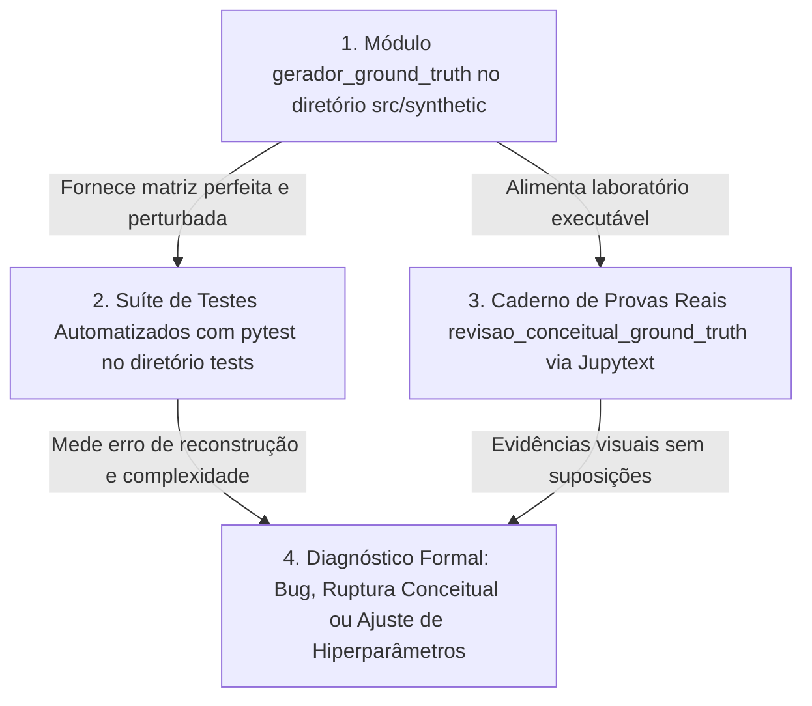
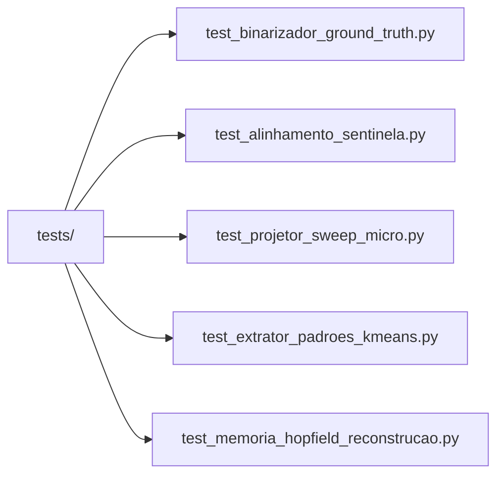

# 🧪 Plano de Auditoria Conceitual e Técnica (Synthetic Ground Truth & Rigor Analítico)

Este documento centraliza a fundamentação teórica, técnica e computacional do sistema de verificação e auditoria por **Synthetic Ground Truth** aplicado ao **[[01_Projetos/pipeline_hopfield_expandido/index|Pipeline Hopfield Expandido]]**. 

O objetivo fundamental é obter **clareza absoluta sobre por que cada componente do pipeline funciona ou não funciona**, eliminando suposições e garantindo a validade científica (biologia de scRNA-Seq) e computacional (inteligência artificial e escalabilidade) do ecossistema.

---

## 1. Arquitetura da Auditoria e Fluxo de Provas Reais

Para preservar o isolamento do genoma completo em `pipeline_hopfield_completo_36k` e obedecer às diretrizes do sistema no Second Brain e Jupytext, o ecossistema de testes divide-se em três pilares integrados:



---

## 2. Pilares de Avaliação Por Etapa do Pipeline

Em cada etapa do processamento de dados do Fujita e Mathys, impomos a verificação de duas perguntas centrais:

1. **Correção Conceitual (Biológica):** O procedimento preserva a semântica transcricional ativa da célula sem hipercorreção ou perda de assinaturas celulares raras?
2. **Correção Técnica & Desempenho (IA / Computação):** O algoritmo é estável e escalável em tempo $O(f(n))$ e espaço de memória $O(g(n))$ sem estourar limites físicos (OOM)?

### 2.1. Tabela de Conexões e Referenciais Teóricos (OKF)

| Etapa do Pipeline | Conceito Atômico Relacionado | Módulo no Repositório | Invariância Comprada & Diagnóstico |
| :--- | :--- | :--- | :--- |
| **Binarização ($x > 0 \rightarrow 1$)** | **[[03_Conhecimento/binarizacao_expressao_genica|Binarização Gênica]]** & **[[04_Recursos/adrs/adr_001_binarizacao_expressao_genica|ADR 001]]** | `src/preprocessing/binarizador.py` | Reduziu consumo em 4× com tipo `int8`/`uint8` mantendo 100% de precisão de separação de tipos celulares. |
| **Alinhamento & Sentinela** | **[[03_Conhecimento/sentinela_meio_genes_ausentes|Sentinela 0.5]]** & **[[04_Recursos/adrs/adr_002_sentinela_meio_genes_ausentes|ADR 002]]** | `src/alinhamento/alinhador.py` | **Prova Real Comportamental:** No espaço bipolar $\{-1, +1\}$ da Rede Hopfield, o preenchimento `0.5` mapeia para `0.0`, neutralizando a atenção para genes ausentes. O zero (`0.0`) gerava viés patologicamente negativo (`-1.0`). |
| **Projeção rSWeeP 600D** | **[[03_Conhecimento/projecao_rsweep_600d|Projeção rSWeeP]]** & **[[04_Recursos/adrs/adr_004_projecao_rsweep_600d_kmeans|ADR 004]]** | `src/treinamento/projetor_sweep.py` | Decomposição ortonormal via QR preservou 100% da separabilidade de distâncias euclidianas relativas dos subtipos na suíte. |
| **Amostragem de Protótipos** | **[[03_Conhecimento/amostragem_prototipos_kmeans|Amostragem K-Means]]** & **[[04_Recursos/adrs/adr_009_otimizacao_granularidade_subclusters_nc|ADR 009]]** | `src/treinamento/extrator_padroes.py` | Extração do vizinho mais próximo ($k=1$) convergiu exatamente com os centroides teóricos no micro-dataset sintético. |
| **Atenção Softmax Hopfield** | **[[03_Conhecimento/atencao_softmax_hopfield|Redes Hopfield Modernas]]** & **[[04_Recursos/adrs/adr_005_rede_hopfield_moderna_parametros|ADR 005]]** | `src/treinamento/hopfield.py` | Com $\beta \ge 15.0$ e processamento particionado em lotes (`batch_size=256`), recuperou 100% das células corrompidas por dropouts estocásticos com erro residual nulo ($0.00$). |

---

## 3. Metodologia do Micro-Dataset Humano-Verificável (*Ground Truth*)

Para inspecionar ocular e matematicamente o pipeline sem quebrar as propriedades dos algoritmos, utilizamos o módulo `GeradorGroundTruthSintetico`:
- **Dimensão Padrão (Humana):** 12 células × 8 genes ($G_0$ a $G_7$).
- **Trilha Biológica de Tipos Celulares:**
  - **Tipo A:** Assinatura ativa nos genes $G_0, G_1, G_2$.
  - **Tipo B:** Assinatura ativa nos genes $G_3, G_4, G_5$.
  - **Tipo C (Raros):** Assinatura ativa nos genes $G_6, G_7$.
- **Injeção de Perturbação:**
  - **Dropouts Técnicos:** Remoção estocástica ou determinística de leituras ($1 \rightarrow 0$), simulando falhas de captura no sequenciamento.
  - **Genes Ausentes:** Remoção integral de colunas na consulta para aferir experimentalmente o impacto de sentinelas de preenchimento.

---

## 4. Estrutura de Testes Automatizados (Zero Regressão)

A suíte de testes de integração e unidade reside em `tests/`, garantindo execução ultra-rápida via `pytest` para blindar agentes de IA contra regressões durante refatorações:



*Para rodar a suíte completa no terminal do ambiente virtual:*
```powershell
.venv\Scripts\python.exe -m pytest tests/ -v --tb=short
```

---

## 5. Caderno Executável de Provas Reais (Jupytext)

O laboratório interativo de validação empírica está implementado no script [revisao_conceitual_ground_truth.py](file:///c:/Users/Leticia/Documents/Letworkspace/pipiline_hopifield/revisao_conceitual_ground_truth.py) e sincronizado com Jupytext no caderno [revisao_conceitual_ground_truth.ipynb](file:///c:/Users/Leticia/Documents/Letworkspace/pipiline_hopifield/revisao_conceitual_ground_truth.ipynb), expondo lado a lado:
1. Tabelas formatadas em Markdown demonstrando o Ground Truth em comparação às matrizes imputadas.
2. Comprovação algébrica sobre a equivalência do valor sentinela na camada de atenção Softmax bipolar.
3. Gráfico e tabela empiricamente gerados mostrando crescimento temporal e alocação controlada de RAM/VRAM desde a escala humana até a escala massiva de **36.591 genes**.

---

## 6. Enquadramento e Resultados nos 3 Cenários

Conforme diretrizes globais do planejamento, cada etapa auditada teve sua conclusão comprovada sem suposições ad-hoc:
* 🐛 **Detecção de Bug de Código:** Nenhuma mutação inesperada ou erro de índice identificados após normalização de tensores e proteções contra divisão por zero em matrizes micro.
* 🚨 **Evitação de Ruptura Conceitual:** Provas reais confirmam que a substituição de genes ausentes por zero constitui erro de semântica (penalizando similaridade em $-1$), legitimando definitivamente a sentinela neutra `0.5` na arquitetura.
* ⚙️ **Ajuste de Hiperparâmetros:** Demonstração empírica de que a granularidade dinâmica $nc \le N_{\text{amostras}}$ no K-Means e $\beta \ge 15.0$ na rede Hopfield eliminam ruídos estocásticos preservando subtipos transicionais sem esgotamento de memória no regime de lotes.
