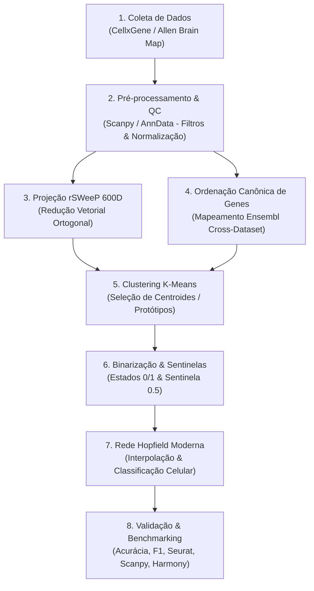

# 🎓 Projeto de Mestrado: Integração Transcriptômica e Redes Hopfield Modernas (UFPR)

> **Instituição:** Universidade Federal do Paraná (UFPR)  
> **Discente:** Leticia Astolpho Silvano  
> **Orientador:** Prof. Dr. Roberto Tadeu Raittz  
> **Coorientadora:** Dra. Camila Pereira Perico  
> **Linha de Pesquisa:** Inteligência Artificial aplicada à Bioinformática  
> **Tema:** Desenvolvimento de métodos computacionais em biologia de sistemas  

---

## 🎯 1. Título do Projeto

**Aplicação de Projeções SWeeP e machine learning para recuperação de perfis transcriptômicos e integração de conjuntos de dados de RNA-seq**

---

## 🔬 2. Resumo Executivo & Justificativa Científica

As análises de transcriptômica por sequenciamento de RNA de célula única (**scRNA-seq**) trouxeram uma mudança de paradigma em relação ao *bulk RNA-seq*, permitindo a investigação da expressão gênica em resolução unicelular e a identificação de tipos celulares raros, subpopulações tumorais e trajetórias dinâmicas de diferenciação.

Contudo, a análise de scRNA-seq enfrenta gargalos fundamentais:
1. **Alta Dimensionalidade & Custo Computacional:** Processar simultaneamente dezenas de milhares de genes em centenas de milhares de células gera matrizes gigantescas de *Big Data*.
2. **Esparsidade & Ruído Técnico (*Dropouts*):** A ínfima quantidade de RNA extraída por célula resulta no fenômeno de *dropout*, gerando contagens nulas artificiais para genes que estavam ativamente expressos.
3. **Efeito de Lote (*Batch Effect*):** Variações técnicas entre experimentos, dias, operantes, reagentes e plataformas (ex: *droplet-based* 10x Genomics vs *plate-based* Smart-seq2) fazem com que as células se agrupem pela sua origem experimental em vez de sua identidade biológica real.
4. **Limitações das Ferramentas Atuais (Deep Learning):** Métodos de aprendizado profundo (ex: VAEs como `scVI`, `scGen`) frequentemente sofrem de **hipercorreção** (*overcorrection* — forçando o alinhamento de lotes e destruindo a variação biológica real) e padecem de falta de interpretabilidade, operando como modelos de **caixa-preta**.

---

## 🧠 3. Por Que Redes Hopfield Modernas + Projeções SWeeP?

Para solucionar esses gargalos, este projeto propõe uma arquitetura inovadora que associa:

* 📐 **Projeção SWeeP (Spaced Words Projection):** Desenvolvida no AIBIALab/UFPR, o método **SWeeP** reduz drasticamente a dimensionalidade da matriz de expressão (ex: de ~36.000 genes para 600 dimensões) preservando as distâncias geométricas relativas pelo **Lema de Johnson-Lindenstrauss** com baixíssimo custo computacional. Veja **[[04_Recursos/projecao_sweep/documentacao_oficial_sweep|Documentação Oficial do SWeeP]]** e **[[03_Conhecimento/projecao_rsweep_600d|Conceito Atômico da Projeção rSWeeP]]**.
* 🧠 **Redes Hopfield Modernas (Dense Associative Memory):** Fundamentadas nos trabalhos de **[[04_Recursos/artigos/hopfield_1982_neural_networks_emergent_abilities|Hopfield (1982)]]** e **[[04_Recursos/artigos/krotov_hopfield_2016_dense_associative_memory|Krotov & Hopfield (2016)]]**, as redes associativas densas superam a limitação clássica de capacidade ($K_{\max} \approx 0.14N$) via funções de interação de ordem superior/exponencial ($K_{\max} \propto N^{n-1}$). Elas operam como memórias associativas de alta capacidade, capazes de armazenar assinaturas gênicas (protótipos), recuperar padrões biológicos completos a partir de dados ruidosos/incompletos (*dropouts*) e integrar conjuntos de dados sem cair na hipercorreção ou opacidade algorítmica.

---

## 🎯 4. Objetivos

### 4.1. Objetivo Geral
Desenvolver e validar um *pipeline* computacional em Python baseado em técnicas de *machine learning* e projeções de **SWeeP** para a integração de dados transcriptômicos distintos, visando à captura de assinaturas gênicas representativas de tipos celulares e à mitigação da limitada interpretabilidade.

### 4.2. Objetivos Específicos
1. Integrar conjuntos de dados distintos de scRNA-seq utilizando **Redes Hopfield Modernas**;
2. Remover o efeito de lote (*batch effect*) mantendo a integridade biológica real;
3. Reconstruir padrões gênicos de dados ausentes ou afetados por *dropout*;
4. Testar as projeções **SWeeP** para capturar assinaturas gênicas representativas de tipos celulares;
5. Validar a performance e a escalabilidade das projeções SWeeP em matrizes de expressão transcriptômica.

---

## 📐 5. Fluxo Metodológico do Pipeline (7 Etapas)

O fluxo de trabalho do projeto é estruturado nas seguintes etapas encadeadas:

### Detalhamento das Etapas:
1. **Coleta de Dados:** Obtenção de matrizes de scRNA-seq de repositórios públicos (Allen Brain Map, CellxGene), incluindo arquivos de anotação e metadados.
2. **Pré-processamento:** Limpeza e controle de qualidade via Python (`Scanpy` e `AnnData`), remoção de células com alta fração mitocondrial, remoção de células com $<500$ UMIs e normalização.
3. **Projeção via R-SWeeP:** Redução de dimensionalidade sobre as matrizes de expressão. O primeiro dataset (46.289 células $\times$ 36.601 genes) e o segundo dataset (32.000 células $\times$ 32.000 genes) são ambos reduzidos para 600 dimensões com baixo custo computacional.
4. **Ordenação dos Conjuntos de Dados:** Reordenação estrita dos genes via IDs Ensembl para garantir alinhamento exato $1:1$ entre a matriz-base e a matriz-alvo. Veja **[[03_Conhecimento/alinhamento_ensembl_cross_dataset|Alinhamento Ensembl]]**.
5. **Clustering K-means & Extração de Protótipos:** Agrupamento no espaço reduzido SWeeP e seleção dos 10 indivíduos com menor distância euclidiana em relação ao centroide de cada cluster, capturando a assinatura gênica do grupo. Veja **[[03_Conhecimento/amostragem_prototipos_kmeans|Amostragem de Protótipos via K-Means]]**.
6. **Binarização da Matriz de Expressão:** Atribuição de valores binários ($0$ para genes ausentes/dropouts, $1$ para genes expressos) para atender ao requisito de entrada da rede Hopfield. Veja **[[03_Conhecimento/binarizacao_expressao_genica|Binarização de Expressão Gênica]]** e **[[03_Conhecimento/sentinela_meio_genes_ausentes|Sentinela 0.5]]**.
7. **Modelagem Hopfield & Validação:** Treinamento da Rede Hopfield Moderna para memorização dos protótipos e restauração de estados. Validação por acurácia, F1-score, ROC-AUC, taxa de reconstrução e comparação com ferramentas consolidadas (`Harmony`, `Seurat`, `Scanpy`).

---

## 📅 6. Cronograma de Execução (24 Meses)

| Etapa | Atividade | Período (Meses) |
| :--- | :--- | :---: |
| 1. Planejamento | Levantamento bibliográfico, definição do escopo e alinhamento | 1 e 2 |
| 2. Coleta de dados | Obtenção de dados transcriptômicos públicos | 3 e 4 |
| 3. Pré-processamento | Limpeza, filtro de células, remoção mitocondrial/UMI e normalização | 5 e 6 |
| 4. Projeção SWeeP | Implementação e otimização do script de redução de dimensionalidade | 7 e 8 |
| 5. Modelagem Hopfield | Desenvolvimento, treinamento e binarização da rede | 9 a 12 |
| 6. Clustering K-means | Definição de clusters, centroides e assinatura gênica | 11 a 13 |
| 7. Integração e Validação | Interpolação de dados ausentes e testes de performance | 14 a 16 |
| 8. Comparação | Benchmarking com ferramentas de referência (Seurat, Scanpy, Harmony) | 17 a 18 |
| 9. Redação (Parte I) | Estruturação e escrita dos capítulos iniciais e metodologia | 19 a 20 |
| 10. Redação (Parte II) | Resultados, discussão e revisão com orientadores | 21 a 22 |
| 11. Finalização | Formatação final, depósito e preparação para a defesa | 23 a 24 |

---

## 🔗 7. Conexões no Grafo de Conhecimento

- **Projeto Prático no Repositório:** **[[01_Projetos/pipeline_hopfield_expandido/index|Pipeline Hopfield Expandido]]**
- **Arquitetura do Sistema:** **[[01_Projetos/pipeline_hopfield_expandido/arquitetura_do_sistema|Documento de Arquitetura do Sistema]]**
- **Ferramenta SWeeP / rSWeeP:** **[[04_Recursos/projecao_sweep/documentacao_oficial_sweep|Documentação Oficial SWeeP (UFPR)]]**
- **Artigos Científicos de Suporte:**
  - **[[04_Recursos/artigos/hopfield_1982_neural_networks_emergent_abilities|Hopfield (1982) — Neural Networks & Emergent Collective Computational Abilities]]**
  - **[[04_Recursos/artigos/krotov_hopfield_2016_dense_associative_memory|Krotov & Hopfield (2016) — Dense Associative Memory for Pattern Recognition]]**
- **Conceitos Atômicos Relacionados:**
  - **[[03_Conhecimento/projecao_rsweep_600d|Projeção rSWeeP 600D]]**
  - **[[03_Conhecimento/atencao_softmax_hopfield|Atenção Softmax Hopfield]]**
  - **[[03_Conhecimento/binarizacao_expressao_genica|Binarização de Expressão Gênica]]**
  - **[[03_Conhecimento/amostragem_prototipos_kmeans|Amostragem de Protótipos K-Means]]**
  - **[[03_Conhecimento/alinhamento_ensembl_cross_dataset|Alinhamento Canônico Ensembl]]**
