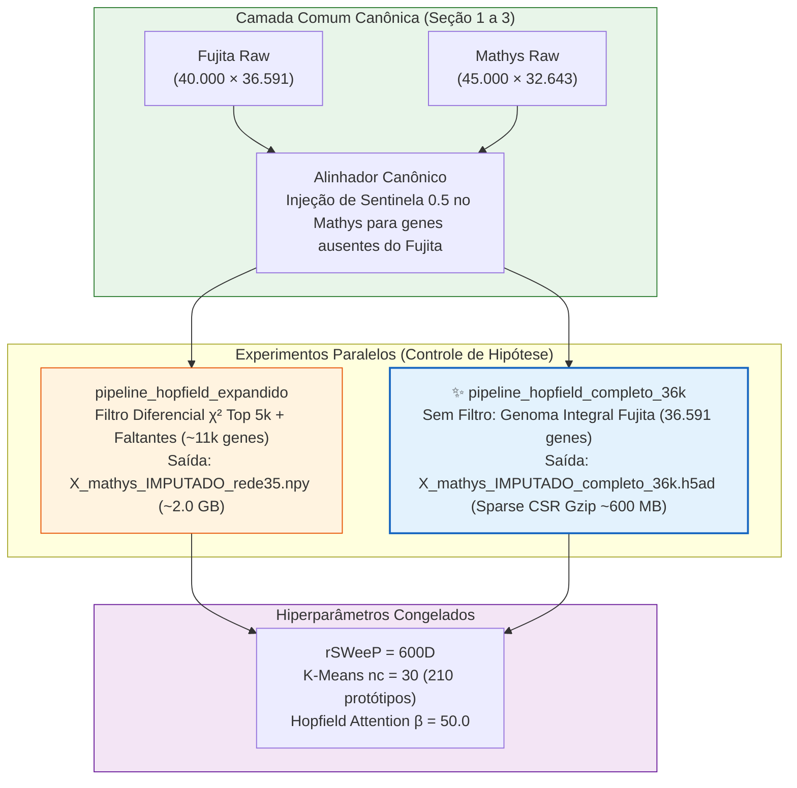

# ADR 007: Experimento de Controle Científico com o Espaço Gênico Completo (36.591 Genes) e Serialização Esparsa `.h5ad`

## 1. Contexto e Motivação
Até o momento, o nosso pipeline principal ([[01_Projetos/pipeline_hopfield_expandido/arquitetura_do_sistema|pipeline_hopfield_expandido]]) realizava uma seleção diferencial baseada no teste de Qui-Quadrado ($\chi^2$) e ganho de informação para reter os Top 5.000 genes mais discriminatórios somados aos genes ausentes no Mathys, alcançando um espaço de aproximadamente 11.000 genes (conforme [[04_Recursos/adrs/adr_006_otimizacao_imputacao_chi2|ADR 006]]).
Entretanto, para validar se a restrição dimensional de ~11k genes pode estar subtraindo sinais sutis na matriz de atenção da [[03_Conhecimento/modern_hopfield_network|Modern Hopfield Network]], faz-se indispensável executar um teste de **genoma completo** utilizando a totalidade dos **36.591 genes nativos do dataset Fujita**, preservando o preenchimento sentinela de `0.5` no dataset Mathys para todos os genes faltantes na interseção.

---

## 2. Decisões Tomadas

1. **Coexistência Isolada de Pipelines via Jupytext:**
   - Criamos o novo pipeline autônomo e pareado [pipeline_hopfield_completo_36k.ipynb](file:///c:/Users/Leticia/Documents/Letworkspace/pipiline_hopifield/pipeline_hopfield_completo_36k.ipynb) e [pipeline_hopfield_completo_36k.py](file:///c:/Users/Leticia/Documents/Letworkspace/pipiline_hopifield/pipeline_hopfield_completo_36k.py). O pipeline expandido de 11k permanece inalterado para permitir benchmarking limpo e posterior comparação de F1-Score e perfil de memória.

2. **Tratamento de Sobreposição e Valores Sentinela:**
   - O espaço de referência é estritamente de 36.591 colunas (o total nativo de Fujita).
   - O Mathys é alinhado recebendo o valor sentinela `0.5` nos ~6.289 genes nativos do Fujita ausentes em sua amostragem. Genes exclusivos do Mathys continuam excluídos, uma vez que a memória de Hopfield (treinada unicamente sobre Fujita) não possui protótipos de comparação para dimensões alienígenas.

3. **Controle Científico Rigoroso de Hiperparâmetros:**
   - Mantiveram-se estritamente idênticos os parâmetros da redução e clusterização: **rSWeeP em 600 dimensões**, **K-Means com $nc=30$ subclusters** por tipo celular (resultando em 210 protótipos) e fator de temperatura **$\beta = 50.0$** na atenção da rede Hopfield. Assim, a variável isolada em observação é exclusivamente o número de colunas gênicas.

4. **Gestão Agressiva de Memória (OOM Safe) na Imputação:**
   - Em 45.000 células por 36.591 genes em `float32`, uma única matriz consome ~6,6 GB de RAM de sistema. Durante a imputação cross-dataset na Seção 13 e 14, reduzimos o tamanho do lote para `batch_size=512`, processando substituições vetoriais por blocos com liberação ativa de ponteiros via `gc.collect()`.

5. **Serialização Eficiente em Disco via Matriz Esparsa `.h5ad`:**
   - Abandonamos a exportação de arquivos binários densos `.npy` e TXTs de 6,6 GB no final da imputação de 36k genes. A saída final da Seção 13 agora é exportada como arquivo **`.h5ad` (AnnData)** munido de matriz esparsa CSR (`scipy.sparse.csr_matrix`) com compressão `gzip`, obtendo uma economia superior a 90% em espaço de armazenamento físico sem perda de metadados celulares.

---

## 3. Diagrama de Fluxo (Mermaid)

---

## 4. Consequências e Próximos Passos
- **Positivas:** O ecossistema agora suporta estudos comparativos instantâneos em larga escala de dimensionalidade; a leitura e gravação da matriz imputada de 36k fica muito mais rápida e leve em disco.
- **Riscos Mitigados:** O consumo de memória de vídeo e RAM principal está blindado pelo chunking de 512 células, prevenindo exceções de Out of Memory.
- **Conexão no Grafo do Segundo Cérebro:** Deve ser indexada no índice de recursos [[04_Recursos/adrs/index]] e referenciada no documento mestre [[01_Projetos/pipeline_hopfield_expandido/arquitetura_do_sistema]].
