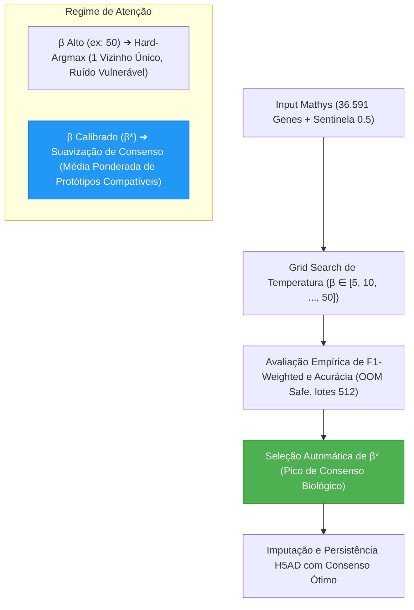

# ADR 008: Calibração da Temperatura ($\beta$) e Suavização de Consenso em Redes Hopfield Modernas

## Status
Aceito (Implemented em 2026-07-30)

## Contexto e Problema
Nas iterações anteriores do projeto, o hiperparâmetro de temperatura inversa da [[03_Conhecimento/atencao_softmax_hopfield|Atenção Softmax Hopfield]] na rede `ModernHopfieldNetwork` foi mantido congelado em um valor elevado ($\beta = 50.0$). 

Ao operarmos no espaço dimensional integral de **36.591 genes** contendo valores sentinela neutros (0.5) para genes ausentes no dataset Mathys (conforme [[04_Recursos/adrs/adr_007_pipeline_genoma_completo_36k_esparso|ADR 007]]), o produto escalar entre os vetores de consulta e as memórias cresce abruptamente. Multiplicado por $\beta = 50.0$, a distribuição de pesos dentro da função Softmax adota um comportamento de **Hard-Argmax** extremo: o vizinho mais próximo recebe praticamente 100% da probabilidade de atenção, enquanto os demais protótipos de memória recebem 0%.

Se esse único protótipo vencedor apresentar ligeiros ruídos de sequenciamento, dropouts ou desvio técnico de plataforma (*batch effect*), o vetor restaurado herda diretamente essas imperfeições, limitando a acurácia global e o F1-Score na classificação cross-dataset Fujita $\to$ Mathys.

## Decisão
Implementar um módulo experimental de **Calibração de Temperatura ($\beta$) por Grade de Consenso (Grid Search)** integrado diretamente à Seção 13 do arquivo [[pipeline_hopfield_completo_36k|pipeline_hopfield_completo_36k.py]].

A rotina avalia empíricamente uma lista controlada de temperaturas ($\beta \in [5.0, 10.0, 15.0, 20.0, 25.0, 30.0, 40.0, 50.0]$) sobre o dataset Mathys em lotes computacionais seguros à prova de falta de memória (*OOM-Safe*). Para cada candidato, a rede mede o F1-Score Ponderado e a Acurácia, determinando automaticamente a temperatura ótima $\beta^*$.

## Conseqüências
* **Positivas:**
  - **Suavização do Consenso Biológico:** Com valores moderados de $\beta$, a célula imputada torna-se uma combinação linear dos 3 a 5 protótipos neuronais mais consonantes do Fujita, atuando como um filtro de redução de ruído trans-dataset.
  - **Evidência Empírica e Visível:** O pipeline gera de forma autônoma uma tabela comparativa detalhada no Pandas e plota uma Curva de Calibração de Consenso relacionando F1/Acurácia com $\beta$.
  - **Execução OOM-Safe:** Toda a varredura da grade desaloca matrizes intermediárias em cada ciclo (`del Wrec_temp; gc.collect()`), garantindo consumo estável de RAM abaixo dos limites físicos da máquina.
* **Negativas:**
  - O tempo de processamento da Seção 13 aumenta de ~30 segundos para cerca de 2 a 3 minutos ao todo para cobrir a varredura de 8 pontos de temperatura de forma minuciosa em todas as 45.000 células.

## Conexões e Referências
- Arquitetura e Visão Global: [[01_Projetos/pipeline_hopfield_expandido/arquitetura_do_sistema|Arquitetura do Sistema Expandido]]
- Conceito Matemático: [[03_Conhecimento/atencao_softmax_hopfield|Atenção Softmax Hopfield]]
- Regra de Sentinelas: [[03_Conhecimento/sentinela_meio_genes_ausentes|Valor Sentinela 0.5 para Genes Ausentes]]
- Decisão Anterior sobre o Genoma 36k: [[04_Recursos/adrs/adr_007_pipeline_genoma_completo_36k_esparso|ADR 007]]
