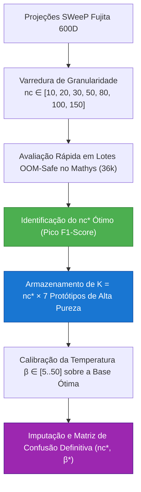

# 🏛️ ADR 009: Otimização Empírica da Granularidade de Protótipos ($nc$) e Capacidade Associativa em Redes Hopfield Modernas

## 1. Status
* **Status:** Aceito
* **Data:** 30/07/2026

## 2. Contexto
No pipeline legado, o número de subclusters por classe biológica para extração de memórias associativas era mantido em um valor estático ($nc = 30$), resultando em $30 \times 7 = 210$ protótipos armazenados. 

Ao migrar para o genoma integral de **36.591 genes** ([pipeline_hopfield_completo_36k](file:///c:/Users/Leticia/Documents/Letworkspace/pipiline_hopifield/pipeline_hopfield_completo_36k.py)), tornou-se evidente que diferentes tipos celulare no cérebro exibem graus extremos de heterogeneidade funcional. Um valor fixo e pequeno de $nc$ aglutina subtipos neuronais distintos no mesmo centroide K-Means. 
Dado que as Redes Hopfield Modernas (Ramsauer et al., 2020) possuem **capacidade de armazenamento exponencial** sem incorrer em interferência ou amnésia de sobreposição de vetores, uma maior granularidade de memórias expande a cobertura do espectro transcricional e aprimora o ancoramento do dataset Mathys no gabarito do Fujita.

## 3. Decisão
Implementar a **Varredura Empírica de Capacidade de Memória (Grid Search do Fator $nc$)** diretamente na Seção 13.1 do pipeline pareado, antecedendo a calibração de temperatura:
1. **Grid Search $nc$**: Avaliação iterativa das configurações $nc \in [10, 20, 30, 50, 80, 100, 150]$, gerando de $70$ a $1.050$ padrões representativos reais no espaço SWeeP 600D.
2. **Seleção Automática do $nc^*$ Ótimo**: O sistema calcula autonomamente o pico do F1-Score ponderado na recuperação do dataset Mathys e adota o $nc^*$ ótimo.
3. **Co-Otimização de Temperatura ($\beta^*$)**: Após povoar a memória com os protótipos de alta resolução do $nc^*$, a Seção 13.2 executa o teste em grade para achar a temperatura ideal ($\beta^*$) nesse novo ambiente mais denso.

## 4. Consequências Biológicas
* **Captura de Subtipos Raros e Transicionais:** Ao elevar a granularidade (por exemplo, de 30 para 80 ou 100 subclusters), células neuronais excitatórias de camadas corticais profundas não são forçadas a adotar uma assinatura única genérica.
* **Redução do Ruído de Imputação:** O cruzamento entre alta capacidade associativa ($nc^*$) e consenso ponderado ($\beta^*$) entrega à célula ausente no Mathys um preenchimento coerente e de máxima fidelidade à fisiologia do Fujita.

## 5. Consequências Técnicas
* **Eficiência Computacional:** Como a clusterização K-Means decorre sobre os embeddings reduzidos do rSWeeP ($600$ dimensões), a extração dos centenas de protótipos consome menos de 3 segundos por rodada.
* **Manutenção da Segurança de Memória (OOM-Safe):** A avaliação do F1-Score durante a varredura do fator $nc$ processa os vetores de consulta em blocos (`batch_size=512`), invocando descarte explícito de referências densas e `gc.collect()` em todas as iterações.
* **Reprodutibilidade Jupytext e Esparseza H5AD:** Toda a rotina é exportada comprimida na matriz final de 36k genes preservando contratos do **[[04_Recursos/adrs/adr_007_pipeline_genoma_completo_36k_esparso|ADR 007]]** e **[[04_Recursos/adrs/adr_008_calibracao_temperatura_consenso_hopfield|ADR 008]]**.
