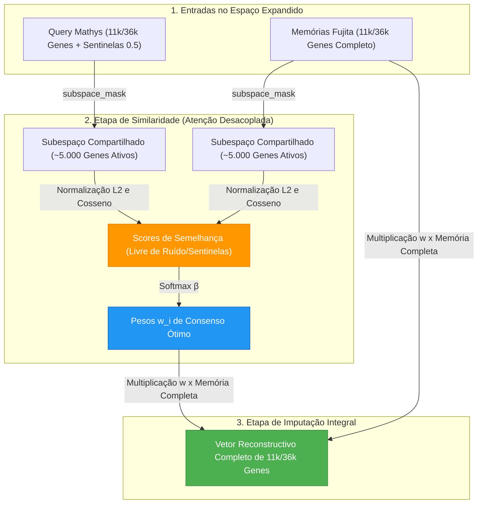

# ADR 011: Desacoplamento entre Atenção em Subespaço Compartilhado e Imputação no Espaço Expandido

## Status
Aceito (Implementado em 2026-08-04)

## Contexto e Problema
Durante os ensaios de reconstrução cross-dataset ($Fujita \to Mathys$) e auto-imputação ($Fujita \to Fujita$) utilizando o espaço gênico expandido (11.279 a 36.591 genes, conforme [[04_Recursos/adrs/adr_003_expansao_espaco_genico_11k|ADR 003]] e [[04_Recursos/adrs/adr_007_pipeline_genoma_completo_36k_esparso|ADR 007]]), foi diagnosticado um gargalo analítico que estagnava o F1-Score na reconstrução e reduzia a precisão na autorreconstrução:

1. **Dominação da Norma pelos Sentinelas Constantes ($0.5$):** No dataset Mathys, mais de 6.000 genes estão ausentes e são preenchidos por [[03_Conhecimento/sentinela_meio_genes_ausentes|Sentinelas Neutros 0.5]] (conforme [[04_Recursos/adrs/adr_002_sentinela_meio_genes_ausentes|ADR 002]]). Na similaridade de cosseno com `normalize=True` (adotada no [[04_Recursos/adrs/adr_010_harmonizacao_cosseno_e_prototipos_consolidados|ADR 010]]), o cálculo da norma $L_2$ de cada célula consulta do Mathys ($q$) passava a ser dominado pela soma constante das 6.000 colunas sentinelas ($\approx 1500$). Isso ofuscava a variabilidade real das identidades celulares nos ~5.000 genes compartilhados.
2. **Injeção de Ruído por Esparsidade e Dropout:** A inclusão de milhares de genes raros ou exclusivos do Fujita no cálculo do produto escalar adicionava variações estocásticas e ruído de dropout na matriz de pesos, diluindo a assinatura dos marcadores fenotípicos principais.

## Decisão
Desacoplar a etapa de cálculo da [[03_Conhecimento/atencao_softmax_hopfield|Atenção Softmax Hopfield]] da etapa posterior de reconstrução e projeção vetorial dentro do método `.retrieve()` da classe `ModernHopfieldNetwork`.

1. **Atenção no Subespaço Limpo e Compartilhado (`subspace_mask`):** O método `.retrieve()` passa a aceitar o argumento opcional `subspace_mask`, representando os índices dos genes em comum com variação biológica ativa e confiável. Para computar a semelhança (seja produto escalar ou norma $L_2$), os vetores de consulta ($x$) e memória ($\Xi$) são temporariamente recortados para esse subespaço limpo:
   $$\text{scores} = \beta \cdot \left(\frac{x_{[\text{mask}]}}{\|x_{[\text{mask}]}\|_2} \cdot \frac{\Xi_{[\text{mask}]}^T}{\|\Xi_{[\text{mask}]}\|_2}\right)$$
2. **Imputação e Reconstrução Integral:** Os pesos exponenciais obtidos no Softmax ($w_i$) são multiplicados pela matriz de protótipos completa ($\Xi_{\text{completo}}$), reconstituindo o genoma em alta dimensionalidade (11k ou 36k genes) sem incorrer na contaminação da norma $L_2$:
   $$x_{\text{imputado}} = \sum_{i} w_i \cdot \Xi_{i, \text{completo}}$$

## Consequências
* **Positivas:**
  - **Recuperação Imediata do Poder de Discriminação:** O cálculo da semelhança vetorial volta a se orientar estritamente por genes reais com poder de diferenciação dos tipos celulares neuroniais e gliais.
  - **Eficiência de RAM e Tempo de Execução:** O cálculo da norma $L_2$ sobre um número menor de colunas reduz operações em ponto flutuante durante os minilotes de inferência.
  - **Retrocompatibilidade Garantida:** A opção padrão `subspace_mask=None` mantém intacto o funcionamento dos fluxos sem subespaços.
* **Negativas:**
  - Requer que o script ou investigador forneça dinamicamente ou por arquivo a lista/máscara de genes válidos no momento da chamada `.retrieve()`.

## Conexões e Referências
- Arquitetura do Sistema: [[01_Projetos/pipeline_hopfield_expandido/arquitetura_do_sistema|Arquitetura do Sistema Expandido]]
- Conceito Atômico da Atenção: [[03_Conhecimento/atencao_softmax_hopfield|Atenção Softmax Hopfield]]
- Regra de Sentinelas no Alinhamento: [[04_Recursos/adrs/adr_002_sentinela_meio_genes_ausentes|ADR 002]]
- Harmonização por Cosseno e Protótipos: [[04_Recursos/adrs/adr_010_harmonizacao_cosseno_e_prototipos_consolidados|ADR 010]]
