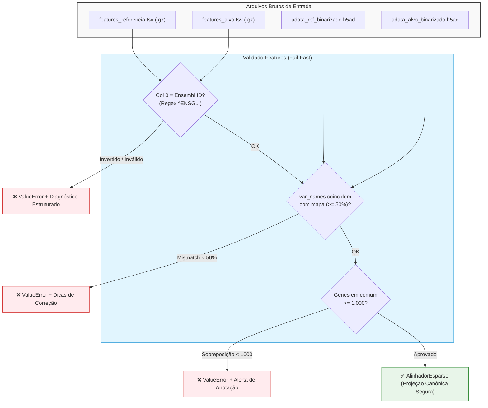

# 🏛️ ADR 013: Validação Estrita de Features e Identificadores Genômicos Pré-Alinhamento

## 1. Status
**Aceito** (Implementado em `src/alinhamento/validador_features.py` e integrado no Capítulo 3 dos pipelines).

---

## 2. Contexto
No processamento de conjuntos de dados independentes de *single-cell RNA sequencing* (scRNA-seq), como **Fujita** e **Mathys**, a correta equivalência de características transcricionais depende do mapeamento entre símbolos gênicos (*Gene Symbols*) e identificadores estáveis do Ensembl (*Ensembl IDs*).

Durante execuções no pipeline genérico, observou-se uma anomalia em que apenas **7 genes** do dataset alvo (Mathys) foram mapeados para o espaço canônico de 61.541 genes. A investigação revelou que:
1. Um arquivo de features com colunas invertidas (ou com convenções de nomes divergentes dos `var_names` da matriz `.h5ad`) passava despercebido pelo leitor e pelo alinhador;
2. Como a matriz esparsa de alinhamento simplesmente preenchia com sentinela `0.5` ou zeros os genes não encontrados, o pipeline continuava a execução sem emitir erros explícitos, resultando em tensores de memória Hopfield degradados e corrupção silenciosa da imputação transcricional.

---

## 3. Decisão
Implementamos a classe [[01_Projetos/pipeline_hopfield_expandido/arquitetura_do_sistema|ValidadorFeatures]] em `src/alinhamento/validador_features.py` adotando uma arquitetura **Fail-Fast** estrita:

1. **Detecção de Schema e Inversão de Colunas (Regex Ensembl):**
   - Inspeciona as primeiras linhas do arquivo de features (`.tsv`, `.tsv.gz`, `.csv`).
   - Avalia a presença do padrão Ensembl (`^ENS[A-Z]*G\d+`). Se a coluna 1 contiver identificadores Ensembl enquanto a coluna 0 contiver símbolos gênicos, o pipeline é interrompido imediatamente com um alerta diagnóstico de colunas invertidas.
2. **Compatibilidade AnnData x Features:**
   - Compara os `var_names` da matriz `.h5ad` binarizada com os identificadores do mapa de features de forma OOM-Safe (`backed='r'`).
   - Exige taxa de compatibilidade mínima configurável (padrão $\ge 50\%$). Caso contrário, levanta `ValueError` detalhado.
3. **Validação de Sobreposição Biológica Inter-Datasets:**
   - Exige que os datasets compartilhem pelo menos um número mínimo de genes homólogos (padrão $\ge 1.000$ genes), evitando o cruzamento acidental de anotações ou espécies distintas.

---

## 4. Consequências Biológicas e Técnicas

### Positivas
* **Eliminação de Corrupção Silenciosa:** Impede que experimentos de imputação cross-dataset operem sobre espaços vazios preenchidos por sentinela falso-positivo.
* **Diagnóstico Rico:** Em caso de falha, fornece tabelas comparativas no console com as primeiras linhas observadas e instruções explícitas de correção.
* **Reprodutibilidade Científica:** Assegura que todos os pipelines construam seus espaços canônicos estritamente sobre matrizes com correspondência gênica verificada.

### Negativas / Restrições
* Requer que os arquivos de features e matrizes AnnData estejam estritamente padronizados antes do início do alinhamento.
