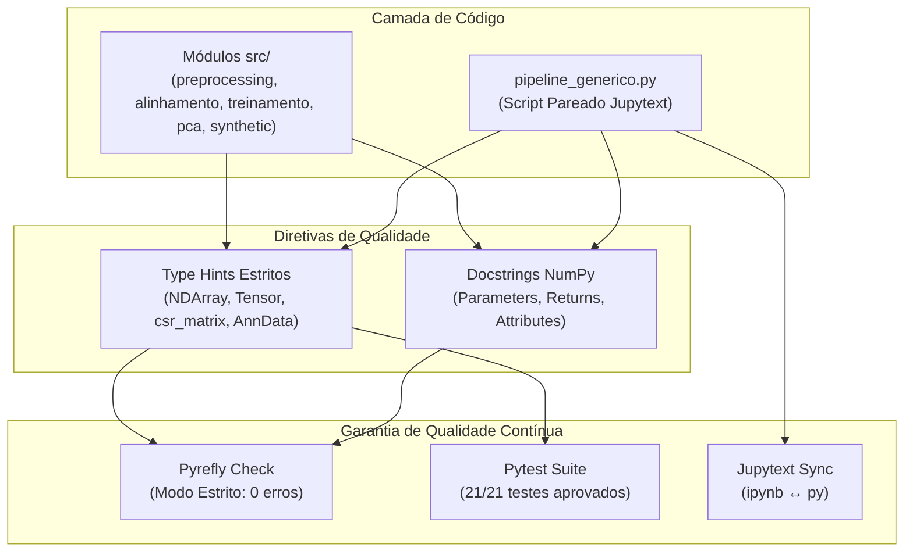

# 🏛️ ADR 014: Adoção Estrita de Type Hints e Docstrings no Padrão NumPy via Pyrefly

## 1. Status
**Aceito** (Implementado em 100% dos módulos de `src/`, `pyproject.toml` e no script/notebook `pipeline_generico`).

---

## 2. Contexto
O projeto `pipiline_hopifield` opera sobre tensores genômicos de grande porte em *single-cell RNA-seq*, alternando entre formatos densos (`numpy.ndarray`, `torch.Tensor`), esparsos (`scipy.sparse.csr_matrix`), anotações tabulares (`pandas.DataFrame`, `polars.DataFrame`) e estruturas biológicas de contêiner (`anndata.AnnData`).

A ausência de tipagem estrita gerava:
1. **Ambiguidade de Formatos de Matriz:** Dúvidas em tempo de execução se uma matriz era densa ou esparsa, podendo causar erros de alocação de memória (OOM);
2. **Fragilidade em Refatorações:** Mudanças de assinatura e retorno sem checagem estática antes dos testes de integração;
3. **Déficit Documental:** Falta de docstrings padronizadas detalhando parâmetros, tipos e retornos conforme as diretrizes científicas do ecossistema SciPy/NumPy.

---

## 3. Decisão
Adotamos uma política rigorosa de **Type Hints Estritos e Docstrings Completas (Padrão NumPy)** validada via **Pyrefly**:

1. **Configuração Estrita no `pyproject.toml`:**
   - Ativação do modo estrito sem inferência de retorno (`infer-return-types = "never"`).
   - Inclusão do escopo `project-includes = ["src", "pipeline_generico.py"]` e `search-path = [".", "src"]`.
   - Adição dos pacotes de stubs oficiais `pandas-stubs` e `types-tqdm`.
2. **Tipagem Defensiva de Tensores e Matrizes:**
   - Uso explícito de `NDArray[np.float32]`, `NDArray[np.int_]`, `NDArray[np.bool_]`, `NDArray[np.intp]`.
   - Distinção clara e checagem via `sp.issparse()` e coerção segura para `sp.csr_matrix`.
   - Tipagem rigorosa em `ad.AnnData` com garantias de tipo para `obs` e `var`.
3. **Docstrings em Padrão NumPy:**
   - 100% das classes, métodos e funções nos pacotes `preprocessing`, `synthetic`, `pca`, `alinhamento`, `treinamento` e `config` contêm seções padronizadas `Parameters`, `Returns`, `Raises` e `Attributes`.
4. **Notebooks Sincronizados com Jupytext:**
   - O script pareado `pipeline_generico.py` adota tipagem e docstrings de alto nível e sincroniza de forma transparente com `pipeline_generico.ipynb` via `jupytext --sync`.

---

## 4. Consequências Biológicas
- **Confiabilidade Translacional:** Redução de erros de indexação ou mismatching de identificadores gênicos entre datasets heterogêneos.
- **Rastreabilidade Científica:** Documentação detalhada dos passos matemáticos e transformações biológicas direto no código-fonte.

---

## 5. Consequências Técnicas
- **Detecção Antecipada de Erros (Zero Runtime Surprises):** Verificação estática em milissegundos antes da execução pesada de scRNA-seq.
- **Integração OOM-Safe:** Certeza de que matrizes esparsas não são convertidas inadvertidamente para densas em pontos críticos do pipeline.
- **Manutenibilidade de Longo Prazo:** Código autoexplicativo para pesquisadores e agentes de IA que navegam pelo Second Brain.
