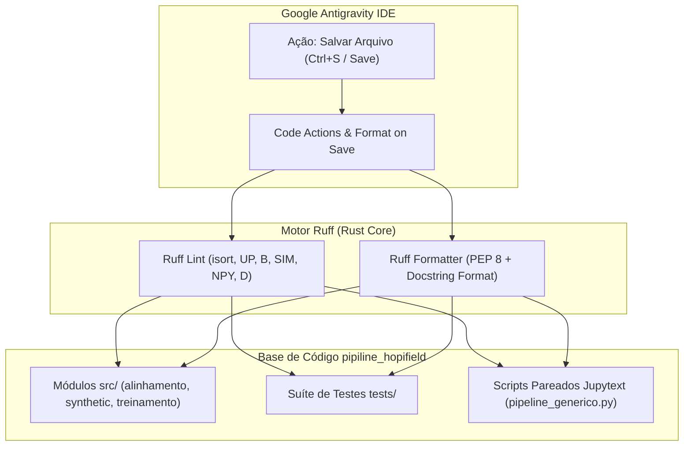

# 🏛️ ADR 015: Adoção do Ruff como Linter/Formatador Unificado e Automação de Salvamento no IDE

## 1. Status
**Aceito** (Configurado no `pyproject.toml`, integrado ao ambiente virtual `.venv`, sincronizado no `.vscode/settings.json` e aplicado em 100% dos módulos de `src/` e `tests/`).

---

## 2. Contexto
O ecossistema `pipiline_hopifield` combina processamento intensivo de bioinformática (*single-cell RNA-seq*), modelos neurais associativos de alta dimensionalidade (*Modern Hopfield Networks*) e projeções ortogonais (*rSWeeP*). 

Com o crescimento da base de código e a adoção formal de [[ADR 014|Type Hints Estritos e Docstrings NumPy]], identificou-se a necessidade de:
1. **Velocidade de Feedback:** Substituir ferramentas legadas lentas por um mecanismo de análise estática e formatação que execute em milissegundos.
2. **Harmonização de Imports e Estilo:** Eliminar divergências de importação não ordenada (`isort`), espaços em branco residuais e sintaxes obsoletas do Python (`UP` / Pyupgrade).
3. **Automação Transparente no IDE:** Permitir que desenvolvedores e agentes no **Google Antigravity IDE** tenham correção e formatação instantânea ao salvar qualquer arquivo Python ou Notebook (`Format on Save` e `Fix All on Save`).
4. **Governança Unificada via PEP 518/621:** Centralizar todos os metadados, regras e parâmetros de formatação no arquivo canônico `pyproject.toml`.

---

## 3. Decisão

Adotamos o **Ruff** como o motor oficial e exclusivo de *Linting* e *Code Formatting* do projeto:

1. **Configuração Canônica no `pyproject.toml`:**
   - **Metadados PEP 621 (`[project]`):** Declaração formal de versão, dependências centrais e opcionais (`dev`).
   - **Seleção de Regras (`[tool.ruff.lint]`):** Ativação de `E`, `W` (pycodestyle), `F` (Pyflakes), `I` (isort), `UP` (pyupgrade), `B` (flake8-bugbear), `SIM` (flake8-simplify), `NPY` (NumPy), `RUF` (Ruff) e `D` (pydocstyle).
   - **Docstrings no Padrão NumPy:** Configuração explícita de `[tool.ruff.lint.pydocstyle] convention = "numpy"` para preservar estrita compatibilidade com o [[ADR 014]].
   - **Formatação Determinística (`[tool.ruff.format]`):** Aspas duplas, indentação de 4 espaços, quebra inteligente e formatação automática de exemplos de código dentro de docstrings (`docstring-code-format = true`).

2. **Integração no Google Antigravity IDE (`.vscode/settings.json`):**
   - Definição de `charliermarsh.ruff` como o formatador padrão para Python.
   - Ativação de `editor.formatOnSave = true`.
   - Ativação de `source.fixAll` e `source.organizeImports` automáticos no evento de salvamento.
   - Mapeamento explícito do binário local `${workspaceFolder}/.venv/Scripts/ruff.exe`.

---

## 4. Consequências Biológicas
- **Legibilidade e Confiança Científica:** Módulos que manipulam anotações genômicas e matrizes de expressão tornam-se uniformes, facilitando a revisão por pares e a identificação visual rápida de operadores matriciais e sentinelas.
- **Prevenção de Efeitos Colaterais:** Regras do *flake8-bugbear* e *NumPy* detectam antipadrões numéricos antes que causem distorções nos cálculos biológicos.

---

## 5. Consequências Técnicas
- **Desempenho Extremo:** Execução do linter e formatador em ~10-20 milissegundos para todo o repositório.
- **Zero Atrito de Desenvolvimento:** O desenvolvedor escreve o código e o IDE organiza imports, ajusta tipagens modernas (`X | Y`), remove variáveis mortas e formata a indentação sem necessidade de comandos manuais.
- **Integração Perfeita com Pyrefly e Pytest:** O Ruff opera em total consonância com a verificação estrita de tipos do Pyrefly e a suíte de 21 testes unitários do Pytest.
