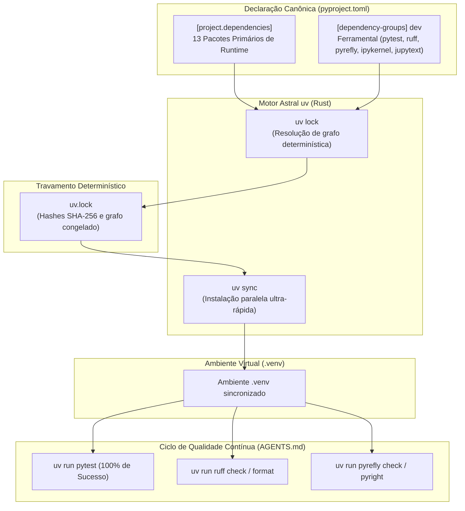

# 🏛️ ADR 016: Migração do Gerenciador de Pacotes para uv e Travamento Determinístico com uv.lock

## 1. Status
**Aceito** (Configurado no `pyproject.toml`, `requirements.txt` legado removido, `uv.lock` gerado e sincronizado no ambiente `.venv`, com regras de execução adicionadas ao `AGENTS.md`).

---

## 2. Contexto
O projeto `pipiline_hopifield` possui dependências científicas robustas (como PyTorch, AnnData, Scanpy, Polars, scikit-learn e SciPy) e uma infraestrutura de testes e tipagem estrita ([[ADR 014]], [[ADR 015]]).

Anteriormente, o gerenciamento de dependências dependia do `pip` com um arquivo `requirements.txt` estático de mais de 300 linhas, misturando dependências de primeiro nível (primárias) com centenas de dependências transitivas. Isso gerava:
1. **Poluição de Configuração:** Dificuldade de identificar quais eram os pacotes centrais e quais eram subdependências.
2. **Lentidão em Resoluções e Instalações:** O instalador clássico do `pip` executava downloads e resoluções sequenciais lentas.
3. **Falta de Lockfile Determinístico Multiplataforma:** O formato `requirements.txt` não fornecia controle rigoroso de hashes com resolução de grafo completa e isolamento de grupos de desenvolvimento.
4. **Necessidade de Padronização com os Padrões Modernos:** Alinhamento total com as especificações PEP 621 e PEP 735.

---

## 3. Decisão

Decidimos migrar integralmente o gerenciamento de pacotes e ambiente virtual para o **`uv`** (desenvolvido pela Astral em Rust):

1. **Separação Estrita de Dependências no `pyproject.toml`:**
   - **`[project.dependencies]` (Runtime Primário):** Contém estritamente as bibliotecas diretamente importadas no código de produção (`anndata`, `h5py`, `hdbscan`, `matplotlib`, `numpy`, `pandas`, `polars`, `scanpy`, `scikit-learn`, `scipy`, `seaborn`, `torch`, `tqdm`).
   - **`[dependency-groups] dev` / `[project.optional-dependencies] dev` (Ferramental):** Agrupa ferramentas de teste, linting, formatação e tipagem (`pytest`, `ruff`, `pyright`, `pyrefly`, `pandas-stubs`, `types-tqdm`, `ipykernel`, `jupytext`).
   - **Dependências Transitivas:** Não são declaradas manualmente; são resolvidas e gerenciadas de forma transparente pelo `uv`.

2. **Remoção do `requirements.txt`:**
   - O arquivo legado `requirements.txt` foi excluído do repositório, consolidando `pyproject.toml` como a única fonte de verdade declarativa.

3. **Geração e Controle pelo `uv.lock`:**
   - Criação do arquivo de lock universal determinístico (`uv.lock`), contendo hashes criptográficos e resolução exata de todas as dependências transitivas.

4. **Diretrizes para Agentes de IA e Desenvolvedores (`AGENTS.md`):**
   - Obrigatoriedade do prefixo `uv run` para todas as execuções (`uv run pytest`, `uv run ruff check .`, `uv run pyrefly check`).
   - Protocolo de **Verificação Obrigatória Pós-Implementação** imediatamente após qualquer alteração no código.

---

## 4. Consequências Biológicas
- **Reprodutibilidade Estrita de Resultados Científicos:** Garantia de que cálculos matriciais, projeções rSWeeP e atenção Hopfield rodem com as exatas versões de bibliotecas numéricas em qualquer máquina ou ambiente de servidor.
- **Isolamento de Efeitos Numéricos:** Prevenção de que atualizações automáticas silenciosas de subdependências alterem sementes aleatórias ou precisão numérica nos clusters e reconstruções.

---

## 5. Consequências Técnicas
- **Velocidade de Sincronização:** Operações de instalação e verificação que levavam minutos agora ocorrem em frações de segundo graças ao cache global do `uv`.
- **Base de Código Limpa:** O `pyproject.toml` permanece legível e sustentável, livre de centenas de dependências de dependências.
- **Rigor Operacional Automatizado:** A inclusão das regras no `AGENTS.md` garante que todo agente de IA execute verificações automáticas com `uv run` antes de concluir suas tarefas.
