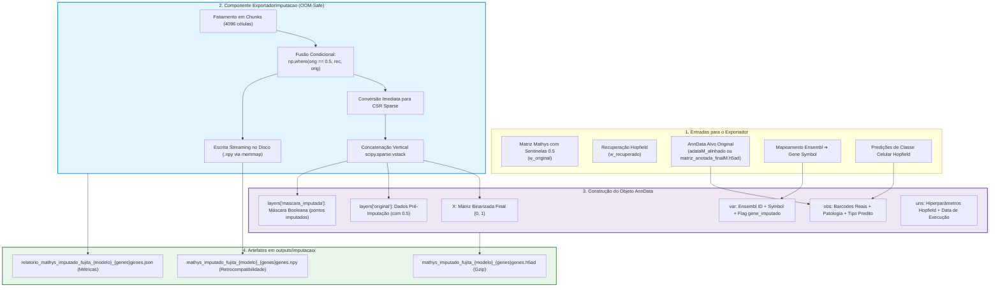

# ADR 017: Exportação Estruturada de Imputação Cross-Dataset em AnnData OOM-Safe com Camadas de Rastreabilidade

## Status
Aceito e Implementado (2026-09-01)

## Contexto e Problema
Nas etapas de inferência e reconstrução cross-dataset do pipeline ($Fujita \to Mathys$), a [[03_Conhecimento/atencao_softmax_hopfield|Rede Hopfield Moderna]] recupera e preenche os genes ausentes no dataset alvo que foram marcados com [[03_Conhecimento/sentinela_meio_genes_ausentes|Sentinela Neutra 0.5]] (conforme [[04_Recursos/adrs/adr_002_sentinela_meio_genes_ausentes|ADR 002]] e [[04_Recursos/adrs/adr_011_desacoplamento_atencao_subespaco_e_imputacao_expandida|ADR 011]]).

Entretanto, o procedimento legado de persistência dos resultados apresentava gargalos críticos:
1. **Perda de Identidade Biológica e Clínica:** A matriz resultante era exportada exclusivamente como matriz bruta NumPy (`X_mathys_IMPUTADO_rede35.npy`), descartando completamente os metadados celulares (`obs`) do Mathys (barcodes originais, doadores, patologia, status de Alzheimer e subtipos celulares).
2. **Incompatibilidade com o Ecossistema Single-Cell:** Ferramentas padrão de downstream (como Scanpy e Seurat) exigem objetos AnnData (`.h5ad`) com anotações enriquecidas em `obs`, `var` e `uns`. Tentativas anteriores em notebooks geravam índices celulares sintéticos (`celula_0`, `celula_1`), invalidando correlações fenotípicas.
3. **Ausência de Camadas de Rastreabilidade (`layers`):** Uma vez fundidos os dados, tornava-se impossível discernir quais valores haviam sido genuinamente medidos pelo sequenciamento original e quais decorriam da inferência por consenso da rede Hopfield.
4. **Risco de Esgotamento de Memória (OOM):** Para matrizes de genoma expandido ($>70.000$ células $\times 36.591$ genes), a manipulação simultânea de múltiplas matrizes densas em ponto flutuante excede 10 GB a 25 GB de RAM, causando falhas de execução em instâncias padrão de computação.

## Decisão
Criar o módulo dedicado `src/treinamento/exportador_imputacao.py` contendo a classe `ExportadorImputacao`, estabelecendo o padrão oficial de exportação de imputação cross-dataset no pipeline:

1. **Formato Principal em AnnData (`.h5ad` Gzip + CSR Sparse):**
   - A matriz principal `X` armazena a matriz final binarizada $\{0, 1\}$ consolidada (expressão observada do Mathys preservada e sentinelas substituídos pela recuperação associativa).
   - Armazenada estritamente em formato esparso comprimido `scipy.sparse.csr_matrix` com compressão `gzip`.
2. **Camadas de Auditoria (`layers`):**
   - `layers['original']`: Armazena a matriz pré-imputação (Mathys com as sentinelas $0.5$).
   - `layers['mascara_imputada']`: Matriz booleana esparsa indicando precisamente quais coordenadas $(célula, gene)$ foram imputadas pela rede Hopfield.
3. **Metadados Biológicos e de Proveniência:**
   - `obs`: Herda os metadados reais do dataset alvo (`adataM.obs`), acrescido de `tipo_celular_real` (`clo_m`), `tipo_predito_hopfield`, `prototipo_hopfield_idx`, `n_genes_imputados` e `pct_genes_imputados`.
   - `var`: Indexado pelos Ensembl IDs canônicos, contendo `gene_symbol`, a flag booleana `gene_imputado` e a contagem `n_celulas_imputadas`.
   - `uns`: Hiperparâmetros de inferência (`beta`, `nc`, `n_padroes`, limiares), data de execução e identificadores dos datasets.
4. **Streaming em Lotes OOM-Safe:**
   - Processamento fatiado em blocos (padrão 4.096 células), convertendo imediatamente chunks densos em fatias CSR e realizando concatenação vertical via `scipy.sparse.vstack`.
   - Gravação do arquivo `.npy` (retrocompatibilidade) diretamente em disco via `numpy.lib.format.open_memmap`, eliminando a necessidade de reter a matriz densa completa na memória RAM.
5. **Relatório Estruturado de Métricas:**
   - Geração automática de `relatorio_{nome_modelo}_{n_genes}genes.json` computando o total de sentinelas resolvidos, proporção de zeros e uns imputados e distribuição de predições de classes.
6. **Centralização de Caminhos:**
   - Adição do diretório `OUT_IMPUTACAO = os.path.join(OUTPUTS, "imputacao")` em `src/config.py`.

## Arquitetura do Componente

## Consequências
* **Positivas:**
  - **Reprodutibilidade e Integração Total com Scanpy:** O arquivo `.h5ad` resultante pode ser aberto de forma transparente por qualquer pipeline de bioinformática mantendo todos os metadados clínicos e celulares.
  - **Auditabilidade Científica:** As camadas `original` e `mascara_imputada` permitem aos pesquisadores quantificar o impacto exato da imputação em genes específicos.
  - **Eficiência de Memória OOM-Safe:** Elimina riscos de falha por falta de memória através do processamento em lotes e conversão esparsa.
  - **Retrocompatibilidade Garantida:** A geração opcional do `.npy` assegura que scripts numéricos legados continuem funcionando sem alterações.
* **Negativas:**
  - O tempo de compressão gzip durante a escrita do `.h5ad` pode introduzir um pequeno overhead computacional (alguns segundos adicionais) em relação à gravação de um arquivo binário cru.

## Conexões e Referências
* [[01_Projetos/pipeline_hopfield_expandido/arquitetura_do_sistema|Arquitetura do Sistema Expandido]]
* [[04_Recursos/adrs/adr_002_sentinela_meio_genes_ausentes|ADR 002: Sentinela Neutra 0.5]]
* [[04_Recursos/adrs/adr_007_pipeline_completo_36k_genes_espartano|ADR 007: Pipeline Completo 36k]]
* [[04_Recursos/adrs/adr_011_desacoplamento_atencao_subespaco_e_imputacao_expandida|ADR 011: Desacoplamento da Atenção Hopfield]]
