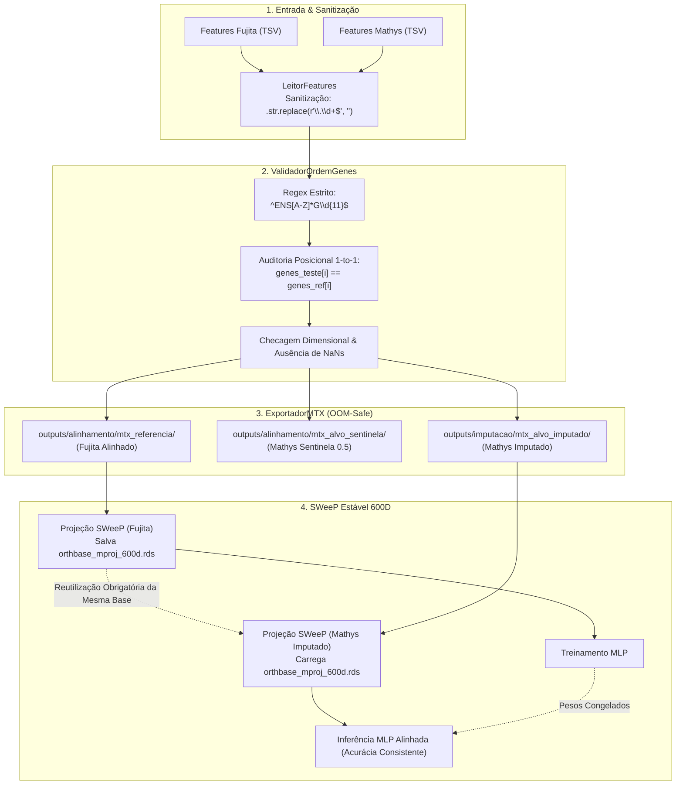

# ADR 018: Validação Estrita de Ordem Gênica, Exportação Padronizada Matrix Market (.mtx) e Congelamento da Base Ortonormal SWeeP

## Status
Aceito e Implementado (2026-09-01)

## Contexto e Problema
Ao transferir representações de células reconstruídas pela [[03_Conhecimento/atencao_softmax_hopfield|Rede Hopfield Moderna]] ($Fujita \to Mathys$) para um classificador perceptron multicamadas (MLP) previamente treinado na referência canônica com alta acurácia, observou-se uma queda anômala de desempenho da inferência:
1. **Queda de Classificação de 90% para 70%:** O MLP avaliado no dataset alvo bruto (~6.000 genes ausentes preenchidos com zero) atingiu 90% de acurácia, mas ao receber o alvo após imputação pela rede Hopfield com base na referência completa, a acurácia caiu inesperadamente para 70%.
2. **Vulnerabilidade a Desalinhamento Posicional Silencioso de Colunas:** Modelos densos (MLP e redes neurais) operam estritamente sobre posições dimensionais ordenadas ($j = 0, \dots, N-1$). Qualquer permutação inadvertida na ordem de colunas entre datasets corrompe as representações sem disparar erros em tempo de execução.
3. **Incompatibilidade por Sufixo de Versão de Anotação Ensembl:** Datasets scRNA-seq costumam originar-se de diferentes releases do Gencode/Ensembl. Se a referência utilizar identificadores estáveis sem versão (`ENSG00000141510`) e o alvo contiver sufixos de release (`ENSG00000141510.3`), o casamento exato de strings falha (0% de sobreposição).
4. **Instabilidade Estocástica na Projeção SWeeP (Espaço Latente 600D):** A projeção dimensional executada em R (`rSWeeP:::liteParam`) gera uma base ortonormal estocástica (`par$Mproj`). Se a referência e o alvo imputado forem projetados em execuções independentes sem salvar a base ortonormal, os vetores resultantes habitam espaços latentes mutuamente rotacionados, inviabilizando qualquer generalização do classificador MLP.

## Decisão

Instituir um protocolo integrado de integridade posicional, sanitização gênica, exportação padronizada em Matrix Market (`.mtx`) e congelamento da base ortonormal:

### 1. Sanitização Automática e Validação Estrita de Ensembl IDs
- **Remoção de Versão no Carregamento:** O componente [[01_Projetos/pipeline_hopfield_expandido/arquitetura_do_sistema|LeitorFeatures]] passa a remover automaticamente o sufixo numérico de versão (`.str.replace(r"\.\d+$", "")`) em todas as leituras de arquivos TSV/CSV de features.
- **Regex Estrita sem Versão:** O novo componente `ValidadorOrdemGenes` adota o padrão canônico imutável `^ENS[A-Z]*G\d{11}$`, rejeitando sumariamente identificadores com ponto, versão de release ou símbolos gênicos em posições reservadas para Ensembl IDs.

### 2. Validação Posicional 1-to-1 com Fail-Fast
- Verificação censitária (100% das colunas) garantindo $genes\_teste[i] \equiv genes\_referencia[i]$ para todo $i$.
- Caso qualquer discrepância dimensional ou posicional seja detectada, o pipeline aborta com diagnóstico detalhado apontando os primeiros índices divergentes, valores esperados e valores observados.

### 3. Exportação Padronizada Matrix Market (`.mtx`) para Machine Learning
- O componente `ExportadorMTX` grava em disco matrizes esparsas no formato orientado a Machine Learning: **células nas linhas $\times$ genes nas colunas**.
- Suporte universal e resiliente a matrizes em memória (`scipy.sparse.csr_matrix`, arrays NumPy) e instâncias de `AnnData` abertas em modo *backed* (`backed="r"`), convertendo transparentemente datasets em disco (`_CSRDataset`, `_CSCDataset`, `Dataset`) em `sp.csr_matrix` via `.to_memory()`.
- Cada pasta exportada possui estrutura tripartite validada:
  1. `matrix.mtx`: Matriz no formato Matrix Market gravada via `scipy.io.mmwrite` de forma OOM-Safe a partir de estruturas `scipy.sparse.csr_matrix`.
  2. `genes_referencia.tsv`: Arquivo sem cabeçalho com 2 colunas separadas por tabulação (`Ensembl_ID\tGene_Symbol`), ordenadas rigorosamente na mesma ordem das colunas da matriz.
  3. `barcodes.tsv`: Arquivo com 1 coluna contendo os identificadores celulares correspondentes a cada linha da matriz.
- Três pastas de saída dedicadas e auditadas pré e pós-gravação:
  - `outputs/alinhamento/mtx_referencia/`: Referência Alinhada (Fujita completo).
  - `outputs/alinhamento/mtx_alvo_sentinela/`: Alvo pré-Hopfield com Sentinela 0.5 (Mathys).
  - `outputs/imputacao/mtx_alvo_imputado/`: Alvo pós-Hopfield com valores imputados (Mathys).

### 4. Congelamento da Base Ortonormal SWeeP (`orthbase`)
- Ajuste no script de projeção `ProjeçãoSweepEstavel.py` (pareado via Jupytext com `ProjeçãoSweepEstavel.ipynb`) para persistir a matriz de projeção `par$Mproj` no arquivo `orthbase_mproj_600d.rds`.
- Na projeção do alvo imputado, o mesmo arquivo `.rds` é obrigatoriamente lido e injetado em `par$Mproj`, garantindo que ambos os datasets sejam projetados sobre a mesmíssima base ortonormal determinística.

## Arquitetura e Fluxo de Auditoria

## Consequências

### Positivas
- **Eliminação de Desalinhamentos Silenciosos:** Qualquer inversão ou ausência gênica é interceptada imediatamente antes do treinamento ou inferência.
- **Interoperabilidade Total scRNA-seq & ML:** As matrizes Matrix Market com orientação (células $\times$ genes) e arquivos de anotação de features e barcodes permitem ingestão direta em Python, R (Matrix, Seurat) e frameworks de Deep Learning.
- **Imunidade a Variações de Releases Ensembl:** Genes com sufixos de versão não mais fragmentam a união de espaços gênicos.
- **Isometria e Congruência no Espaço Latente:** O congelamento de `orthbase_mproj_600d.rds` resolve a discrepância geométrica responsável pela queda artificial de acurácia no classificador MLP.

### Limitações Mitigadas
- **Consumo de Armazenamento:** Matrizes no formato Matrix Market de genoma expandido ($~45.000 \times 36.591$) ocupam espaço em disco; mitigated pela representação estritamente coordenada esparsa (`coordinate real general`).
