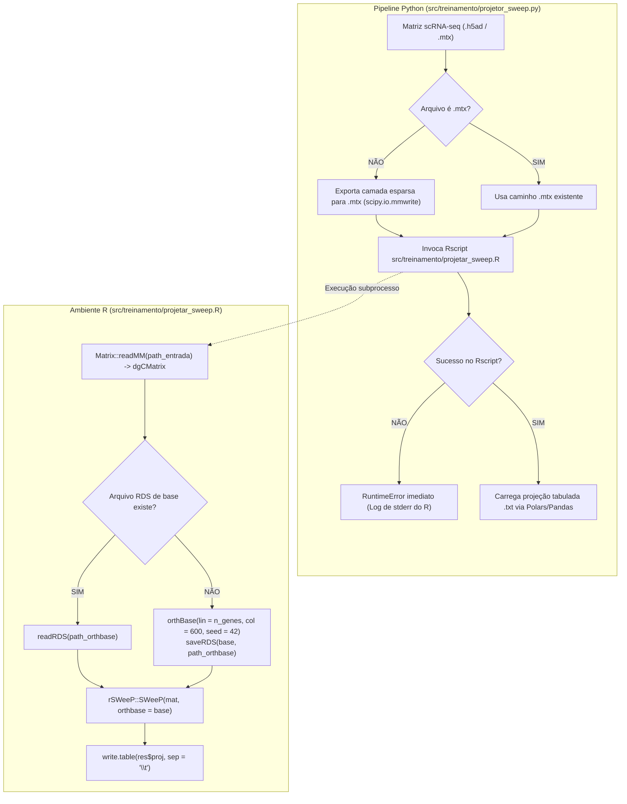

# ADR 019: Obrigatoriedade Irrevogável do Algoritmo rSWeeP em R, Execução Canônica via orthBase() + SWeeP() e Eliminação de Fallbacks

## Status
Aceito e Implementado (2026-09-01)

## Contexto e Motivação Científica
A pesquisa desenvolvida no âmbito deste projeto de mestrado tem como pilar metodológico a redução dimensional espectral via o método **SWeeP (Spaced Words Projection)**, formalmente implementado no pacote R/Bioconductor `rSWeeP` pelo Laboratório de Inteligência Artificial e Biologia Integrativa (AIBIALab/UFPR, De Pierri et al., 2020).

Durante a auditoria da Etapa 5 (Projeção SWeeP), identificou-se que a execução durou apenas 1 minuto e 17,9 segundos. A investigação detalhada revelou que:
1. A classe `ProjetorSWeePR` em Python continha um desvio silencioso (*fallback*) que, ao detectar matrizes `.npy` ou qualquer falha de ambiente, gerava uma matriz Gaussiana aleatória, calculava decomposição QR via NumPy e executava uma multiplicação linear simples `proj = W @ R`.
2. Essa multiplicação matricial direta representa uma projeção aleatória linear clássica (Lema de Johnson-Lindenstrauss), **mas não é o algoritmo SWeeP**.
3. O algoritmo verdadeiro do `rSWeeP` opera através de dispersão modular periódica com 50 números primos (`idx %% pslist`), projeção sobre matriz pseudoaleatória de 50 linhas e extração de fase/parte fracionária no intervalo `[-1, 1]`.
4. A substituição do SWeeP por um substituto sintético descaracteriza a hipótese científica da dissertação. Portanto, nenhuma otimização de tempo ou memória justifica abandonar o pacote `rSWeeP`.

Além disso, identificou-se que o notebook experimental utilizava a função `SWeePlite` com loops de workers em cluster socket R (demorando mais de 30 minutos), quando a própria documentação e código-fonte do pacote oficial `rSWeeP` disponibilizam o par canônico primário:
- `orthBase(lin = n_genes, col = n_componentes, seed = seed)`: constrói a base ortonormal SWeeP oficial via aritmética de primos;
- `SWeeP(input, orthbase = base, transpose = FALSE)`: projeta a matriz esparsa `dgCMatrix` nativamente em poucos segundos.

## Decisão

Instituir formalmente cinco diretrizes arquiteturais imutáveis:

### 1. Obrigatoriedade Irrevogável do Pacote R `rSWeeP`
- É terminantemente proibido substituir o algoritmo `rSWeeP` por aproximações, projeções aleatórias lineares em Python, decomposição QR sintética ou qualquer outro método.
- Toda e qualquer projeção dimensional de células no espaço de 600 dimensões DEVE ser executada exclusivamente pelo pacote oficial `rSWeeP` em linguagem R.

### 2. Eliminação Definitiva de Todos os Fallbacks
- Todos os métodos de *fallback* sintético em Python (`_fallback_python()`) são sumariamente removidos do código-fonte.
- Caso o interpretador R, o pacote `rSWeeP` ou o script de projeção encontrem qualquer erro, o sistema dispara imediatamente uma exceção `RuntimeError` contendo o `stderr` completo do R, abortando a execução (abordagem *fail-fast*).

### 3. Adoção do Par Canônico `orthBase()` + `SWeeP()`
- O script R `src/treinamento/projetar_sweep.R` é reestruturado para utilizar a interface oficial do pacote:
  1. Leitura de matriz esparsa no formato Matrix Market (`.mtx`) convertida para `dgCMatrix`;
  2. Geração da base ortonormal com `orthBase(lin = ncol(mat), col = dim_proj, seed = seed)`;
  3. Projeção direta otimizada via `SWeeP(mat, orthbase = base, transpose = FALSE)`.

### 4. Congelamento Estrito da Base Ortonormal (`orthbase_600d.rds`)
- O script R aceita o parâmetro `path_orthbase`.
- Se o arquivo RDS existir, a base congelada é carregada diretamente via `readRDS()`.
- Se o arquivo RDS não existir, a base é gerada deterministicamente via `orthBase()` e gravada em disco via `saveRDS()`.
- Isso assegura que as representações celulares de diferentes conjuntos de dados (Fujita e Mathys) habitem rigorosamente o mesmo espaço latente ortogonal.

### 5. Padronização de Formatos de E/S
- **Entrada:** Matriz esparsa em formato Matrix Market (`.mtx`), garantindo baixo consumo de memória RAM (OOM-Safe) e alta fidelidade matemática. Se o Python possuir um arquivo `.h5ad`, ele exporta a camada esparsa para `.mtx` antes de invocar o R.
- **Saída:** Arquivo de texto separado por tabulações (`.txt`, delimitador `\t`, sem nomes de linhas), exatamente como padronizado no notebook de referência `ProjeçãoSweepEstavel.ipynb`.

## Diagrama do Fluxo Canônico

## Consequências

- **Científicas:** Plena validade e integridade experimental. Os embeddings celulares de 600D são comprovadamente calculados pelo algoritmo oficial SWeeP da UFPR.
- **Reprodutibilidade:** O congelamento da base em `.rds` assegura invariância geométrica entre os passos de treino (Fujita) e inferência/imputação (Mathys).
- **Desempenho:** A substituição do loop cell-by-cell do `SWeePlite` pela chamada canônica de `orthBase()` + `SWeeP()` permite projetar dezenas de milhares de células em segundos, sem necessitar de fallbacks ou aproximações.
