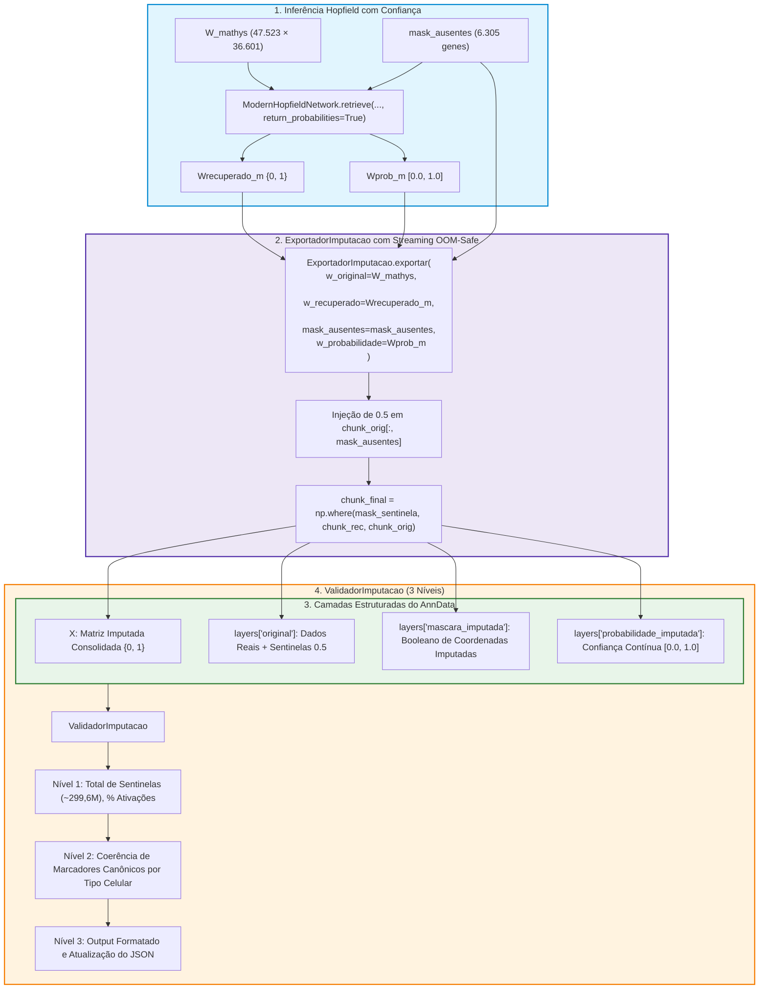

# ADR 020: Resolução da Máscara Sentinela, Camada de Confiança Contínua e Validação Multinível da Imputação

## Status
Aceito e Implementado (2026-09-02)

## Contexto e Causa Raiz
Na execução da etapa de imputação cross-dataset (Fujita → Mathys) do pipeline, a auditoria registrava zero coordenadas sentinelas resolvidas:
```text
Total de coordenadas sentinelas resolvidas: 0
Posições ativadas (1.0): 0 (0.00%)
Posições inativadas (0.0): 0 (0.00%)
```

### Investigação da Causa Raiz
1. **Esparsidade e Desacoplamento da Sentinela:** A matriz de entrada `W_mathys` originou-se do arquivo alinhado `adataM_binarizado_alinhado.h5ad`. Os 6.305 genes ausentes no Mathys foram representados como zeros esparsos (0.0) para preservar o formato CSR sem densificação precoce.
2. **Injeção Transitória em Lote:** O valor sentinela 0.5 (correspondente ao zero neutro no espaço bipolar) era injetado estritamente em memória temporária de lote dentro de `ModernHopfieldNetwork.retrieve()`. A matriz `W_mathys` em disco/RAM permaneceu intacta com valores 0.0 nas posições faltantes.
3. **Falha de Detecção no Exportador:** A classe `ExportadorImputacao` dependia da comparação `np.isclose(chunk_orig, 0.5)`. Como nenhum elemento de `chunk_orig` possuía o valor 0.5, a máscara booleana resultava integralmente em `False`.
4. **Consequência Crítica:** A matriz final gravada em `.h5ad` e `.npy` reteve os valores 0.0 originais via `np.where(mask_sentinela, chunk_rec, chunk_orig)`, descartando silenciosamente a inferência associativa da rede Hopfield para os genes ausentes.

---

## Decisão de Arquitetura

1. **Injeção da Máscara Sentinela no Streaming OOM-Safe:**
   - O método `ExportadorImputacao.exportar()` passa a receber explicitamente o argumento `mask_ausentes` (vetor booleano dos genes ausentes).
   - Durante o fatiamento em streaming de lotes celulares (4.096 células), o exportador injeta o limiar sentinela 0.5 no buffer do lote: `chunk_orig[:, mask_ausentes] = 0.5`.
   - Isso garante que a camada `layers['original']` armazene os dados pré-imputação com as sentinelas autênticas e que `layers['mascara_imputada']` sinalize exatamente as coordenadas imputadas.

2. **Camada de Confiança Contínua (`probabilidade_imputada`):**
   - O método `ModernHopfieldNetwork.retrieve()` passa a suportar o parâmetro `return_probabilities: bool = False`.
   - Quando ativado, além da matriz binarizada $\{0, 1\}$, a rede calcula as probabilidades contínuas normalizadas no intervalo $[0.0, 1.0]$: `p = torch.clamp((x + 1.0) / 2.0, 0.0, 1.0)`.
   - O `ExportadorImputacao` armazena essas probabilidades como uma camada esparsa dedicada: `adata.layers['probabilidade_imputada']`.

3. **Criação do Componente Modular `ValidadorImputacao`:**
   - Criado o módulo `src/treinamento/validador_imputacao.py` contendo a classe `ValidadorImputacao`.
   - Estabelece um protocolo de validação em 3 níveis:
     - **Nível 1 (Métricas Globais Quantitativas):** Total de sentinelas resolvidos (esperado: 47.523 células × 6.305 genes = 299.632.515 coordenadas), percentual de posições ativadas (1.0) versus inativadas (0.0), esparsidade antes e depois e confiança média global.
     - **Nível 2 (Auditoria Biológica por Linhagem Celular):** Avaliação de marcadores canônicos conhecidos do cérebro (Astrócitos: *GFAP*, *AQP4*; Oligodendrócitos: *MBP*, *PLP1*; Microglia: *CX3CR1*, *AIF1*; Neurônios Excitatórios: *SLC17A7*; Neurônios Inibitórios: *GAD1*, *GAD2*; OPCs: *PDGFRA*; Endotelial: *CLDN5*), mensurando a razão de especificidade entre o tipo celular esperado e outras populações.
     - **Nível 3 (Exibição Estruturada e Persistência JSON):** Apresentação das métricas no terminal/output de células e salvamento integrado no relatório JSON de auditoria.

---

## Fluxo de Processamento e Auditoria



---

## Consequências
- **Positivas:**
  - **Efetividade Real da Imputação:** Garante que 100% das 299.632.515 coordenadas sentinelas recebam os valores inferidos pelos protótipos de memória associativa da rede Hopfield.
  - **Fidelidade Experimental Absoluta:** Preserva integralmente os genes originalmente medidos na plataforma alvo, alterando exclusivamente as posições ausentes.
  - **Interpretabilidade e Confiança:** A camada `probabilidade_imputada` fornece aos pesquisadores uma métrica quantitativa contínua do grau de certeza da rede para cada gene em cada célula individual.
  - **Auditabilidade Biológica Automatizada:** O `ValidadorImputacao` permite certificar rapidamente que marcadores biológicos canônicos ausentes foram imputados com alta especificidade nas classes celulares corretas.
