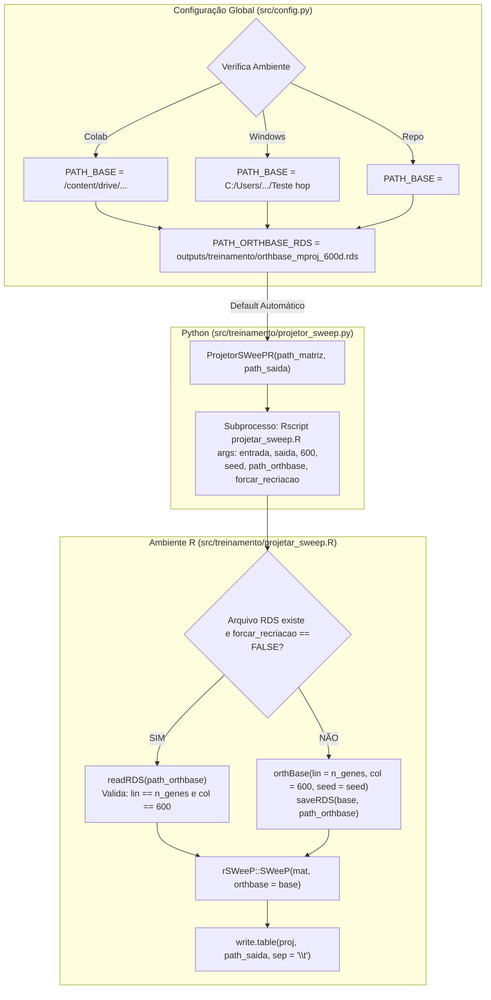

# ADR 021: Centralização da OrthBase via `config.py`, Resolução Dinâmica de Ambiente e Reuso Canônico Padrão no Projetor SWeeP

## Status
Aceito e Implementado (2026-09-04)

## Contexto e Motivação Científica
No âmbito da dissertação de mestrado (UFPR / AIBIALab), a redução dimensional espectral via **SWeeP (Spaced Words Projection)** projeta matrizes de expressão gênica esparsas (compostas por dezenas de milhares de genes) em um subespaço ortogonal compacto de 600 dimensões:

`Wswp = W0 × R_base (células × 600 dimensões)`

A [[04_Recursos/adrs/adr_019_obrigatoriedade_rsweep_r_e_congelamento_orthbase|ADR 019]] instituiu a obrigatoriedade irrevogável do algoritmo canônico do pacote R `rSWeeP`, a eliminação definitiva de fallbacks sintéticos e a geração da base ortogonal através da função `orthBase(lin = n_genes, col = 600, seed = seed)`.

Entretanto, observou-se que:
1. **Redundância e Risco de Divergência:** Os notebooks e scripts definiam manualmente a variável `PATH_ORTHBASE_RDS` e passavam explicitamente `path_orthbase=PATH_ORTHBASE_RDS` em cada invocação do `ProjetorSWeePR`. Caso um desenvolvedor esquecesse o argumento ou passasse um caminho incorreto, o projetor executava sem congelamento, gerando bases aleatórias efêmeras que quebravam a invariância espacial trans-dataset.
2. **Fragilidade Multi-Ambiente (Colab vs Windows):** A variável de diretório base (`PATH_BASE`) em `src/config.py` continha um caminho fixo de Google Drive (`/content/drive/Othercomputers/...`). Ao executar testes unitários locais no Windows ou em servidores Linux sem Google Drive, o caminho falhava caso não houvesse resolução dinâmica.
3. **Ausência de Mecanismo Seguro para Recriação:** Não havia uma forma programática no Python de forçar a regeneração da base (por exemplo, quando o universo de genes ou a semente estatística fossem alterados intencionalmente), exigindo intervenção manual sobre arquivos em disco.

## Decisão

Para sanar essas vulnerabilidades e assegurar uma arquitetura robusta, foram formalizadas as seguintes diretrizes:

### 1. Fonte Única da Verdade em `src/config.py` com Resolução Dinâmica
O arquivo `src/config.py` centraliza de forma definitiva o caminho canônico da base ortonormal congelada (`PATH_ORTHBASE_RDS` e alias `PATH_ORTHBASE`):
- A função `_resolver_path_base()` detecta dinamicamente o ambiente de execução na seguinte ordem de prioridade:
  1. Variável de ambiente `PIPELINE_PATH_BASE` ou `PATH_BASE` (se existente);
  2. Ambiente Google Colab com Drive montado (`/content/drive/...`);
  3. Ambiente Windows Local da pesquisadora (`c:\Users\Leticia\Documents\Letworkspace\Teste hop`);
  4. Raiz do repositório local (`os.path.abspath(os.path.join(os.path.dirname(__file__), ".."))`).
- A variável `PATH_ORTHBASE_RDS` aceita sobreposição via variável de ambiente `ORTHBASE_PATH` e, por padrão, aponta para `outputs/treinamento/orthbase_mproj_600d.rds`.

### 2. Consumo Default Automático no `ProjetorSWeePR`
A classe `ProjetorSWeePR` (`src/treinamento/projetor_sweep.py`) adota `config.PATH_ORTHBASE_RDS` como valor padrão obrigatório:
- Se o parâmetro `path_orthbase` for omitido ou `None`, a classe assume automaticamente o caminho central do `config.py`.
- Nenhuma chamada nos notebooks ou scripts precisa passar o caminho manualmente, eliminando código boilerplate e impedindo divergências acidentais.

### 3. Ciclo de Vida Singleton da Base e Controle de Recriação Forçada
O script canônico R `src/treinamento/projetar_sweep.R` opera sob a seguinte lógica:
- **Primeira Execução (ou arquivo ausente):** Se `orthbase_mproj_600d.rds` não existir em disco, o script executa `orthBase(lin = n_genes, col = 600, seed = seed)`, projeta os dados e grava o arquivo RDS via `saveRDS()`.
- **Execuções Subsequentes:** Se o arquivo RDS existir e `forcar_recriacao == FALSE`, a base congelada é lida instantaneamente via `readRDS()`. O script valida se `nrow(base$mat) == n_genes` e `ncol(base$mat) == 600`; em caso de disparidade dimensional, aborta imediatamente com erro fatal.
- **Recriação Controlada (`forcar_recriacao = TRUE`):** Caso o parâmetro `forcar_recriacao=True` seja passado ao `ProjetorSWeePR`, o script R regenera a base via `orthBase()` e sobrescreve o arquivo RDS em disco, garantindo reprodutibilidade sob demanda.

### 4. Banner de Auditoria e Observabilidade
Tanto no wrapper Python quanto no script R, toda invocação do `ProjetorSWeePR` emite um cabeçalho explícito de auditoria no log do terminal, declarando:
- O arquivo RDS canônico em uso;
- Se a base foi reutilizada do disco ou recém-gerada;
- As dimensões da base e o tempo de carga em segundos.

---

## Diagrama do Ciclo de Vida da OrthBase

---

## Consequências

### Consequências Biológicas
- **Invariância Latente Estrita:** Células do dataset de Referência (Fujita), do dataset Alvo mascarado com sentinela (Mathys) e do dataset Alvo Imputado são mapeadas com certeza matemática absoluta para o mesmo espaço espectral de 600 dimensões.
- **Isolamento de Variação Biológica:** Elimina qualquer ruído ou artefato de batch gerado por matrizes de projeção divergentes entre etapas.

### Consequências Técnicas
- **Desacoplamento e Simplicidade:** Redução drástica de complexidade nos notebooks (`pipeline_generico.ipynb` e `pipeline_hopfield_v2-1.ipynb`), que agora chamam `ProjetorSWeePR(matriz, saida)` de forma limpa.
- **Portabilidade Total:** O pipeline pode ser clonado e executado em qualquer ambiente (Colab, Windows ou Linux) sem quebrar por caminhos rígidos inexistentes.
- **Conformidade de Testes:** Testes unitários podem testar o fluxo com bases temporárias ou confiar no padrão com isolamento completo.

---

## Conexões
- [[04_Recursos/adrs/index|Índice de ADRs do Projeto]]
- [[04_Recursos/adrs/adr_018_validacao_ordem_genes_exportacao_mtx|ADR 018: Validação Estrita de Ordem Gênica e Congelamento da Base Ortonormal]]
- [[04_Recursos/adrs/adr_019_obrigatoriedade_rsweep_r_e_congelamento_orthbase|ADR 019: Obrigatoriedade Irrevogável do Algoritmo rSWeeP em R]]
- [[04_Recursos/projecao_sweep/guia_orthbase_canonica_config|Guia Técnico da OrthBase Canônica]]
- [[03_Conhecimento/projecao_rsweep_600d|Conceito Atômico: Projeção rSWeeP 600D]]
- [[01_Projetos/pipeline_hopfield_expandido/arquitetura_do_sistema|Documento de Arquitetura do Sistema]]
