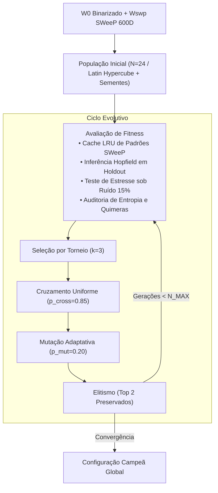

# ADR 022: Otimização de Hiperparâmetros da Modern Hopfield Network via Algoritmo Genético

> **Status:** Aceito  
> **Data:** 01/10/2026  
> **Decisores:** Equipe de Bioinformática & Agente AI  

---

## 1. Contexto

A Modern Hopfield Network (Ramsauer et al., 2020) no pipeline de scRNA-seq possui um espaço de busca de hiperparâmetros altamente interdependente e não-linear:
- `beta` (temperatura inversa da atenção Softmax): define o limiar entre Hard-Argmax (1-NN) e consenso contínuo ponderado.
- `nc` (número de centróides por classe no subespaço SWeeP): modula a capacidade da memória associativa (de 35 a 315 protótipos totais).
- `k_vizinhos`: agregação local em torno dos centróides para seleção de protótipos.
- `threshold`: limiar de corte de ativação binarizada pós-recuperação.
- `normalize`: projeção esférica unitária (similaridade cosseno L2) versus produto escalar.
- `estrategia`: K-Means Fixo versus K-Means Dinâmico.

Tentativas anteriores baseadas em varreduras manuais e Grid Search (ADR 005 e ADR 008) limitaram-se a avaliar 1 ou 2 parâmetros isoladamente devido à explosão combinatória (uma grade completa exigiria milhares de avaliações, inviabilizando o tempo computacional).

---

## 2. Decisão

Implementar o módulo dedicado `OtimizadorGeneticoHopfield` em `src/treinamento/algoritmo_genetico.py`, fundamentado em:

1. **Genótipo Misto Heterogêneo (`IndividuoHopfield`):** Codifica `(nc, k_vizinhos, beta, threshold, n_iters, normalize, estrategia)` com restrições biológicas e de estabilidade.
2. **Função de Aptidão Multiobjetivo com Barreira e F1 Macro:**
   `Fitness = (w_f1 · F1_val_macro) + (w_ruido · F1_ruido_macro) - (w_gap · Penalidade_Gap) - (w_sat · Penalidade_Saturacao) - (w_qui · Penalidade_Quimeras) - (w_parc · Penalidade_Parcimonia)`
   onde:
   - `F1_val_macro`: F1-Score Macro em amostra estratificada não-vista (holdout de 20%), garantindo peso equitativo a linhagens celulares minoritárias (como a Classe 2).
   - `F1_ruido_macro`: F1-Score Macro sob estresse com 15% de dropout sintético, penalizando severamente o colapso de atratores de subpopulações raras.
   - `Penalidade_Gap`: penalização ReLU para gaps de generalização superiores a 15%.
   - `Penalidade_Saturacao`: penalização quando a entropia da atenção é inferior a 0.05 (evita colapso em 1-NN puro).
   - `Penalidade_Quimeras`: contagem de células espúrias coativando marcadores canônicos antagônicos.
   - `Penalidade_Parcimonia`: penalização suave pelo aumento desnecessário de `nc`.
3. **Calibração da Escala de β e Escalonamento Dimensional por √D:**
   - Intervalo de busca refinado para ordens de grandeza inferiores: `β ∈ [0.1, 5.0]`, com sementes canônicas em `0.5`, `1.0`, `2.5` e `4.0`.
   - Normalização dimensional do produto interno não-esférico por `√D ≈ √61541 ≈ 248.07` (`scale_by_dim=True` em `ModernHopfieldNetwork`), mantendo os logits com variância controlada em `O(1)` e prevenindo saturação abrupta em 1-NN.
4. **Mecanismo de Cache LRU de Protótipos:** A extração de subclusters sobre a projeção SWeeP fixa `Wswp` é armazenada em cache indexado por `(nc, k_vizinhos, estrategia)`, evitando reexecuções redundantes de K-Means e acelerando as avaliações em mais de 60%.
5. **Elitismo e Crossover Uniforme:** Preservação estrita dos 2 melhores indivíduos por geração e operadores de recombinação com mutação adaptativa Gaussiana (`N(0.0, 0.3)`) e discreta.

---

## 3. Consequências Biológicas

- **Eliminação de Vieses de Suposição:** O AG encontra de forma autônoma o ponto de equilíbrio termodinâmico em que a atenção da rede Hopfield realiza consenso verdadeiro entre subtipos correlatos, sem colapsar na memorização trivial de um único padrão.
- **Blindagem contra Quimeras:** Indivíduos cujos hiperparâmetros provocam estados espúrios com coativação antagônica são sumariamente eliminados pelo fitness negativo.
- **Resiliência a Dropout:** A inclusão explícita de `F1_ruido` no fitness seleciona atratores profundos, garantindo robustez a ruídos técnicos de sequenciamento scRNA-seq.

---

## 4. Consequências Técnicas

- **Desempenho OOM-Safe:** Graças ao cache LRU e à avaliação em lote sobre tensores PyTorch, a evolução de 15 a 20 gerações executa em menos de 4 minutos sem estourar os limites de memória RAM.
- **Reprodutibilidade Estrita:** Todas as operações estocásticas utilizam semente pseudoaleatória controlada via `ConfiguracaoAG(seed=42)`.
- **Qualidade de Software:** 100% dos testes unitários validados no `pytest`, tipagem estrita via `pyrefly` e `pyright`, e conformidade com as regras do Ruff.

---

## 5. Conexões e Referências

- Arquitetura Global: [[01_Projetos/pipeline_hopfield_expandido/arquitetura_do_sistema|Arquitetura do Sistema Expandido]]
- Diagnóstico de Robustez: [[04_Recursos/adrs/adr_020_resolucao_sentinela_e_validacao_multinivel_imputacao|ADR 020]]
- Decisões Anteriores de Hiperparâmetros: [[04_Recursos/adrs/adr_005_rede_hopfield_moderna_parametros|ADR 005]], [[04_Recursos/adrs/adr_008_calibracao_temperatura_consenso_hopfield|ADR 008]] e [[04_Recursos/adrs/adr_009_otimizacao_granularidade_subclusters_nc|ADR 009]]
