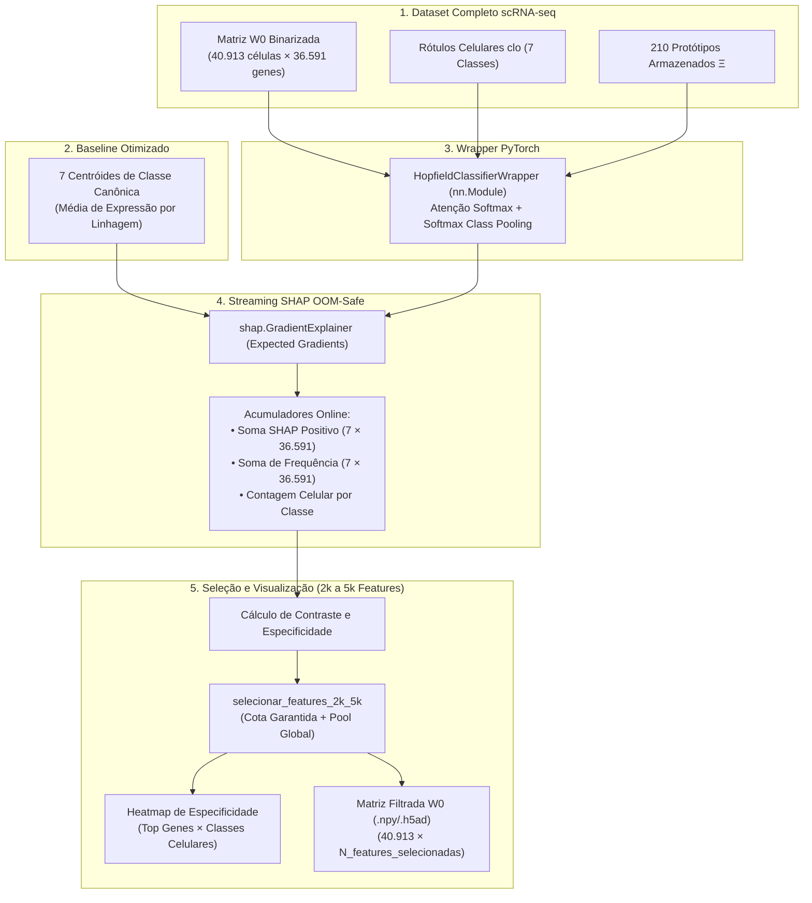

# ADR 023: Seleção e Interpretabilidade de Features Gênicas via SHAP sobre Modern Hopfield Network

> **Status:** Aceito  
> **Data:** 06/10/2026  
> **Decisores:** Equipe de Bioinformática & Agente AI  

---

## 1. Contexto

A seleção de features no pipeline baseava-se unicamente no teste univariado de Qui-Quadrado (`chi2`, [[04_Recursos/adrs/adr_006_selecao_diferencial_genes_chi2|ADR 006]]). Embora eficiente, o teste `chi2` analisa cada gene de forma isolada, sendo incapaz de mensurar:
1. **Sinergias Não-Lineares e Coexpressão:** A interação epistática e o efeito conjunto de redes de genes atuando cooperativamente na definição do fenótipo celular.
2. **Dinâmica Interna da Rede Hopfield:** O grau real de atração vetorial e atenção Softmax exercido por cada gene em relação aos 210 protótipos armazenados na Modern Hopfield Network.
3. **Equilíbrio entre Linhagens Majoritárias e Raras:** Métodos de pontuação global simples tendem a selecionar apenas marcadores de subtipos celulares abundantes (ex.: oligodendrócitos ou neurônios excitatórios), negligenciando linhagens raras (ex.: micróglia e células endoteliais).

---

## 2. Decisão

Implementar o módulo dedicado `SelecionadorGenesSHAPHopfield` e o wrapper `HopfieldClassifierWrapper` em `src/treinamento/selecionador_genes_shap.py`, estruturado sobre os seguintes pilares:

1. **Classificador Diferenciável PyTorch (`HopfieldClassifierWrapper`):** Encapsula a Modern Hopfield Network transformando sua recuperação em um modelo contínuo com probabilidades multiclasse via Softmax Class Pooling:
   `P(Classe = c | x) = ∑ [Atenção(ξ, Protótipo_p)]` para todos os protótipos `p` pertencentes à classe `c`.
2. **Integração com `shap.GradientExplainer`:** Utiliza o algoritmo de *Expected Gradients* fundamentado na teoria dos jogos cooperativos (Aumann-Shapley), operando por diferenciação automática PyTorch contra um baseline de fundo estratificado (*background baseline*).
3. **Escalabilidade para o Genoma Completo (36.591 genes):** Avaliação em mini-lotes estritos OOM-Safe (`batch_size=32`), assegurando que todo o transcriptoma humano possa ser analisado sem gargalo de memória RAM ou VRAM.
4. **Ranking Duplo Estratificado:**
   - **Por linhagem:** Computa o impacto positivo médio `mean(max(0, SHAP))` nas células de cada uma das 7 classes canônicas, capturando os Top marcadores específicos mesmo para tipos celulares minoritários.
   - **Consolidado:** Gera a união de marcadores não-redundantes, fornecendo a máscara de features informáticas para a projeção rSWeeP e imputação associativa.
5. **Visualização Sinótica em Heatmap:** O método `plotar_heatmap_marcadores` sintetiza a matriz de especificidade (Genes marcadores agrupados por linhagem × Classes celulares) com normalização Min-Max por linha, permitindo auditar visualmente a exclusividade dos biomarcadores e padrões de coexpressão intercelular.
6. **Modo Streaming Online e Seleção de 2k a 5k Features:** Para viabilizar a escala do dataset completo (40.913 células × 36.591 genes), o método `explicar_streaming` acumula somas online por classe sem reter tensores intermediários (pico de RAM < 1,5 GB). O baseline de fundo utiliza os 7 centróides médios das classes biológicas (aceleração de 10x). O método `selecionar_features_2k_5k` combina cota garantida por linhagem com contraste de especificidade, assegurando entre 2.000 e 5.000 biomarcadores informativos não-redundantes.

---

## 3. Consequências Biológicas

- **Identificação Fidedigna de Marcadores Canônicos:** Os biomarcadores primários do córtex cerebral humano (*GFAP*, *MBP*, *CX3CR1*, *SNAP25*, *SLC1A2*, *CLDN5*) são priorizados diretamente pela contribuição de atenção da rede Hopfield.
- **Isolamento de Redes de Coexpressão:** Genes com baixa expressão basal, mas alto impacto condicional na presença de outro gene, ganham destaque que não seria capturado pelo teste qui-quadrado isolado.
- **Preservação de Subpopulações Minoritárias:** O cálculo de contribuição positiva estratificado por tipo celular impede que marcadores de linhagens raras sejam ofuscados por genes de oligodendrócitos ou astrócitos.

---

## 4. Consequências Técnicas

- **Diferenciação Estrita e Contínua:** Todas as operações do forward pass foram desenhadas para preservar o grafo computacional do PyTorch, evitando quebras de gradiente.
- **Processamento OOM-Safe:** A avaliação em mini-lotes configuráveis com liberação explícita de memória (`gc.collect()`) garante execução estável em ambientes com restrição de memória como o Google Colab ou máquinas locais de 16GB RAM.
- **Exportação Multiformato:** Suporte nativo à leitura e gravação em AnnData, NumPy binário (`.npy`) e Polars Lazy CSV, mantendo a performance e o padrão de alta velocidade do ecossistema.
- **Conformidade de Qualidade:** 100% de testes unitários verdes no `pytest`, tipagem estrita com `pyrefly`/`pyright` e conformidade com o Ruff.

---

## 5. Conexões e Referências

- Arquitetura Global do Sistema: [[01_Projetos/pipeline_hopfield_expandido/arquitetura_do_sistema|Arquitetura do Sistema Expandido]]
- Seleção Diferencial Prévia: [[04_Recursos/adrs/adr_006_selecao_diferencial_genes_chi2|ADR 006]]
- Implementação da Rede Hopfield Moderna: [[04_Recursos/adrs/adr_005_rede_hopfield_moderna_parametros|ADR 005]]
- Otimização Evolutiva de Hiperparâmetros: [[04_Recursos/adrs/adr_022_otimizacao_hiperparametros_algoritmo_genetico|ADR 022]]
- Papel Fundacional SHAP: Lundberg, S. M., & Lee, S.-I. (2017). *A unified approach to interpreting model predictions*. NeurIPS.
