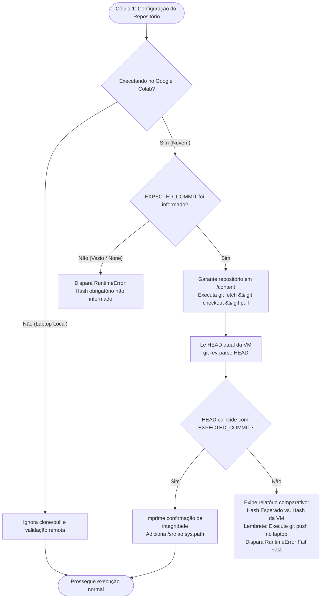

# ADR 024: Validação Fail Fast de Integridade do Repositório Git no Google Colab

> **Status:** Aceito  
> **Data:** 08/10/2026  
> **Decisores:** Pesquisadora & Agente AI  

---

## 1. Contexto

Durante o ciclo de experimentação e treinamento do pipeline em instâncias na nuvem (Google Colab), o fluxo de trabalho frequentemente envolve editar códigos e corrigir bugs no laptop local, mas executar as células de computação intensiva na VM remota.

Um ponto crítico recorrente de fricção operacional era o esquecimento involuntário de executar `git push` no ambiente local após implementar correções. Ao iniciar o notebook no Google Colab, a VM realizava o clone ou pull do repositório remoto apontando para um commit defasado (`HEAD` obsoleto). Como resultado:
1. Bugs já solucionados localmente reapareciam na nuvem após minutos de execução;
2. Recursos de GPU/TPU e tempo de pesquisa eram desperdiçados em experimentos inválidos;
3. A rastreabilidade e reprodutibilidade científica dos artefatos gerados ficavam comprometidas.

Para eliminar essa vulnerabilidade operacional, fez-se necessária a inclusão de um mecanismo de validação estrito fundamentado no princípio de engenharia **Fail Fast** logo no cabeçalho do notebook.

---

## 2. Decisão

Implementar uma rotina de verificação de integridade Git com as seguintes diretrizes arquiteturais:

1. **Variável de Configuração do Commit Esperado (`EXPECTED_COMMIT`):**
   - Declarada explicitamente no topo do notebook (ex.: `EXPECTED_COMMIT = "058e839"`).
   - Suporta tanto hashes curtos (a partir de 7 caracteres) quanto SHA-1 completo de 40 caracteres, comparando via prefixo ou igualdade exata com `git rev-parse HEAD`.
2. **Atualização Prévia e Fail Fast Rígido:**
   - Antes de inspecionar o HEAD, a rotina sincroniza o repositório na VM executando `git checkout <branch>`, `git fetch origin <branch>` e `git pull origin <branch>`.
   - Se o HEAD obtido divergir do `EXPECTED_COMMIT`, o sistema exibe um relatório diagnóstico no console e dispara imediatamente `RuntimeError`, abortando todas as células subsequentes do notebook antes de qualquer consumo de memória ou processamento biológico.
3. **Obrigatoriedade Estrita no Google Colab:**
   - Caso `EXPECTED_COMMIT` seja deixado como `None` ou string vazia no Colab, um `RuntimeError` é disparado na primeira célula, proibindo execuções anônimas ou não rastreadas.
4. **Isolamento de Ambiente (Local vs. Nuvem):**
   - A validação remota e o fluxo de clone/pull ativam-se exclusivamente no Google Colab (detectado via `google.colab` em `sys.modules`, `/content` ou variáveis de ambiente `COLAB_GPU`).
   - No laptop local (Windows/VSCode), a etapa remota é ignorada automaticamente para não onerar o desenvolvimento com verificações desnecessárias.
5. **Implementação Autocontida no Notebook e Módulo Espelho em `src/utils/`:**
   - Para garantir robustez mesmo quando uma VM clonar uma versão muito antiga (onde novos arquivos ainda não existiam), a rotina de validação na célula do notebook é totalmente autocontida em Python puro com `subprocess`.
   - Um módulo utilitário equivalente e tipado foi criado em `src/utils/validador_git_colab.py`, acompanhado de cobertura integral de testes unitários em `tests/test_validador_git_colab.py`.
6. **Desacoplamento do Push e Execução Total sem Atrito ("Run All"):**
   - O notebook foi mantido 100% focado no pipeline experimental, sem células auxiliares ocasionais de inspeção ou instruções de push. Isso permite executar o notebook inteiro ("Run All") de ponta a ponta sem qualquer interrupção.
   - O processo de inspeção do HEAD, atualização automática de `EXPECTED_COMMIT` e envio via `git push` foi totalmente desacoplado para o utilitário CLI externo `scripts/sincronizar_colab.py`.

---

## 3. Diagrama de Fluxo (Fail Fast)

---

## 4. Consequências

### Positivas
- **Prevenção Total de Regressão Involuntária:** É impossível executar código defasado na nuvem por esquecimento de `git push`.
- **Rastreabilidade Científica:** Cada execução no Colab fica explicitamente vinculada no topo do notebook ao hash exato do código utilizado.
- **Feedback Imediato:** Em caso de divergência, o erro é emitido no primeiro segundo da inicialização, instruindo exatamente o comando `git push origin <branch>` a ser executado no laptop.

### Considerações Operacionais
- Antes de rodar o notebook no Google Colab, a usuária deve conferir o hash do seu último commit e inseri-lo na variável `EXPECTED_COMMIT` (facilitado pela célula de pré-voo local).
