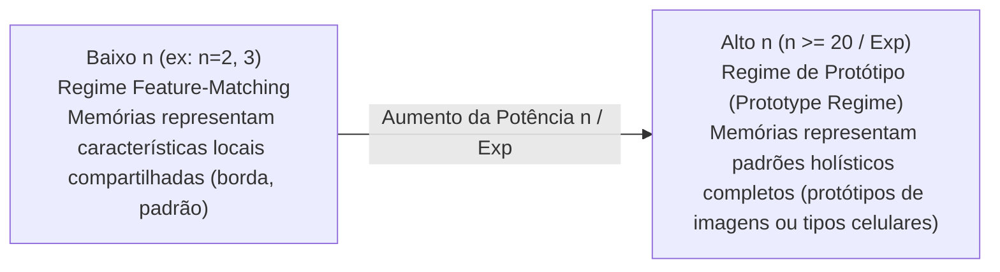

# 📜 Artigo Científico: Krotov & Hopfield (2016) — Dense Associative Memory for Pattern Recognition

> **Autores:** Dmitry Krotov & John J. Hopfield  
> **Publicação:** *30th Conference on Neural Information Processing Systems (NIPS 2016)*, Barcelona, Espanha.  
> **Citação:** Krotov, D., & Hopfield, J. J. (2016). Dense associative memory for pattern recognition. *Advances in Neural Information Processing Systems (NIPS)*, 29.  
> **URL / arXiv:** [arXiv:1606.01164](https://arxiv.org/abs/1606.01164)  

---

## 💡 1. Contexto & Ruptura de Paradigma

Em 2016, Krotov e Hopfield introduziram o conceito de **Memória Associativa Densa (Dense Associative Memory - DAM)**, reformulando fundamentalmente a arquitetura clássica de Hopfield de 1982. 

O trabalho resolveu o gargalo histórico de baixa capacidade de armazenamento ($K_{\max} \approx 0.14N$) substituindo a função de energia quadrática por **funções de interação de ordem superior (polinomiais e exponenciais)**. Além disso, o artigo demonstrou pela primeira vez uma **dualidade matemática exata** entre memórias associativas densas e redes neurais profundas com mecanismos de atenção (*Softmax Attention*).

---

## 📐 2. Formulário Matemático & Capacidade Exponencial

### 2.1. Hamiltoniano / Função de Energia de Ordem Superior
Em vez da interação quadrática par a par ($T_{ij} V_i V_j$), o modelo denso define a energia total através de uma função não-linear $F(x)$ aplicada às projeções do estado de entrada $\sigma$ sobre os vetores de memória armazenados $\xi^\mu$:

$$E = -\sum_{\mu=1}^{K} F\left( \sum_{i=1}^{N} \xi_i^\mu \sigma_i \right)$$

Onde:
- $\sigma_i \in \{-1, +1\}$ é a configuração dos $N$ neurônios visíveis.
- $\xi^\mu = (\xi_1^\mu, \dots, \xi_N^\mu)$ é o $\mu$-ésimo vetor de memória (de um total de $K$ memórias).
- $F(x)$ é uma função não-linear de interação (ex: $F(x) = x^n$, $F(x) = \text{ReP}_n(x)$, ou $F(x) = \exp(x)$).

### 2.2. Superação do Limite de Capacidade
Quando $F(x) = x^n$, a capacidade máxima de armazenamento de memórias $K_{\max}$ escala de forma não-linear e super-linear com a dimensão $N$:

$$K_{\max} \propto N^{n-1}$$

Para funções de crescimento exponencial ($F(x) = \exp(x)$ ou Softmax contínuo), a capacidade de armazenamento torna-se **exponencial**:

$$K_{\max} \propto 2^{N/2} \quad \text{ou} \quad \alpha^N$$

Isso permite que a rede armazene **milhares de protótipos celulares** em espaços vetoriais de dimensão moderada ($N = 600$), superando por completo o colapso por *crosstalk*.

---

## 🔄 3. Regimes de Operação: *Feature-Matching* vs *Prototype Regime*

Krotov & Hopfield demonstraram que a potência $n$ da função de interação controla a transição fundamental entre dois regimes de representação de dados:

* **Regime Feature-Matching ($n$ pequeno):** A energia é distribuída por múltiplos vetores de memória. A rede decompõe o estímulo em características parciais (ex: bordas de imagem ou módulos de co-expressão gênica).
* **Regime de Protótipo ($n$ elevado ou $\exp$):** A energia forma picos agudos em torno de memórias específicas. A rede responde ativando diretamente o **protótipo completo do tipo celular** que melhor corresponde ao estímulo, permitindo a **restauração perfeita de *dropouts***.

---

## ⚡ 4. Dualidade com Deep Learning & Mecanismos de Atenção

O artigo demonstra formalmente que uma atualização de um único passo da memória associativa densa é matematicamente equivalente a uma camada oculta de rede neural *feedforward* onde a função de ativação é a derivada da função de energia:

$$f(x) = F'(x)$$

No limite exponencial / Softmax, a equação de atualização de estados recupera exatamente o mecanismo de atenção do Transformer:

$$\text{Atualização} = \text{Softmax}(\beta \cdot \xi^\top \sigma) \cdot \xi$$

---

## 🔬 5. Impacto e Aplicação no Projeto de Mestrado (UFPR)

A ingestão deste artigo fundamenta as seguintes decisões de arquitetura no repositório:
1. **Escolha de Hopfield Moderno:** Permite armazenar com segurança centenas de centroides de tipos celulares (**protótipos K-means**) e utilizá-los para interpolar dados faltantes (*dropouts*) e corrigir o efeito de lote.
2. **Mitigação do Efeito Caixa-Preta:** Ao contrário de VAEs que mapeiam células em espaços latentes abstratos e não-interpretáveis, as memórias da Rede Hopfield Moderna correspondem diretamente a **vetores binários de expressão gênica de células reais/protótipos**, garantindo total transparência algorítmica.

---

## 🔗 Conexões no Grafo

- **Artigo Precursor:** **[[04_Recursos/artigos/hopfield_1982_neural_networks_emergent_abilities|Hopfield (1982) — Classical Neural Networks]]**
- **Área de Pesquisa:** **[[02_Areas/modern_hopfield_networks/index|Redes Hopfield Modernas]]**
- **Projeto de Mestrado:** **[[01_Projetos/proposta_mestrado/index|Projeto de Mestrado UFPR]]**
- **Conceitos Atômicos:**
  - **[[03_Conhecimento/atencao_softmax_hopfield|Atenção Softmax Hopfield]]**
  - **[[03_Conhecimento/amostragem_prototipos_kmeans|Amostragem de Protótipos K-Means]]**
  - **[[03_Conhecimento/binarizacao_expressao_genica|Binarização de Expressão Gênica]]**
