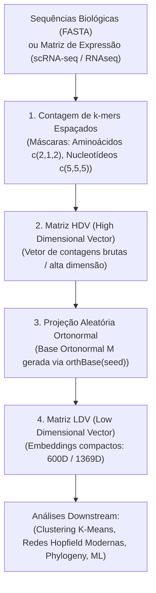

# 📐 Documentação Técnica Oficial: SWeeP / rSWeeP (UFPR / AIBIALab)

> **Ferramenta:** Spaced Words Projection (SWeeP) / Pacote R `rSWeeP`  
> **Versão do Pacote:** 1.24.0 (Bioconductor Release 3.23)  
> **Desenvolvimento:** Laboratório de Inteligência Artificial e Biologia Integrativa (AIBIALab / UFPR)  
> **Manutenção:** Camila Pereira Perico (`camilapp94@gmail.com`)  
> **Autores:** Camila Pereira Perico, Danrley Rafael Fernandes, Mariane Gonçalves Kulik, Júlia Formighieri Varaschin, Camilla Reginatto de Pierri, Ricardo Assunção Vialle, Roberto Tadeu Raittz.  
> **Repositórios:** [GitHub rSWeeP](https://github.com/CamilaPPerico/rSWeeP) | [Bioconductor rSWeeP](https://bioconductor.org/packages/rSWeeP) | [Tutoriais AIBIALab](https://aibialab.github.io/rSWeeP)  
> **Referência Principal:** De Pierri, C. R., Voyceik, R., Santos de Mattos, L. G. C., Kulik, M. G., Camargo, J. O., Repula de Oliveira, A. M., ... & Raittz, R. T. (2020). *SWeeP: representing large biological sequences datasets in compact vectors*. Scientific Reports, 10(1), 91.  

---

## 💡 1. Visão Geral do Método SWeeP

O **SWeeP** (*Spaced Words Projection*) é um método computacional sem alinhamento (*alignment-free*) projetado para representar sequências biológicas (nucleotídeos ou aminoácidos) e matrizes de expressão gênica em vetores numéricos compactos de dimensão fixa, preservando a comparabilidade inter-sequencial e a geometria das distâncias biológicas.

O método baseia-se em duas etapas fundamentais:
1. **Contagem de $k$-mers Espaçados (Espaço HDV):** Geração de um vetor de alta dimensão (*High Dimensional Vector - HDV*) que escaneia e indexa as sequências biológicas ou os perfis de expressão através de blocos de palavras espaçadas (*spaced-words*).
2. **Projeção Ortonormal Aleatória (Espaço LDV):** Projeção da matriz HDV sobre uma base ortonormal gerada via decomposição QR, produzindo um vetor de baixa dimensão (*Low Dimensional Vector - LDV*) compacto (ex: 600 ou 1.369 dimensões) fundamentado no **Lema de Johnson-Lindenstrauss**.

---

## 📐 2. Arquitetura da Transformação Matrométrica



---

## 🛠️ 3. Funções Principais do Pacote `rSWeeP`

### 3.1. `SWeeP()` — Projeção Vetorial Principal
Realiza a projeção de sequências biológicas ou matrizes genéricas/RNA-seq no espaço LDV.

* **Assinaturas Suportadas:** `AAStringSet`, `DNAStringSet`, `RNAStringSet`, `BStringSet`, `BString`, `character` (caminho para pasta de arquivos FASTA), `dgCMatrix` (matriz Seurat/scRNA-seq), `matrix`, `array`, `integer`.
* **Sintaxe e Parâmetros:**
  ```R
  SWeeP(input, orthbase, bin = FALSE, ncores = NULL, norm = "none", 
        mask = NULL, seqtype = "AA", concatenate = FALSE, lowRAMmode = FALSE, 
        transpose = FALSE, RNAseqdata = FALSE, verbose = TRUE)
  ```
* **Parâmetros Principais:**
  * `input`: Objeto de sequências biológicas, caminho de pasta ou matriz de expressão.
  * `orthbase`: Matriz de base ortonormal gerada pela função `orthBase()`.
  * `psz`: Tamanho do vetor de projeção de saída (ex: `psz = 600` ou `psz = 1369`).
  * `bin`: Modo binário (`TRUE`) ou modo de contagem (`FALSE`, padrão).
  * `norm`: Tipo de normalização do HDV (`"none"`, `"log"`, ou `"logNeg"`). A opção `"logNeg"` converte zeros em $-1$ e é recomendada para genes e sequências curtas.
  * `mask`: Máscara de leitura. Padrão para aminoácidos é `c(2,1,2)` e para nucleotídeos `c(5,5,5)`.
  * `seqtype`: Tipo de dados (`"AA"` para aminoácidos, `"NT"` para nucleotídeos).
  * `lowRAMmode`: Otimizado para leitura de arquivos grandes individualmente com baixo consumo de RAM.
  * `transpose`: Se as linhas correspondem às amostras e colunas aos genes, use `transpose = FALSE`. Se as colunas correspondem às amostras, use `transpose = TRUE`.
  * `RNAseqdata`: Ajusta parâmetros automaticamente para matrizes de RNA-seq/scRNA-seq (`TRUE`).

---

### 3.2. `SWeePlite()` — Versão Otimizada para Grandes Volumes
Versão do SWeeP desenvolvida para grande escala, eliminando a necessidade de fornecer a matriz ortonormal externamente (gerada internamente em blocos) e reduzindo drasticamente o consumo de memória RAM.

```R
SWeePlite(input, psz = 1369, bin = FALSE, ncores = NULL, norm = "none",
          concatenate = FALSE, mask = NULL, seqtype = NULL, nk = 15000, 
          lowRAMmode = FALSE, verbose = TRUE)
```
* `nk`: Tamanho do bloco do HDV para o *loop* paralelo (padrão 15.000 ou 50.000).

---

### 3.3. `orthBase()` — Gerador de Base Ortonormal Reproduzível
Gera a matriz ortonormal de projeção com dimensões ajustadas à máscara de leitura e ao tamanho desejado de projeção (`psz`).

```R
orthBase(lin = NULL, col, seqtype = "AA", mask = c(2, 1, 2), seed = 647474747)
```
* **Retorno:** Lista contendo `mat` (a matriz ortonormal), `seed` (a semente aleatória para reprodutibilidade estrita) e `version` (versão do pacote `rSWeeP`).

---

### 3.4. `extractHDV()` — Extração da Matriz de Alta Dimensão
Obtém a matriz HDV sem aplicar a projeção ortonormal para o espaço reduzido.

```R
extractHDV(input, mask = NULL, seqtype = "AA", bin = FALSE, concatenate = FALSE, verbose = TRUE)
```

---

### 3.5. Funções de Avaliação Filogenética: `PCCI()` e `PMPG()`
* `PCCI(tr, mt)`: *PhyloTaxonomic Consistency Cophenetic Index* — Avalia a consistência do agrupamento de um mesmo táxon na árvore filogenética gerada pelos vetores SWeeP.
* `PMPG(tr, mt)`: *Percentage of Mono or Paraphyletic Groups* — Calcula a porcentagem de grupos monofiléticos e parafiléticos na árvore.

---

## 🔬 4. Aplicação e Integração no Projeto de Mestrado (UFPR)

No **[[01_Projetos/proposta_mestrado/index|Projeto de Mestrado da UFPR]]**, o pacote `rSWeeP` é a ferramenta central na etapa de **Redução de Dimensionalidade (Etapa 3 do Pipeline)**:

1. **Compressão de Matrizes scRNA-seq:** Reduz a dimensão de matrizes de expressão contendo ~36.000 genes para um espaço vetorial compacto de **600 dimensões** (`psz = 600`), mantendo a geometria espacial das distâncias entre células.
2. **Desempenho Extremo:** Permite realizar o agrupamento K-Means de mais de 40.000 células em frações de segundo, viabilizando a amostragem rápida de **protótipos gênicos** que alimentam a **Rede Hopfield Moderna**.

---

## 🔗 Conexões no Grafo

- **Projeto de Mestrado:** **[[01_Projetos/proposta_mestrado/index|Projeto de Mestrado UFPR]]**
- **Nota de Recurso Auxiliar:** **[[04_Recursos/projecao_sweep/projeao_rsweep|Recurso Projeção rSWeeP 600D]]**
- **Conceito Atômico:** **[[03_Conhecimento/projecao_rsweep_600d|Projeção rSWeeP 600D]]**
- **Decisão de Arquitetura:** **[[04_Recursos/adrs/adr_004_projecao_rsweep_600d_kmeans|ADR 004 — Projeção rSWeeP 600D e K-Means]]**
