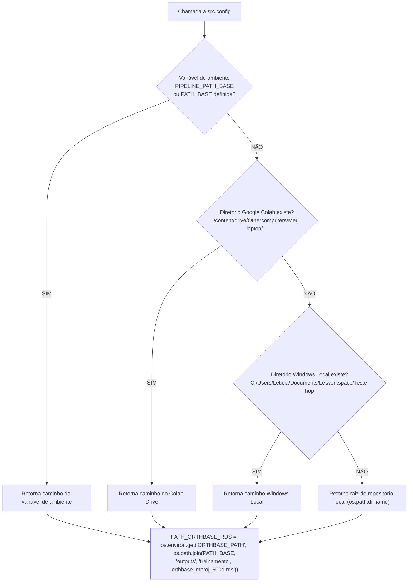
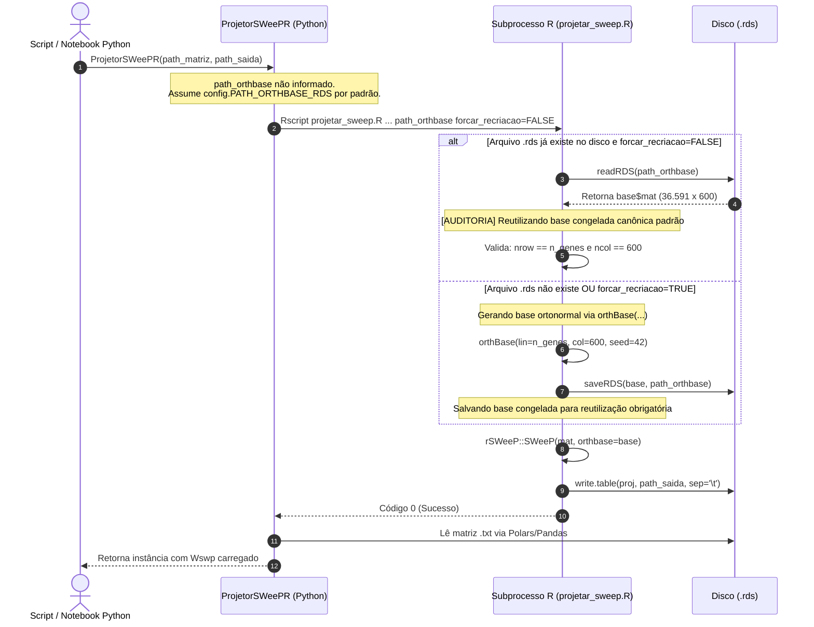

# Guia Técnico Operacional: OrthBase Canônica SWeeP e Centralização via `config.py`

## 1. Visão Geral e Fundamentação

No pipeline de bioinformática e aprendizado associativo para scRNA-seq deste projeto, a **base ortonormal SWeeP** (`orthbase_mproj_600d.rds`) é a âncora geométrica fundamental de todo o subespaço latente. Ela transforma matrizes de presença/ausência de dezenas de milhares de genes (espaço gênico estendido de 36.591 genes) em um espaço contínuo compacto de 600 dimensões:

`Wswp = W0 × R_base (células × 600 dimensões)`

Para garantir que o conjunto de **Referência (Fujita)**, o conjunto **Alvo mascarado (Mathys com Sentinela 0.5)** e o conjunto **Alvo Imputado pós-Hopfield** possam ser comparados e submetidos a K-Means e avaliação supervisionada no mesmo sistema de coordenadas, a matriz `R_base` deve ser **rigorosamente idêntica e congelada** entre todas as etapas.

Conforme a [[04_Recursos/adrs/adr_019_obrigatoriedade_rsweep_r_e_congelamento_orthbase|ADR 019]] e a [[04_Recursos/adrs/adr_021_centralizacao_orthbase_config_e_reuso_canonico|ADR 021]], o arquivo `src/config.py` é a **única fonte da verdade** para a localização desta base, e o componente `ProjetorSWeePR` a consome automaticamente como padrão incondicional.

---

## 2. Estrutura Matemática e Formato Interno (.rds)

A base canônica é gerada pela biblioteca oficial em R `rSWeeP` (AIBIALab/UFPR, De Pierri et al., 2020) através da função:

```R
base <- orthBase(lin = n_genes, col = dim_proj, seed = seed)
```

### Propriedades da Matriz Gerada
- **Dimensões:** `36.591 linhas (genes)` × `600 colunas (dimensão latente)`.
- **Aritmética dos Primos:** O algoritmo gera dispersão de subespaço utilizando uma sequência de 50 números primos (`idx %% pslist`) combinada com projeção pseudoaleatória controlada pela semente (`seed = 42`).
- **Ortonormalidade:** A matriz satisfaz `R_base.T × R_base ≈ I_600`, preservando distâncias euclidianas relativas segundo o Lema de Johnson-Lindenstrauss.
- **Formato de Serialização:** Objeto binário compactado R (`.rds`), lido via `readRDS()` e gravado via `saveRDS()`.
- **Estrutura do Objeto R:** Lista S3 contendo `base$mat` (matriz numérica de dupla precisão `double` / `float64`).

---

## 3. Resolução Multi-Ambiente em `src/config.py`

Para permitir a alternância fluida entre o ambiente de nuvem (**Google Colab com Google Drive**), o ambiente de trabalho local da pesquisadora (**Windows Local**) e ambientes de automação/CI sem Google Drive, o arquivo `src/config.py` implementa a função `_resolver_path_base()`:



---

## 4. Ciclo de Vida Singleton da Base

A interação entre o Python (`ProjetorSWeePR`) e o R (`projetar_sweep.R`) segue uma arquitetura segura à prova de falhas:



---

## 5. Guia Prático de Uso em Código

### 5.1. Uso Canônico Padrão (Recomendado)
Não é necessário passar `path_orthbase`. A classe assume o caminho centralizado e compartilha a mesma base automaticamente:

```python
from treinamento.projetor_sweep import ProjetorSWeePR
import config

# Projeção da Referência (gera e salva a base na 1ª vez; reutiliza nas próximas)
proj_ref = ProjetorSWeePR(
    path_matriz="outputs/alinhamento/mtx_referencia/matrix.mtx",
    path_saida=config.PATH_SWEEP_REFERENCIA,
    seed=42,
)
proj_ref.projetar()

# Projeção do Alvo (reutiliza estritamente a mesma base congelada)
proj_alvo = ProjetorSWeePR(
    path_matriz="outputs/alinhamento/mtx_alvo_sentinela/matrix.mtx",
    path_saida=config.PATH_SWEEP_ALVO_SENTINELA,
    seed=42,
)
proj_alvo.projetar()
```

### 5.2. Forçar a Regeneração da Base
Caso haja alteração intencional do conjunto de genes (ex: novo alinhamento) ou da semente estatística:

```python
proj_novo = ProjetorSWeePR(
    path_matriz="outputs/alinhamento/novo_espaco/matrix.mtx",
    path_saida="outputs/treinamento/matriz_sweep_nova.txt",
    seed=77,
    forcar_recriacao=True,  # Sobrescreve o arquivo .rds em config.PATH_ORTHBASE_RDS
)
proj_novo.projetar()
```

### 5.3. Usar uma Base Específica/Alternativa
Se um experimento necessitar de um arquivo de base isolado fora do padrão:

```python
proj_isolado = ProjetorSWeePR(
    path_matriz="caminho/matriz.mtx",
    path_saida="caminho/saida.txt",
    path_orthbase="experimentos/orthbase_teste_100d.rds",
    n_componentes=100,
    seed=123,
)
proj_isolado.projetar()
```

---

## 6. Observabilidade e Logs de Auditoria

Ao ser executado, o pipeline emite mensagens explícitas de auditoria no terminal:

```text
[ProjetorSWeePR] =========================================================
[ProjetorSWeePR] [AUDITORIA] Executando projeção oficial rSWeeP em R...
  script R         : .../src/treinamento/projetar_sweep.R
  entrada          : outputs/alinhamento/mtx_referencia/matrix.mtx
  saída            : outputs/treinamento/matriz_reduzida_sweepREF.txt
  dim_proj         : 600, seed: 42
  base RDS padrão  : outputs/treinamento/orthbase_mproj_600d.rds
  forçar recriação : False
[ProjetorSWeePR] =========================================================
=================================================================
          PROJEÇÃO CANÔNICA rSWeeP (UFPR / AIBIALab)             
=================================================================
[rSWeeP] =========================================================
[rSWeeP] [AUDITORIA] Reutilizando base congelada canônica padrão:
[rSWeeP]   Arquivo : outputs/treinamento/orthbase_mproj_600d.rds 
[rSWeeP]   Carga concluída em 0.12 s. Dimensões: 36591 x 600
[rSWeeP] =========================================================
[rSWeeP] Projetando amostras no espaço latente 600D...
[rSWeeP] Projeção concluída em 3.45 s! Dimensões da saída: 40913 x 600
[ProjetorSWeePR] Wswp carregado com sucesso absoluto: (40913, 600)
```

---

## 7. Conexões com o Grafo de Conhecimento
- Decisões Formais: [[04_Recursos/adrs/adr_021_centralizacao_orthbase_config_e_reuso_canonico|ADR 021: Centralização da OrthBase via config.py]] e [[04_Recursos/adrs/adr_019_obrigatoriedade_rsweep_r_e_congelamento_orthbase|ADR 019: Obrigatoriedade Irrevogável do rSWeeP e Eliminação de Fallbacks]]
- Conceito Atômico: [[03_Conhecimento/projecao_rsweep_600d|Conceito Atômico: Projeção rSWeeP 600D]]
- Documentação Oficial da UFPR: [[04_Recursos/projecao_sweep/documentacao_oficial_sweep|Documentação Oficial rSWeeP / SWeeP]]
- Arquitetura do Sistema: [[01_Projetos/pipeline_hopfield_expandido/arquitetura_do_sistema|Documento de Arquitetura do Sistema]]
- Manual do Pipeline: [[01_Projetos/pipeline_hopfield_expandido/documentacao_pipeline_hopfield|Manual Mestre do Pipeline]]
